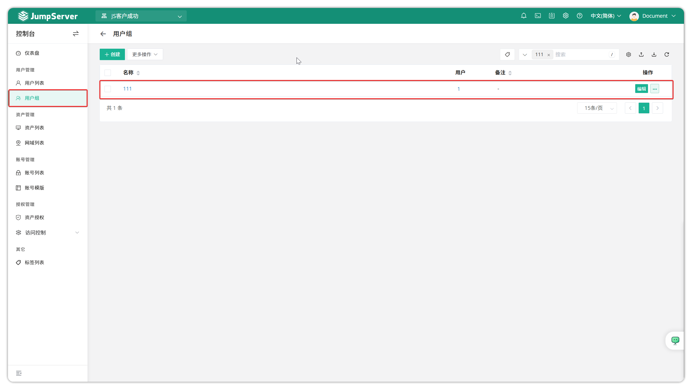
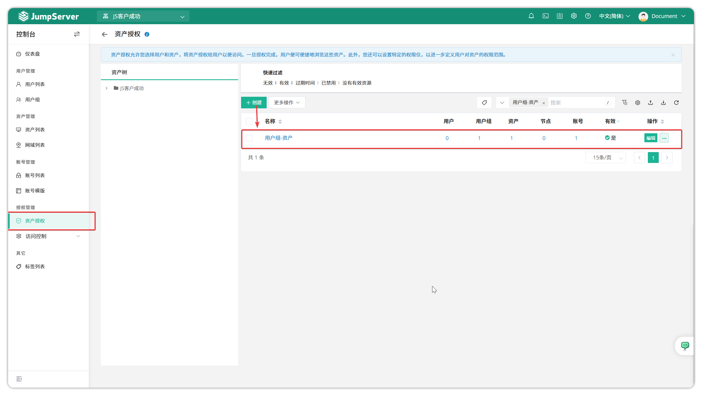
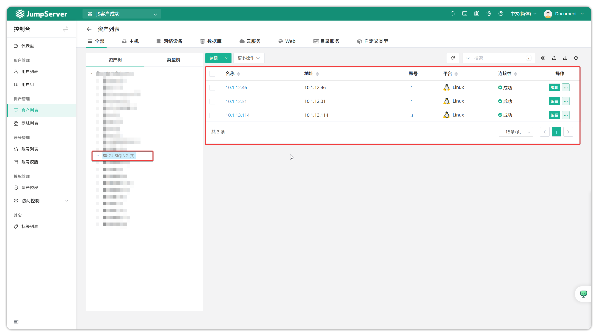
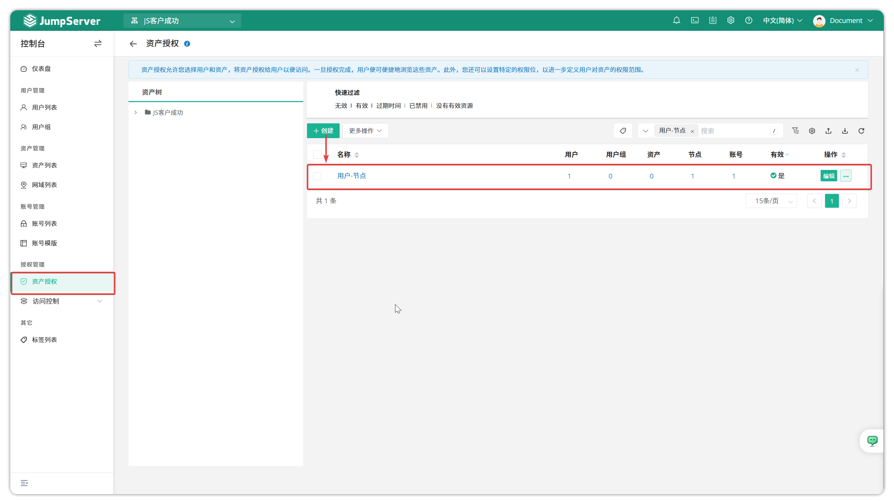
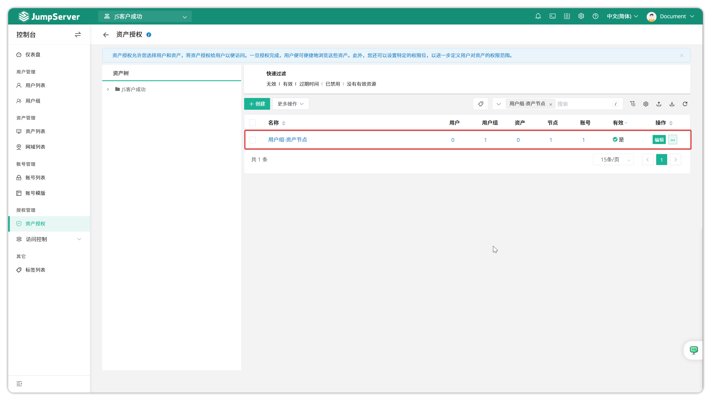

# 授权管理
## 1 资产授权
### 1.1 功能简介
!!! tip "资产的授权规则通过以下几个维度确定用户能使用那种协议、哪些账号访问哪些资产并且拥有什么样的权限。维度分别如下:"
    - 用户：用户维度主要包括用户与用户组（代表该用户组下所有的用户）；
    - 资产：资产维度主要包括资产、节点（资产组的概念，代表该节点下的所有资产）、账号（登录资产的账号）；
    - 账号：账号维度主要区分用户可以用哪些账号登录资产。
    - 协议：协议维度主要区分用户登录资产可以使用的协议。
    - 动作：动作维度主要包括连接权限、上传、下载、删除权限、复制粘贴权限（仅支持RDP 协议和 VNC 协议）。

!!! tip ""
    **点击资产授权页面的`创建`按钮，即进入资产授权创建页面。填写授权规则信息并提交。**
    

!!! tip ""
    - 详细参数说明：

    | 参数       | 说明                                                                 |
    |------------|--------------------------------------------------------------------|
    | 名称       | 授权规则的名称。                                                   |
    | 用户       | JumpServer 登录用户，即给该用户授权资产的连接或其它权限。           |
    | 用户组     | JumpServer 登录用户组，即给该用户组授权资产的连接或其它权限。       |
    | 资产       | 授权的资产，即用户需求连接的资产。                                 |
    | 节点       | 授权的节点，即用户需求连接的资产组。                               |
    | 账号       | 授权资产登录的账号。                                               |
    |            | ● **所有账号**：资产上添加的所有账号都授权；                        |
    |            | ● **指定账号**：手动输入需要授权的账号名称；                        |
    |            | ● **虚拟账号**：手动输入：授权用户连接时自行输入用户名/密码；       |
    |            | ● **同名账户**：授权用户连接时使用与 JumpServer 登录用户同名的账号；|
    |            | ● **匿名账号**：授权用户连接时不代填任何认证信息，仅拉起应用本身。（适用于 Web 和自定义类型的资产） |
    | 协议       | 授权用户可用的协议。                                               |
    |            | ● **所有**：用户可以使用堡垒机支持的任意协议登录资产；              |
    |            | ● **指定协议**：用户可以使用指定协议登录资产。                      |
    | 动作       | 授权的动作，即用户对资产可以做什么。剪切板权限控制目前仅支持 RDP/VNC 协议的连接。是否允许 SSH 协议会话分享。 |
    | 开始日期   | 该授权规则开始的时间，默认为该授权规则创建的时间。                 |
    | 失效日期   | 该授权规则失效的时间。                                             |

!!! warning "在以下示例中，每次创建新的授权规则时，都会删除原始授权规则，并且原始规则对新创建的授权规则没有任何影响。"

### 1.2 仅给某个用户授权某资产

!!! tip "当需求仅给某个用户授权某资产时："
    - 选择将 **用户模块** 中的`用户`选项选择为需要授权的用户，`用户组`选项置空；
    - 选择将 **资产模块** 中的`资产`选项为需要登录的资产，`节点`选项为空，`账号`选择授权的账号，示例选择`所有账号`。
  
!!! tip ""
    - 授权规则如下：
    

!!! tip ""
    - 授权结果：
    

### 1.3 给某个用户组授权某资产
!!! tip "当针对与允许某个用户组登录一个资产时："
    - 选择将 **用户模块** 中`用户组`选项选择为需要授权的用户组，`用户`选项为空；
    - 将 **资产模块** 中的`资产`选项选择为需要登录的资产，`节点`选项为空，`账号`选择授权的账号，示例选择`所有账号`。

!!! tip ""
    - 授权用户组拥有的用户：
    

!!! tip ""
    - 授权规则如下：
    

!!! tip ""
    - 授权结果如下：
    

### 1.4 给某个用户授权某节点
!!! tip "当针对与允许某个用户登录某一组资产时："
    - 选择将 **用户模块** 中`用户`选项选择为需要授权的用户，`用户组`选项为空；
    - 将 **资产模块** 中的`节点`选项选择为需要登录的资产组，`资产`选项为空，`账号`选择授权的账号，示例选择`所有账号`。

!!! tip ""
    - 授权示例节点中包含的资产如下：
    

!!! tip ""
    - 授权规则如下：
    

!!! tip ""
    - 授权结果如下：
    

### 1.5 给某个用户组授权某节点
!!! tip "当允许某个用户组登录某一组资产时："
    - 选择将 **用户模块** 中`用户组`选项选择为需要授权的用户组，`用户`选项为空；
    - 将 **资产模块** 中的`节点`选项选择为需要登录的资产组，`资产`选项为空，`账号`选择授权的账号，示例选择`所有账号`。

!!! tip ""
    - 授权规则如下：
    

!!! tip ""
    - 授权结果如下：
    

### 1.6 其他
!!! info ""
    - 授权规则模块中的任何选项都为空的情况下，该授权规则不起任何作用。
    - 授权规则模块中的任一模块选项都为空的情况下，该授权规则不起任何作用。
    - 授权规则不能使用`*`进行全匹配。