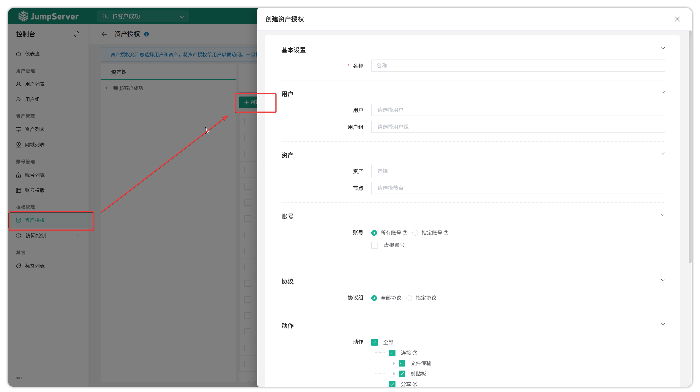
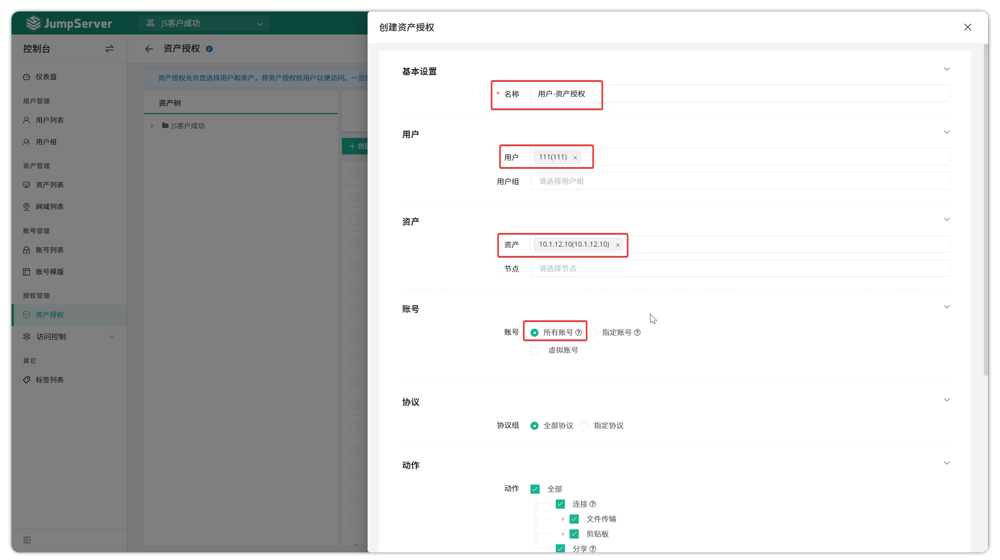
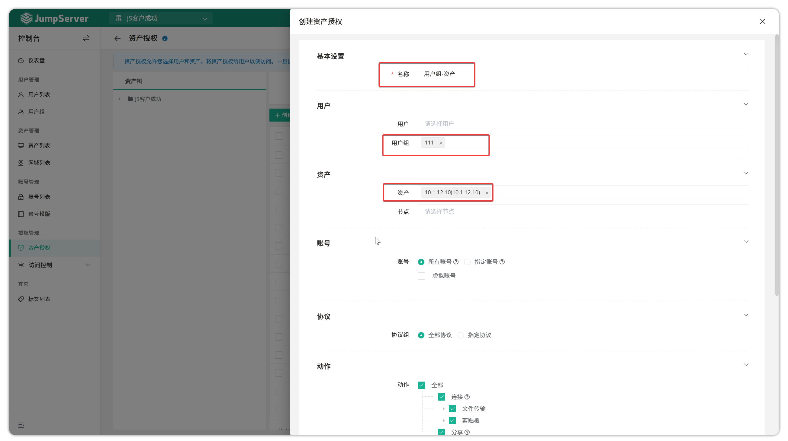
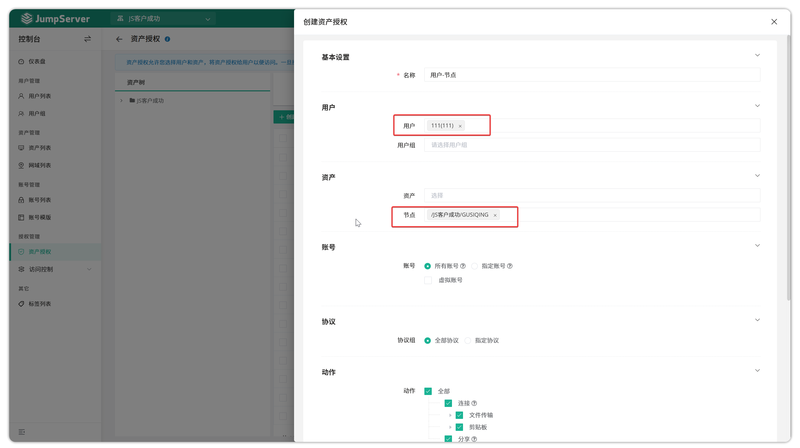
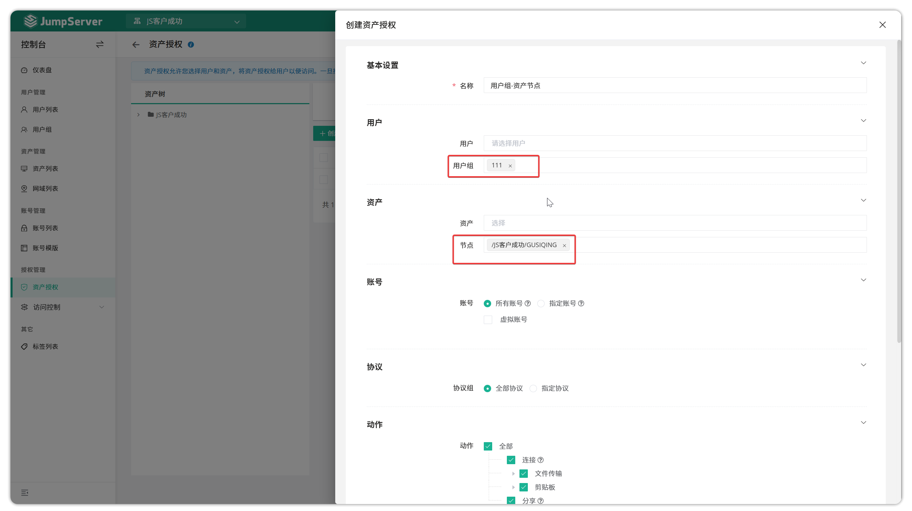

# 资产授权

## 功能概述
!!! tip ""
    - 进入 **控制台** 页面，点击 **资产管理 > 资产授权**，进入资产授权页面。
    - 资产授权规则通过限制了用户访问资产的权限，确保用户只能通过特定规则访问被授权的资产。

## 创建资产授权

!!! tip ""
    - 点击资产授权页面的 `创建` 按钮，填写授权规则信息并提交。

!!! tip ""
    详细参数说明：

| 参数     | 说明 |
|----------|------|
| 名称     | 授权规则的名称 |
| 用户     | JumpServer 登录用户，即被授权连接资产的用户 |
| 用户组   | JumpServer 登录用户组，即被授权连接资产的用户组 |
| 资产     | 授权的资产，即用户可连接的资产 |
| 节点     | 授权的节点，即用户可连接的资产组 |
| 账号     | 授权资产登录的账号，支持： • **所有账号**：资产上所有账号 • **指定账号**：手动输入账号名称 • **虚拟账号**： &nbsp;&nbsp;◦ **手动账号**：连接时手动输入用户名/密码 &nbsp;&nbsp;◦ **同名账号**：使用与 JumpServer 登录用户同名账号 &nbsp;&nbsp;◦ **匿名账号**：不代填认证信息，仅拉起应用本身（适用于 Web/自定义资产） |
| 协议     | 授权用户可用的协议，支持： • **所有**：可用任意协议 • **指定协议**：可用指定协议 |
| 动作     | 用户可对资产执行的操作，包括连接、上传、下载、剪切板（RDP/VNC）、SSH 会话分享等 |
| 开始日期 | 授权规则生效时间，默认为创建时间 |
| 失效日期 | 授权规则失效时间 |

## 授权逻辑说明
!!! info ""
    - **组合授权**：同时选择用户和用户组时，所有用户均生效；同时选择资产和节点时，所有资产均生效，采用“与”关系
    - **空选项无效**：任一必填项（用户/用户组、资产/节点、账号等）为空时，授权规则不生效
    - **不支持通配符**：授权规则不支持 `*` 全匹配

## 授权案例

### 单用户单资产授权
!!! tip ""
    - 仅给某个用户授权某资产：
        - 用户模块：选择需要授权的用户，用户组留空
        - 资产模块：选择需要登录的资产，节点留空，账号选择授权账号（如所有账号）
    - 授权规则示例：
    

### 用户组单资产授权
!!! tip ""
    - 允许某个用户组登录一个资产：
        - 用户模块：选择需要授权的用户组，用户留空
        - 资产模块：选择需要登录的资产，节点留空，账号选择授权账号（如所有账号）
    - 授权规则示例：
    

### 单用户节点授权
!!! tip ""
    - 允许某个用户登录某一组资产：
        - 用户模块：选择需要授权的用户，用户组留空
        - 资产模块：选择需要登录的资产组，资产留空，账号选择授权账号（如所有账号）
    - 授权规则示例：
    

### 用户组节点授权
!!! tip ""
    - 允许某个用户组登录某一组资产：
        - 用户模块：选择需要授权的用户组，用户留空
        - 资产模块：选择需要登录的资产组，资产留空，账号选择授权账号（如所有账号）
    - 授权规则示例：
    

