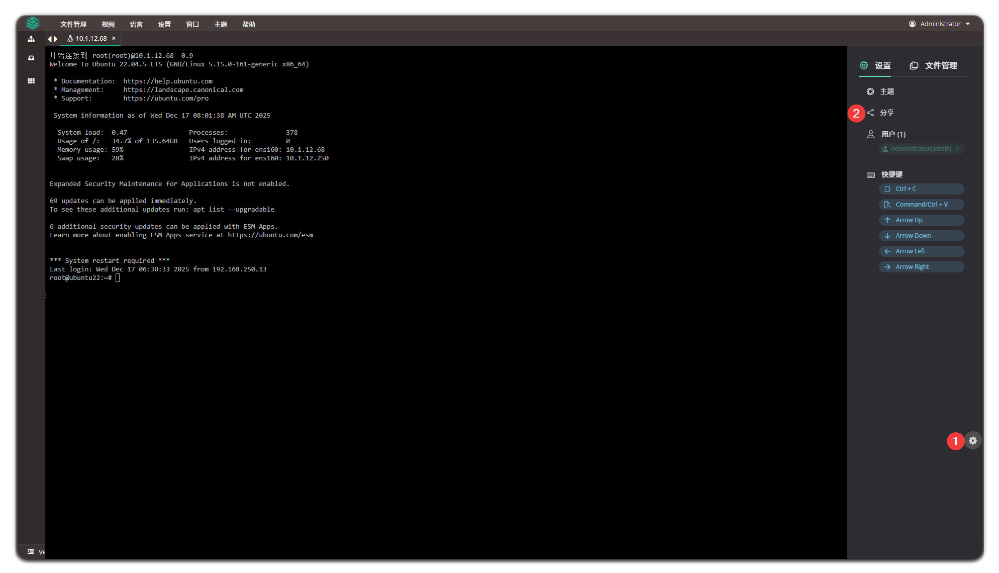
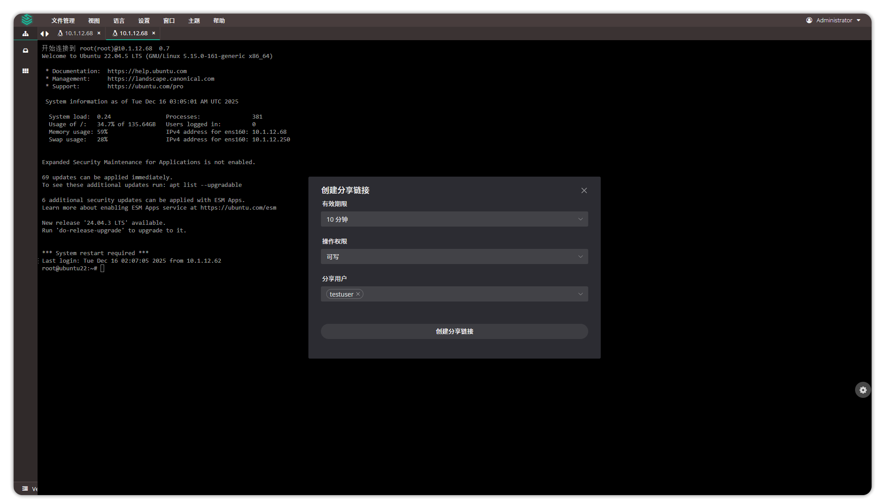
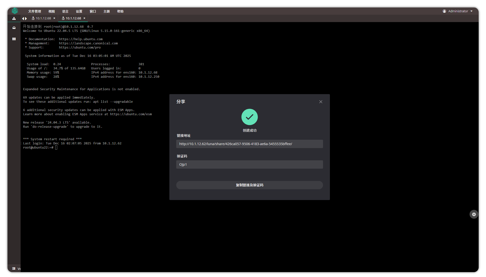

# 会话分享

## 功能介绍
!!! tip ""
    - 用户通过 Web Terminal 连接资产成功后，可以在页面中创建分享链接，并将分享链接和验证码发送给其他用户。
    - 其他用户访问链接并输入验证码，登录成功后，可以进行多用户协同操作。
    - 在 Web Terminal 会话页面可以看到会话中的所有在线用户。
    - 对于共享会话加入者的活动记录，管理员可以进入“会话管理”菜单中的“活动”页面进行查看，并开展相关的审计操作。

## 使用方法
!!! tip ""
    - 在控制台左侧导航栏中，点击 **授权管理**。

!!! tip ""
    - 在分享链接中可以修改 **有效期限**、**操作权限** 以及 **分享用户**，设置完成后点击 **创建分享链接**。

!!! tip ""
    - 复制链接及验证码给对应用户，用户访问链接并输入验证码，登录成功后，可以进行操作。

