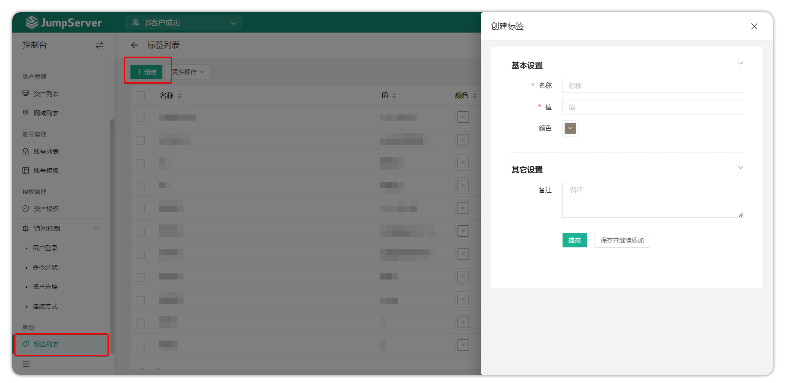
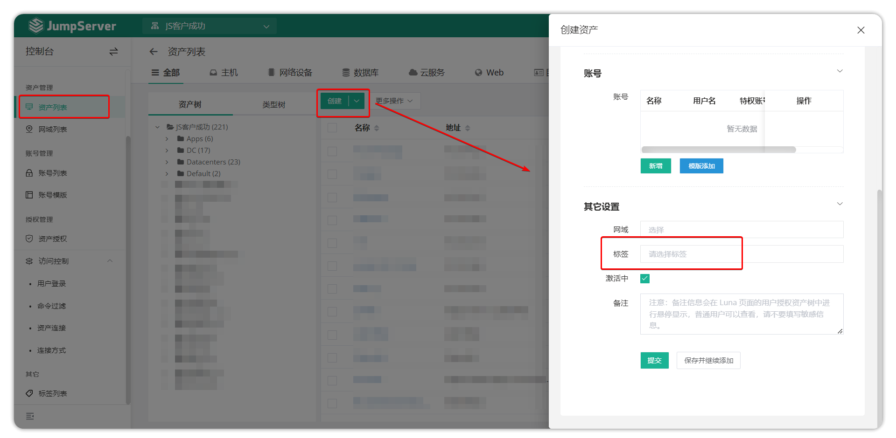
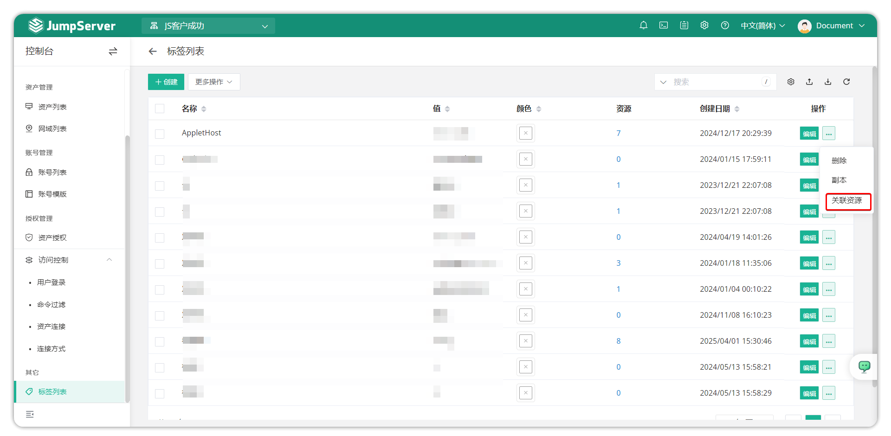
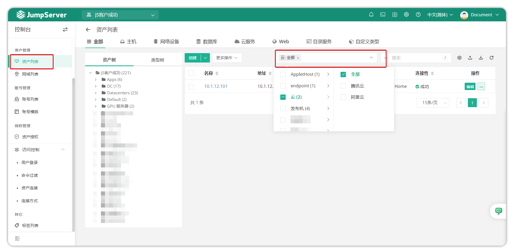

# Tag Management

## 1 Feature Overview

!!! tip ""
    - Enter the **Console** page, click **Other > Tag List** to open the tag list page.
    - JumpServer provides tagging functionality supporting adding tags to assets, users, and accounts for convenient resource querying and management. Users can customize various resource properties as tags to achieve resource classification, summarization, and analysis. Tags also support advanced features such as endpoint rules and application server binding, meeting distributed architecture deployment requirements.

## 2 Creating Tags

!!! tip ""
    - Click the **Create** button in the top-left of the tag management page to open the tag creation page.

!!! tip "Tag Configuration Instructions"
    - Tag information contains two parts: name and value.
    - **Name**: Used to describe the functional category of the tag, such as "Purpose", "Department", etc.
    - **Value**: Records specific tag information, such as "Organization-R&D Department-Frontend Team".
    - Tags can be added to assets during asset creation. Tag names can be repeated, and a single asset can be bound to multiple tags.
    - After deleting a tag, assets previously bound to that tag will automatically remove the corresponding tag information.

## 3 Tag Binding

!!! tip ""
    - Select the tags to be bound when creating assets.

## 4 Using Tags

!!! tip ""
    - Click on the resource count value in the tag list to add tags in bulk to existing resources.

!!! tip ""
    - On the asset list page, users can quickly locate target assets through tag filtering functionality.

## 5 Remote Application Server Tag Binding

!!! info ""
    - In distributed, multi-region system deployment environments, administrators can deploy multiple application servers to improve user access efficiency. Through JumpServer's tagging functionality, precise scheduling of specific servers accessing specific assets can be achieved, optimizing resource allocation and access performance.

!!! tip ""
    - Create server binding tags and configure in the following format:

    | Tag Name | Value | Description |
    | --- | --- | --- |
    | Server | Server name | Specify the server handling this asset access request |

    - Select target assets from the asset list and add corresponding server tags to them.
