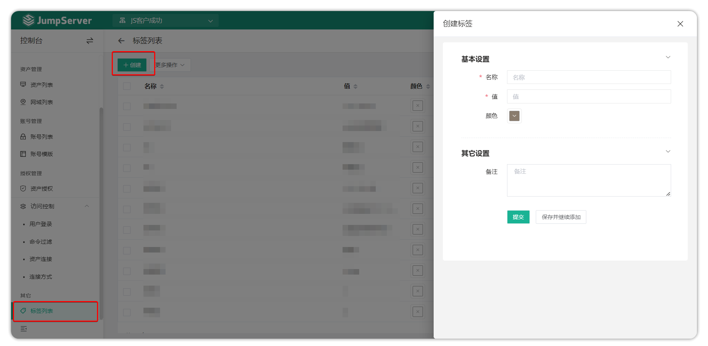
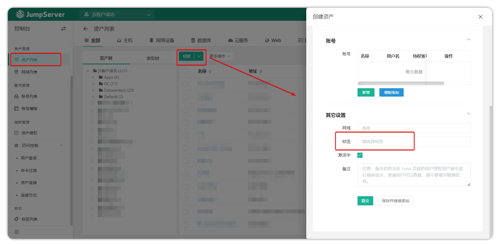
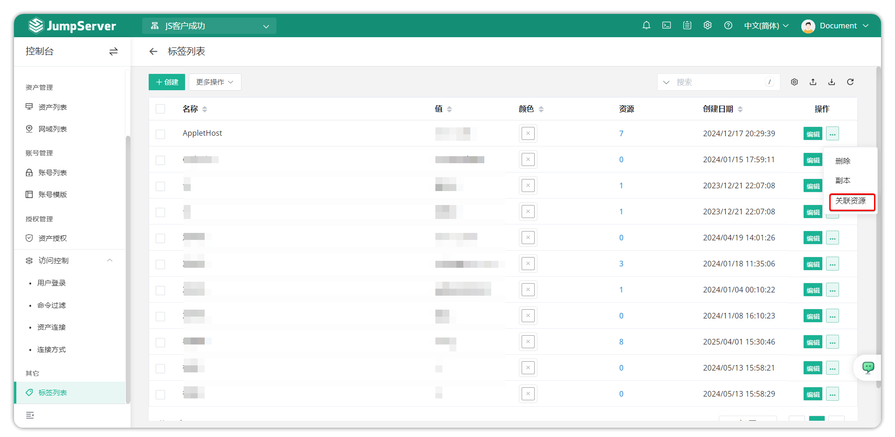
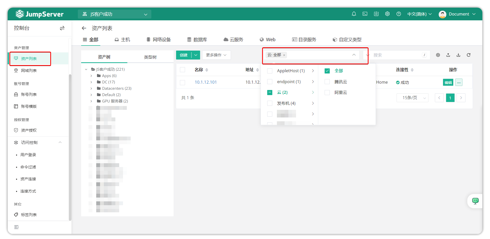

# 标签列表
## 1.功能简述
!!! tip ""
    - JumpServer 支持标签功能。将资产、用户、账号打上标签便于查询和管理，可以由用户自定义资源的各种属性作为标签，方便归类汇总分析。

## 2.标签的创建
!!! tip ""
    - 点击标签管理页面左上角``创建``按钮，进入标签创建页面。

!!! tip "提示"
    - 标签信息有名称和值。
    - 名称可以是描述功能信息，例如：用途。
    - 值则可以是具体信息，例如：组织，1-部门1-研发。
    - 在创建资产的时候，可以选择为该资产打上标签，标签名称可以重名，一个资产可以有多个标签。
    - 标签删除，资产上的标签信息会自动消失。

## 3.标签的绑定
!!! tip ""
    - 在创建资产的页面中选择标签绑定。

## 4.标签的使用
!!! tip ""
    - 点击标签列表中的资源数量值可以将已存在的资源打上标签。

!!! tip ""
    - 在资产列表页面上，用户可以通过标签过滤资产。
