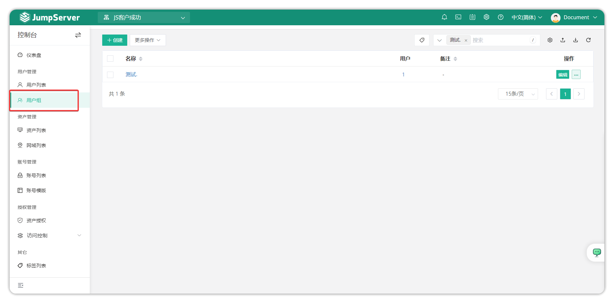
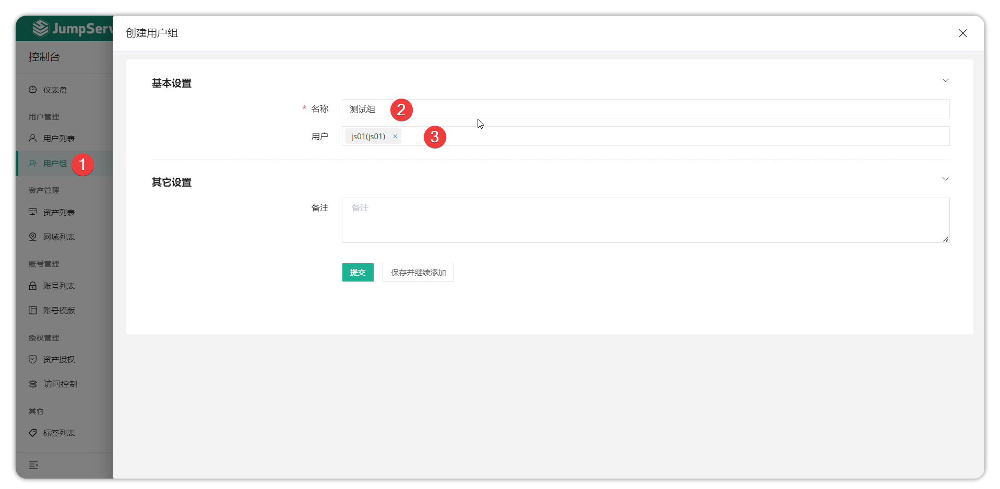
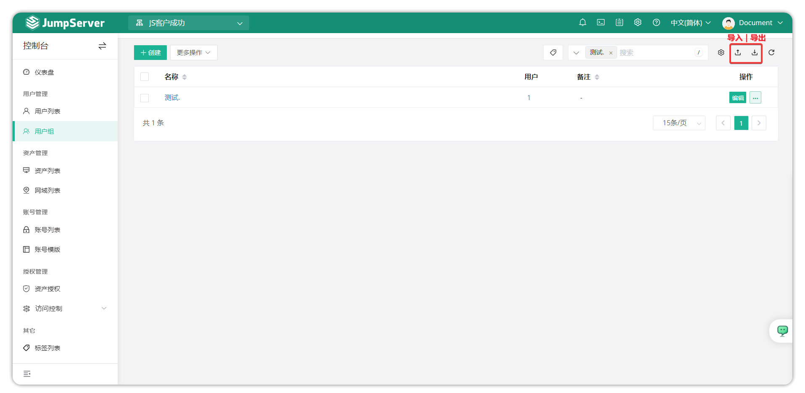
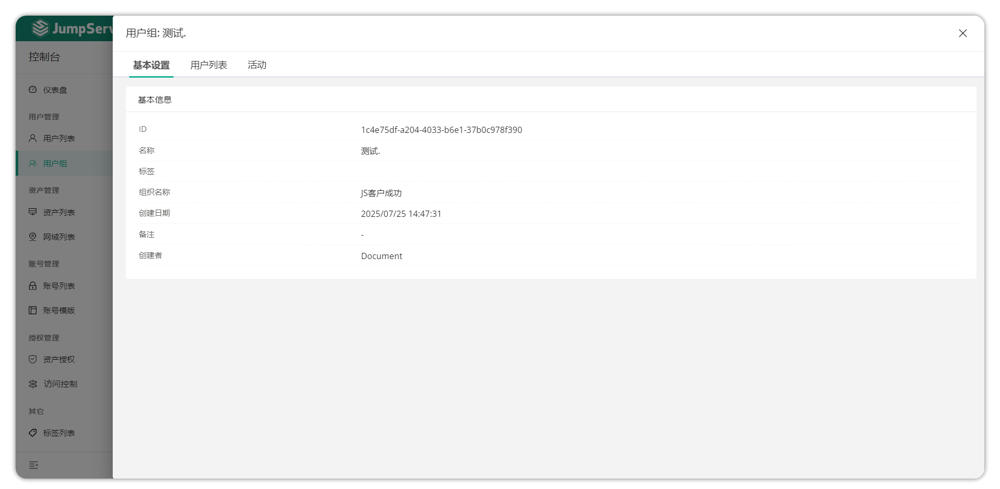
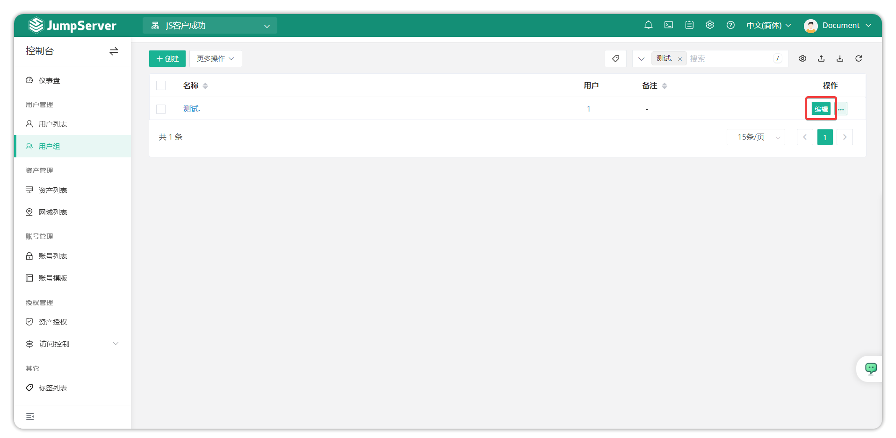
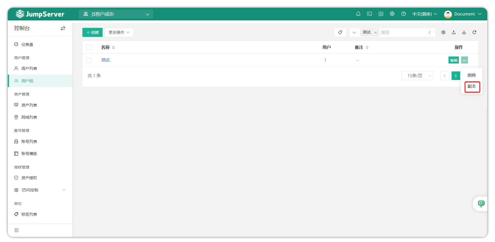
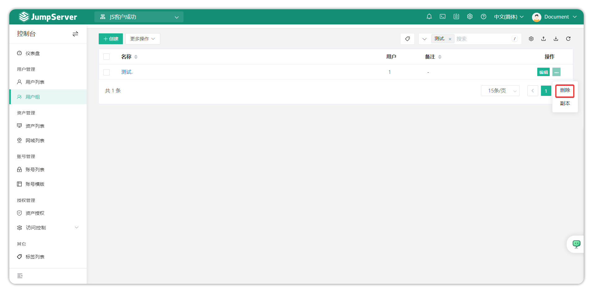
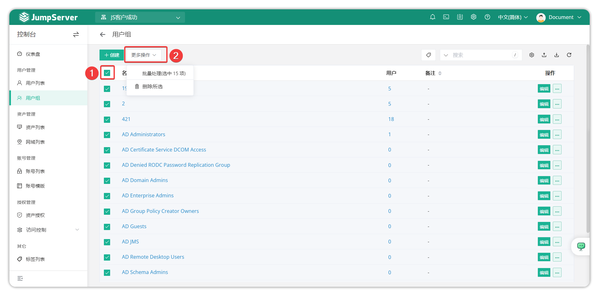

# User Group Management
## 1 Overview
!!! tip ""
    - Click the **Console** button on the navigation bar to open the **Console** page.
    - Click **User Management > User Groups** to open the **User Group List** page.
    - This page is used to manage JumpServer user groups, including creating, deleting, updating, and viewing user groups.
    - User groups organize users into groups. When assigning asset permissions, you can authorize entire user groups; a single user can join multiple user groups.

## 2 Create a user group
!!! tip ""
    - Click the Create button on the user group page to open the user group creation page.
    - Fill in the user group information and click Submit to complete the creation.

!!! tip ""
    - Detailed parameter descriptions:

| Parameter | Description |
|-----------|-------------|
| Name | The user group name |
| Users | Add users to the user group |

## 3 User group import/export
!!! tip ""
    - User groups support import for creation and export of existing user groups, supporting xlsx and csv table formats.
    - For the first import, click Import to download a template, fill in the information as prompted, and then import.

## 4 User group details
!!! tip ""
    - Click the user group name on the user group list page to open the user group detail page.
    - The user group detail page contains the user group basic information and activity logs.

!!! tip ""
    - Detailed parameter descriptions:

| Parameter | Description |
|-----------|-------------|
| Basic Info | The basic info page displays detailed information about the user group, including ID, name, member count, creator, and more. |
| Members | This option allows you to add or remove members from the user group. |
| Activity Logs | This option records activity logs for the user group, including creation time, creator, and other information. |

## 5 Update user group
!!! tip ""
    - When user group information changes, you can update the user group. Click the Edit button next to the corresponding user group to open the user group info page, make changes, and click Submit.

## 6 Clone user group
!!! tip ""
    - When you need to clone a user group, click the More button next to the user group and select Copy.

## 7 Delete user group
!!! tip ""
    - When you need to delete a user group, click the More button next to the user group and select Delete.

## 8 Bulk operations on user group list
!!! tip ""
    - Select the checkboxes next to user group names to perform bulk deletion operations from the More menu.
    
