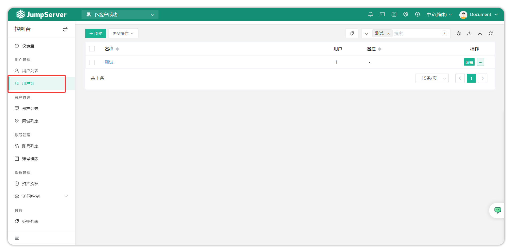
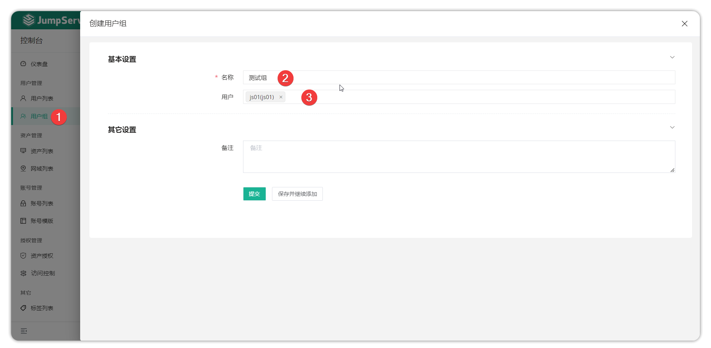
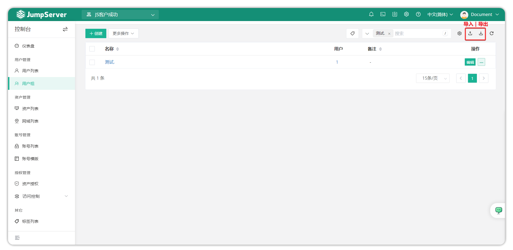
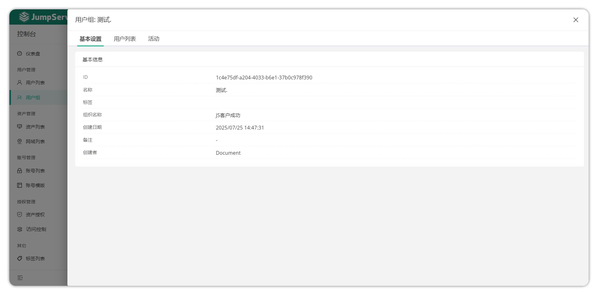
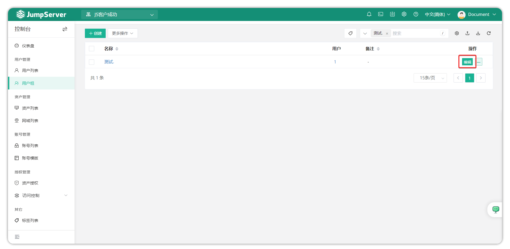
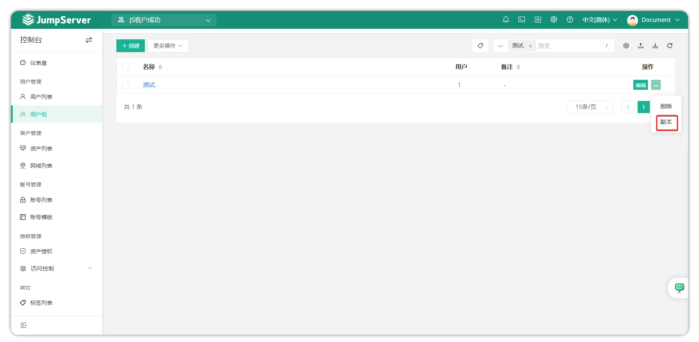
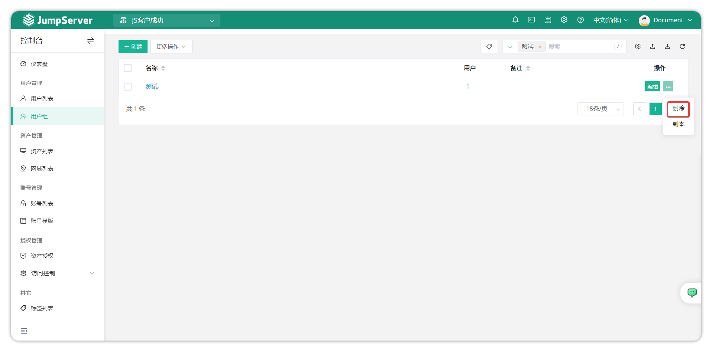
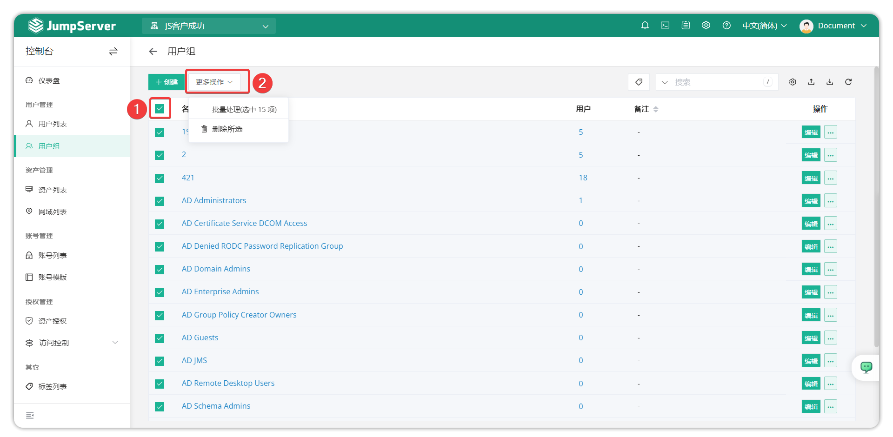

# 用户组管理
## 1.功能简述
!!! tip ""
    - 进入控制台页面，点击 **用户管理-用户组** ，即可进入用户组列表页面。
    - 该页面主要用于管理 JumpServer 用户组，包括新增、删除、更新和查看等操作。
    - 用户组是对用户进行分组管理，在分配资产权限的时候，可针对用户组进行授权，一个用户支持加入多个用户组。

## 2.创建用户组
!!! tip ""
    - 点击用户组页面的创建按钮，进入用户组创建页面。
    - 填写用户组相关信息，点击提交按钮后创建用户组完成。

!!! tip ""
    - 详细参数说明

!!! tip ""
| 参数 | 说明                    |
|------|------------------------|
|名称  | 用户组名称。            |
| 用户 | 将用户添加到该用户组中。 |

## 3.用户组导入导出
!!! tip ""
    - 用户组支持导入创建和已存在用户组导出，支持 xlxs 和 cvs 的表格格式。
    - 首次导入，可点击导入按钮下载模板后根据提示填写信息后导入。

## 4.用户组详情
!!! tip ""
    - 在用户组列表页面点击用户组名称，进入用户组详情页面。
    - 用户组详情页包含的信息包括用户组基本信息以及活动记录。

!!! tip ""
    - 详细参数说明

!!! tip ""
| 参数     | 说明                                                              |
|----------|------------------------------------------------------------------|
|基本信息  | 基本信息页面显示该用户组的详细信息，包括ID、名称、用户数量、创建者等信息。                                                                          |
| 成员     | 该选项可增加或删除该用户组中的成员。                                 |
| 活动记录 | 该选项记录该用户组的活动记录，创建时间、创建人等等信息。               |

## 5.更新用户组
!!! tip ""
    - 对于用户组信息变动情况，可以对用户组信息进行更新。点击对应用户组后方的编辑按钮，进入用户信息页，改动后点击提交按钮即可。

## 6.克隆用户组
!!! tip ""
    - 当需要克隆用户组时，可以点击相应的用户组后方的更多按钮，选择副本按钮，点击副本即可。

## 7.删除用户组
!!! tip ""
    - 当需要删除用户组时，可以点击相应的用户组后方的更多按钮，选择删除按钮，点击删除即可。

## 9.用户组列表批量操作
!!! tip ""
    - 勾选用户组名称前面的框框，可以在更多操作中对用户组进行批量删除。
    