# User Management
## 1 Overview
!!! tip ""
    - Click the **Console** button on the navigation bar to open the **Console** page.
    - Click **User Management > User List** to open the **User List** page.
    - This page is mainly used to manage JumpServer users, including creating, deleting, updating and viewing users.
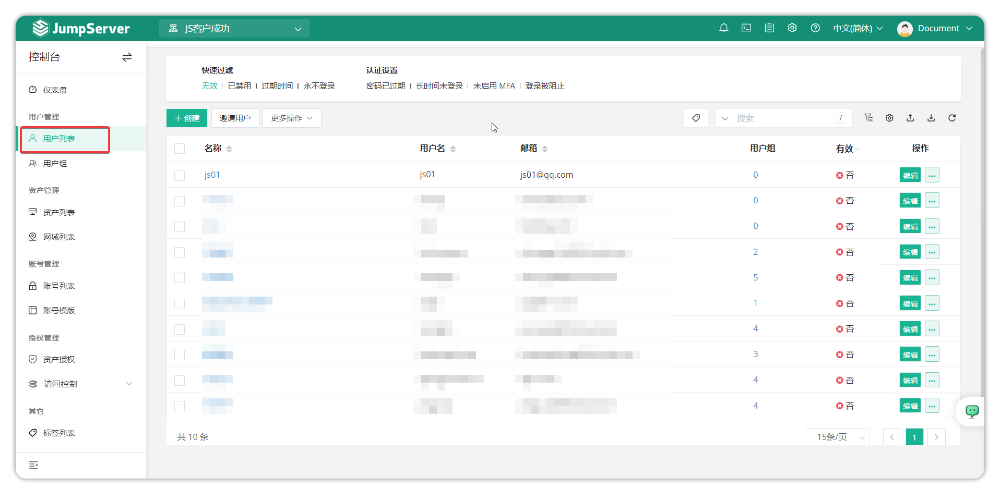
## 2 Create a user
!!! tip ""
    - Click the Create button on the user list page to open the user creation detail page.
    - From the user list page, click the Create button to enter the user creation detail page.
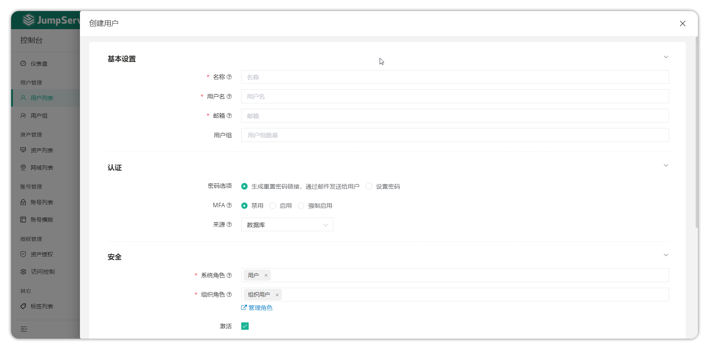

!!! info "Note: Organization roles and organization management are X-Pack (Enterprise) features."
!!! tip ""
    - Detailed parameter descriptions:

| Parameter | Description |
| --------- | ----------- |
| Name | The display name for the user; can be duplicated |
| Username | The account used to log in to JumpServer; must be unique |
| Email | The email address associated with the account; must be unique |
| User Group | Manage users by groups, mainly used for asset authorizations; when an asset is authorized to a user group, all users in that group get the corresponding permissions |
| Password Policy | When an admin creates a user, they can set the password or generate a password and send it to the user by email. After successfully submitting the user info, JumpServer will send a password setup email to the provided address. |
| MFA | Multi-Factor Authentication. When enabled, users must enter username/password (first factor) and a one-time code from their MFA device (second factor), providing stronger account protection. |
| Source | Specifies the source of the user, e.g., "Database" for manually created users or "LDAP" for imported users |
| System Role | Determines a user's permissions at the system level (e.g., System Admin, Auditor, User/custom roles) |
| Organization Role (X-Pack) | Determines a user's permissions at the organization level (e.g., Org Admin, Auditor, User/custom roles) |
| Active | Indicates whether the user is active and allowed to log in; inactive users cannot log in |
| Expiration Date | The last date the user is allowed to log in; after this date login is prohibited |
| Mobile | Optional; user's phone number used for receiving MFA SMS |
| WeChat | Optional; user's enterprise WeChat for WeChat-based authentication |
| Note | Optional; admin can add notes about the user |

## 3 Invite users (X-Pack)
!!! info "Note: Invite users and organization management are X-Pack (Enterprise) features."
!!! tip ""
    - Click the Invite User button on the user detail page to use the invite feature.
    - This feature is used when a JumpServer user exists in the system but not within the current organization; invite them to join the current organization.
    - After clicking Invite User, enter the user to be invited and set their organization role in the popup, then click Submit to save.
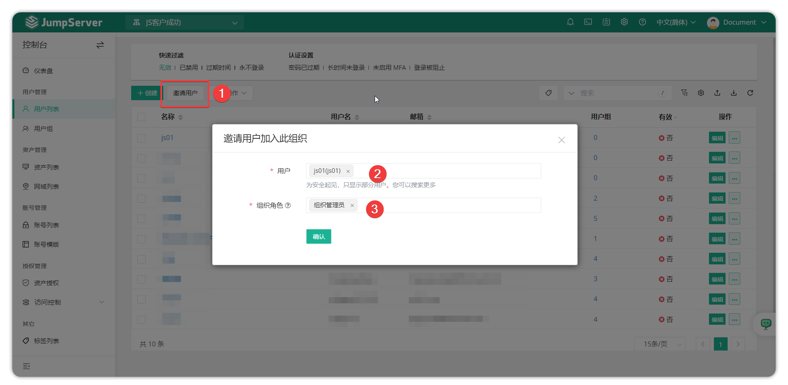
## 4 Importing and exporting users
!!! tip ""
    - Users can be imported for creation or update, and existing users can be exported. Supported formats: xlsx and csv.
    - For the first import, click Import to download a template and fill it according to instructions before importing.
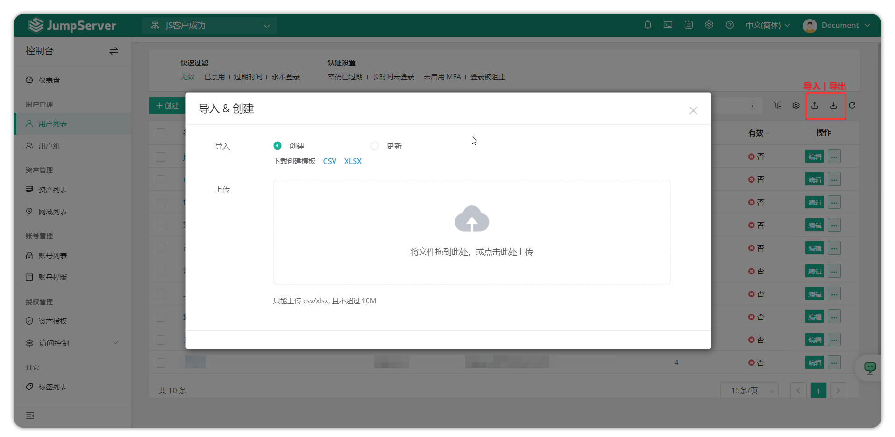
## 5 User details
!!! tip ""
    - Click a user's name on the user list page to open the user detail page.
    - The user details page contains basic info, authorized assets, asset authorization rules, user authorization rules, and activity logs.
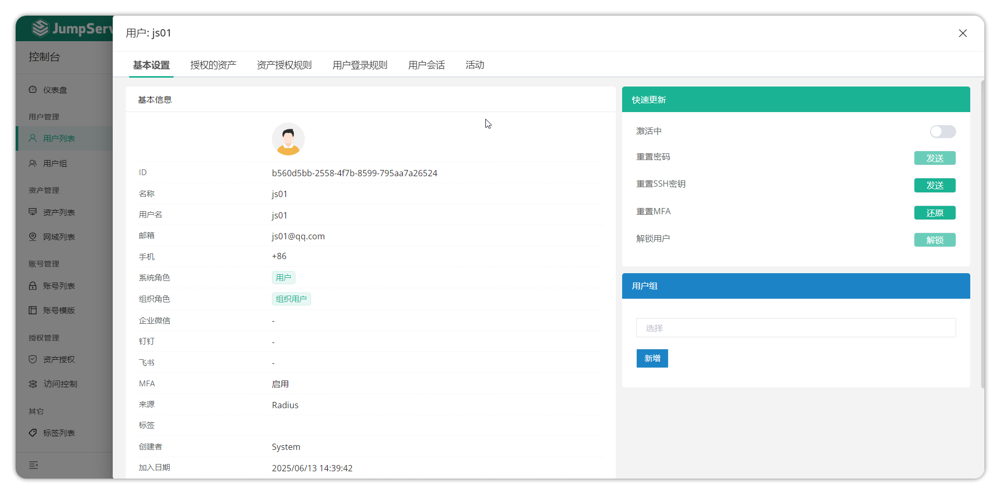
!!! tip ""
    - Detailed parameter descriptions:
| Parameter | Description |
| --------- | ----------- |
| Basic Info | Shows detailed user information including ID, name, username, email, roles, creator, etc. |
| Authorized Assets | Lists assets authorized to the user within the current organization |
| Asset Authorization Rules | Lists asset authorization rules that include this user |
| User Login Rules | The login policy settings for this user. You can configure rules to restrict when the user can log in (e.g., only during certain time windows). |
| Activity Logs | The user's login/activity records |
| Activate | Quick action button to allow or disallow this user from logging in |
| Reset MFA | Quick action to reset the user's MFA to initial state; the user must re-bind MFA on next login |
| Reset Password | Quick action to send a password reset email to the user |
| Reset SSH Key | Quick action to send a reset SSH Key email to the user |
| Unlock User | Quick action to unlock a user who has been locked due to multiple failed login attempts |
| User Groups | Quick action to add the user to a group via a select box or remove them via the delete button next to joined groups |

### 5.1 User Login Rules
!!! tip ""
    - Click the User Login Rules button on the user detail page to set rules that limit the user's login IPs and login time windows.
    - Configure the login rule on this page and click Submit to save and apply.
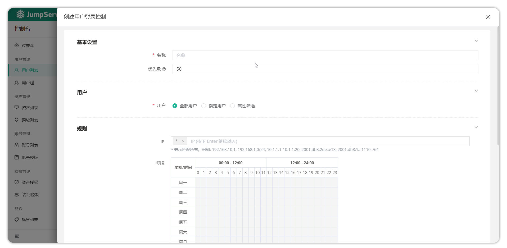
!!! tip ""
    - Detailed parameter descriptions:
| Parameter | Description |
| --------- | ----------- |
| Name | The name of the login rule |
| Priority | The priority of the rule; lower numbers have higher priority |
| IP Group | The IPs restricted by this rule, specified as a comma-separated string. Use * to match all. Examples: 192.168.10.1, 192.168.1.0/24, 10.1.1.1-10.1.1.20, 2001:db8:2de::e13,2001:db8:1a:1110::/64. These IPs refer to the user's source IP when logging in. |
| Time Window | The time period during which the rule applies |
| Action | The action when the rule is executed: **Deny**, **Allow**, or **Login Review**. These mean deny login, allow login, or require approval from specified approvers before login, respectively. |
| Enabled | Whether the login rule is active |

## 6 Updating user information
!!! tip ""
    - To update a user's information, click the edit button next to the user on the user list page to edit and update the user's info.
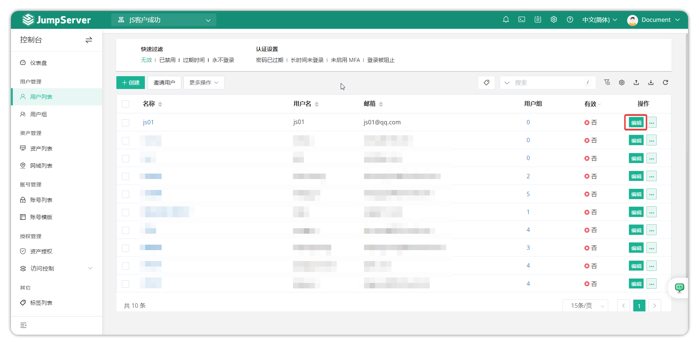
## 7 Clone user
!!! tip ""
    - If a user's information is identical or mostly identical to another, click the More button next to the user and choose Copy to open the user form with prefilled values. Modify the necessary fields and submit.
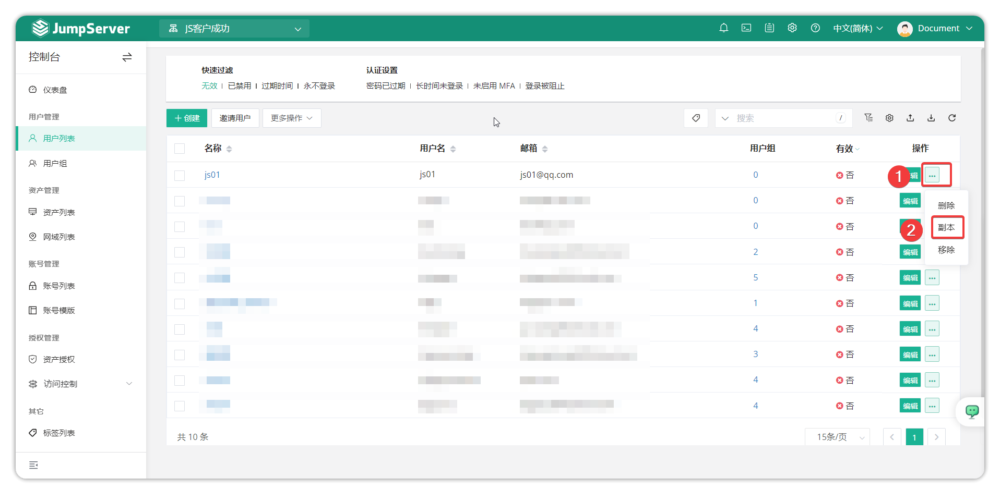
## 8 Delete / Remove user
!!! tip ""
    - To remove a user from the current organization, click More next to the user and select Remove (the user can be re-invited to the organization later).
    - To delete a user from the entire JumpServer system, click More next to the user and select Delete (this will remove the user data from the database and is irreversible).
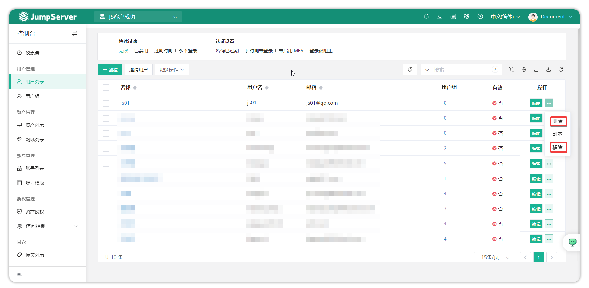

## 9 Bulk operations on the user list
!!! tip ""
    - Select the checkboxes before user names to perform bulk operations such as bulk removal, disable, activate, etc., from the More menu.
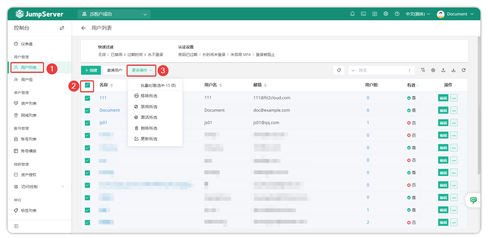  

## 10 Quick user actions
### 10.1 Unlock user
!!! tip ""
    - When a user is temporarily locked due to multiple failed logins, the administrator can unlock the user. On the user list, click the user and use the quick update card on the right of Basic Info to unlock the user.
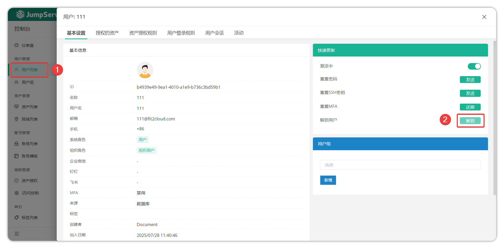 

### 10.2 Reset password
!!! tip ""
    - If a user forgets their password, an admin can send a reset email. The user can then set a new login password. On the user list, click a user and in the Basic Info right panel click Reset Password > Send Email. The system will send a password reset email. In the email the user clicks "Click here to reset password" to open the reset page, enters and confirms the new password, then clicks Submit. The user will receive a notification email after a successful password reset.
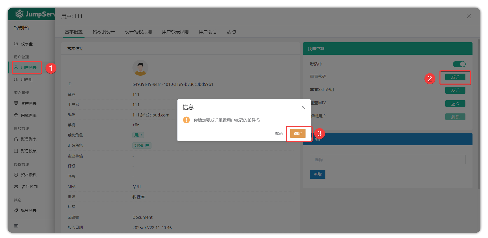 

### 10.3 Reset SSH keys
!!! tip "" 
    - On the user list, click a user and find the Reset SSH Key section in the Basic Info right panel, then click Send. Confirm in the popup. The system will send a reset SSH key email. In the email the user clicks "Click here to set" to open the SSH key page, where they can add or remove SSH keys.
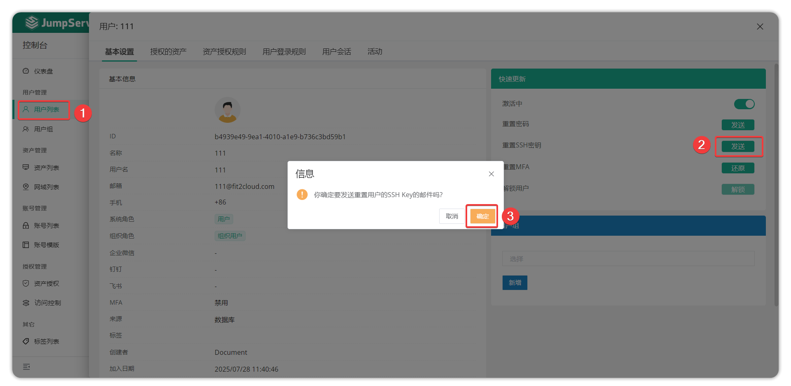

### 10.4 Reset MFA
!!! tip "" 
    - If a user cannot log in because their MFA is lost, an admin can reset the user's MFA. In the Basic Info right panel find Reset MFA and click the Reset button.
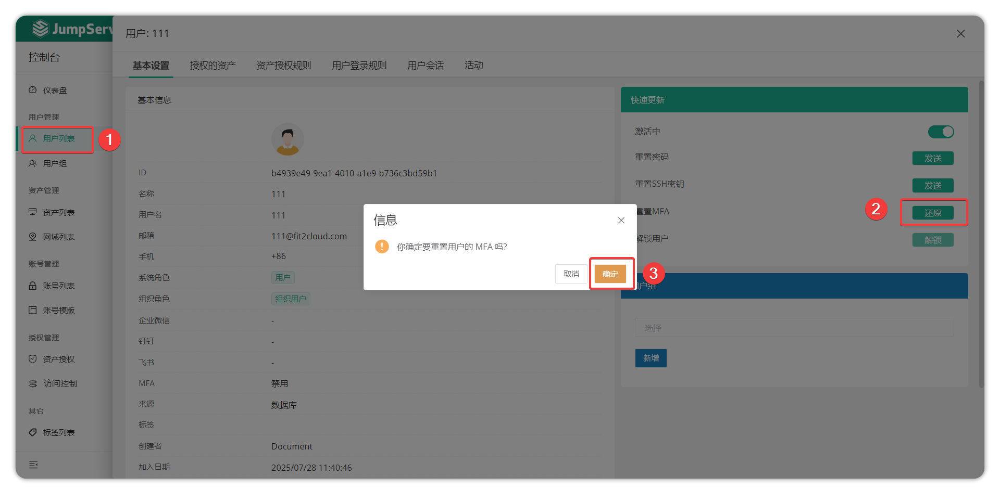
