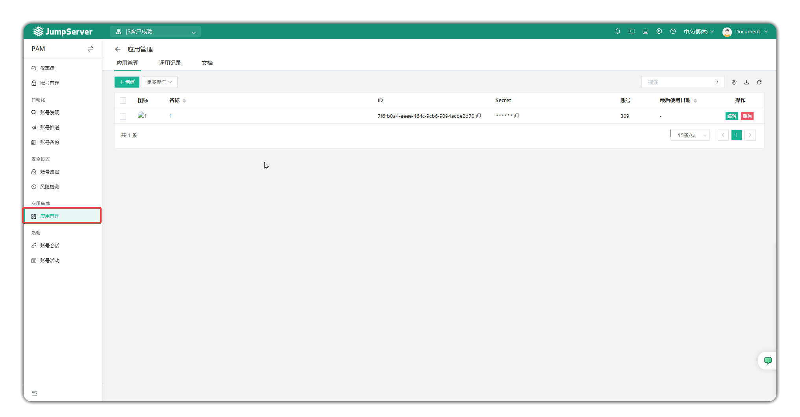
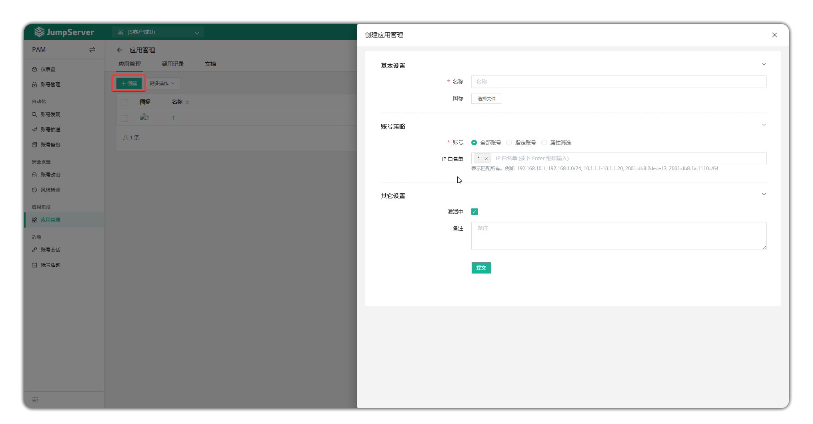
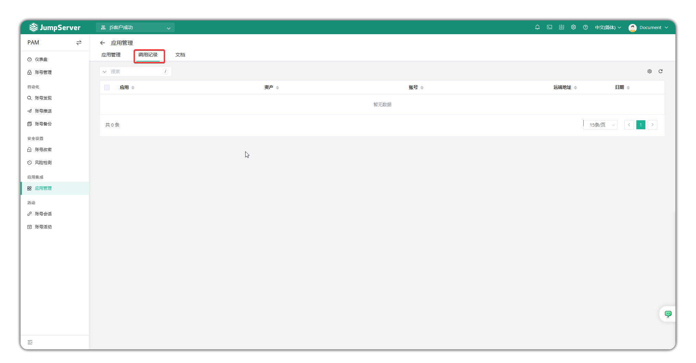
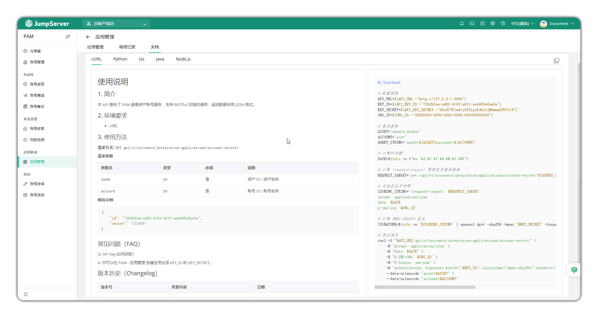

# Application Management

## 1 Overview
!!! info "Note: Application management is a JumpServer Enterprise edition feature."
!!! tip ""
    - Go to the **PAM** page, click **Application Management > Application Management** to open the application management page.
    - Application management provides unified invocation and retrieval services of asset accounts and passwords for external systems (accessed via API interface).

## 2 Create application
!!! tip ""
    - Click the **Create** button to create a new application.
    - You can set the application name, upload an icon, specify account policy and IP whitelist, set whether to activate, and set notes.

## 3 Invocation records
!!! tip ""
    - Click **Invocation Records** to view the invocation history of the application.

## 4 Documentation
!!! tip ""
    - Click **Documentation** to view API invocation examples based on cURL, Python, Go, Java, and Node.js.
    - This API provides PAM asset account viewing service, supporting RESTful-style invocation and returning data in JSON format.
    - For API documentation, please refer to: https://docs.jumpserver.org/en/v4/dev/rest_api/

