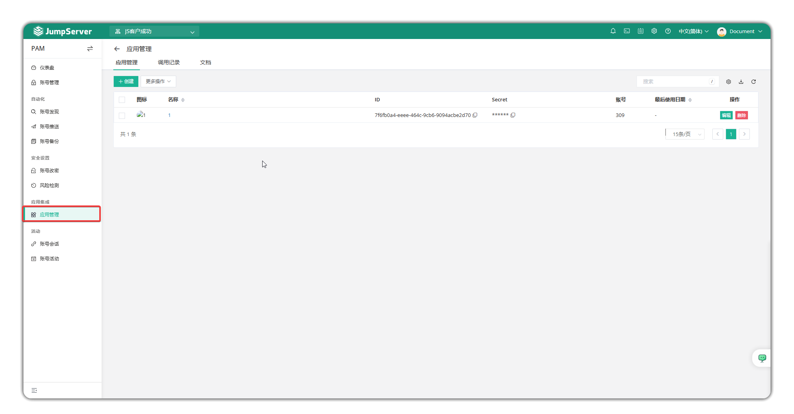
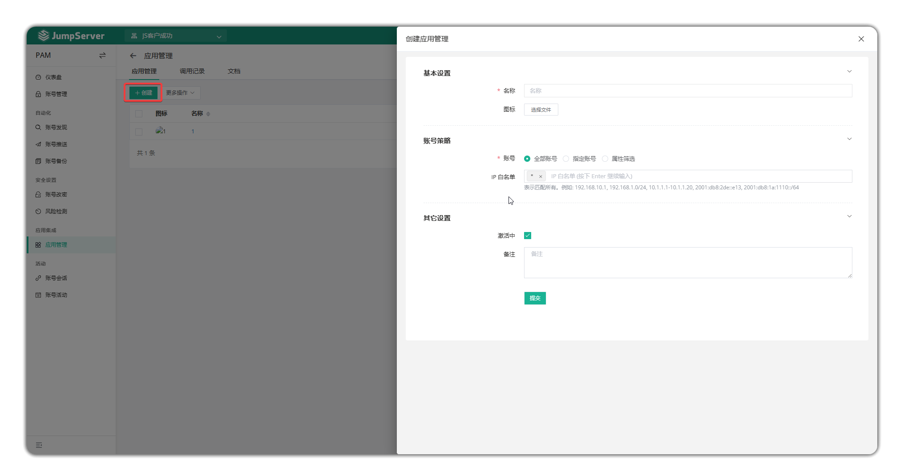
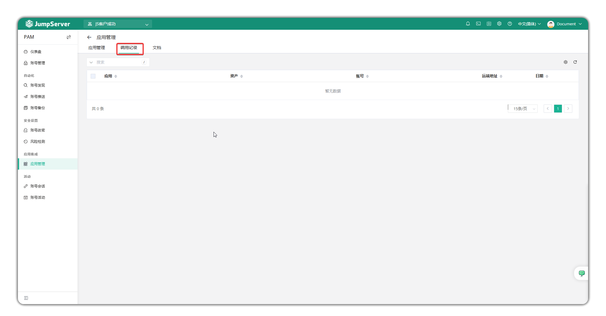
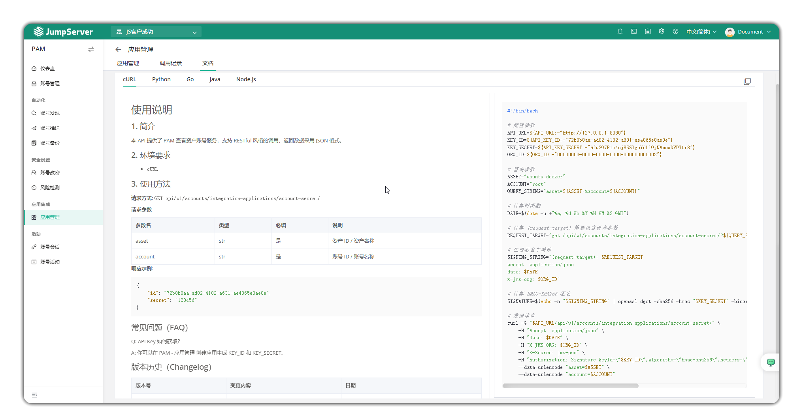

# 应用管理

## 1 功能概述
!!! info "注: 应用管理为 JumpServer 企业版功能。"
!!! tip ""
    - 进入 **PAM** 页面，点击 **应用管理 > 应用管理**，进入应用管理页面
    - 应用管理用于为外部系统提供资产账户和密码的统一调用与检索服务(通过 API 接口访问)

## 2 创建应用
!!! tip ""
    - 点击 **创建** 按钮，即新建一个应用。
    - 可以设置应用的名称、上传图标、指定账号策略和IP白名单、设置是否激活、设置备注。

## 3 调用记录
!!! tip ""
    - 点击 **调用记录**，可以查看应用的调用记录。

## 4 文档
!!! tip ""
    - 点击 **文档**，可以查看基于cURL、Python、Go、Java、Node.js的API调用示例。
    - 本API提供了PAM查看资产账号服务，支持RESTful风格的调用，返回数据采用JSON格式。
    - 关于API文档，请参考: https://docs.jumpserver.org/zh/v4/dev/rest_api/
