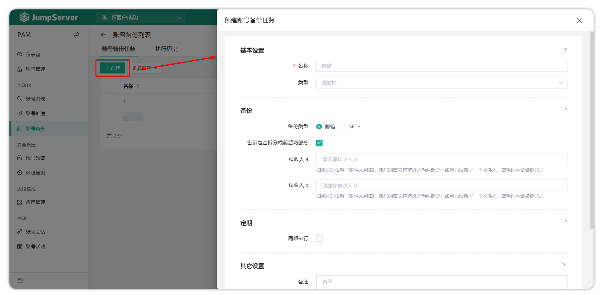
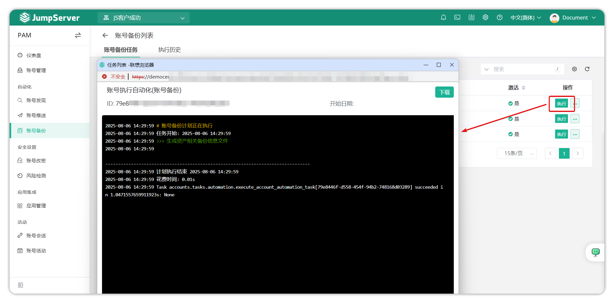
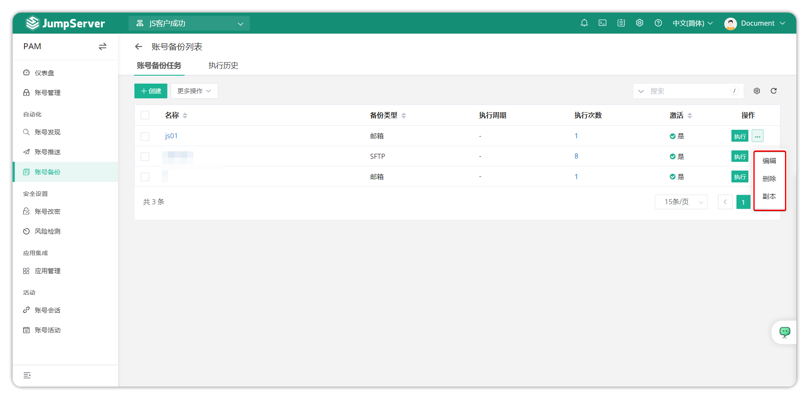
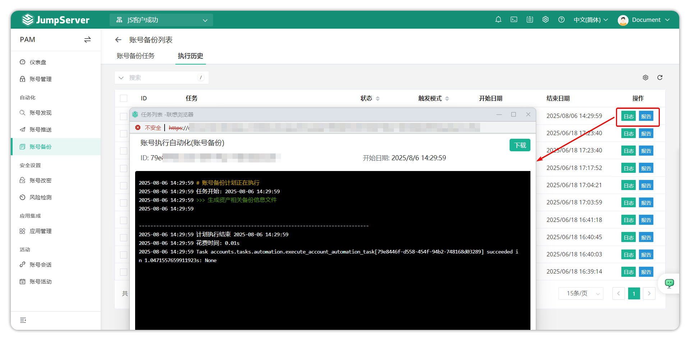

# Account Backup
## 1 Overview
!!! tip ""
    - Click the **PAM** button on the navigation bar to open the **PAM** page.
    - Click **Automation > Account Backup** to open the **Account Backup** page.
    - To prevent uncontrollable factors such as server data corruption and asset account loss that may prevent the environment from running normally, JumpServer supports an account backup feature that can backup all asset accounts on JumpServer. Backup strategies can be immediate or scheduled backup.
## 2 Account backup task
!!! tip ""
    - Click the **Create** button on the **Account Backup Task** page to create an automation task for account backup. Fill in the account backup task information completely and confirm settings to create.

!!! tip ""
    - Detailed parameter descriptions:
|Parameter|Description|
|--------|-------------------|
|Name|The name of the account backup task|
|Type|The type of accounts to backup; backup tasks can be created by account type|
|Backup Type|Account backup method; you can choose to send by email or store to a specified server via SFTP protocol|
|Split secret key into two parts|Whether to split the account secret key into two parts to enhance security; if two recipients or two servers are selected, the secret key file will be split into two parts and sent separately|
|Recipients/Receiving servers|Backup files can be sent to users by email or uploaded to a server via SFTP protocol|
|Periodic execution|Optional; select whether the automation task executes periodically and set the execution time|
|Note|Optional; task notes|

!!! tip ""
    - Select the **Execute** function to execute the account backup function. After execution, you can view the task execution status.

!!! tip ""
    - Click the **More** button next to the account backup task to edit, delete, and copy.

## 3 Execution history
!!! tip ""
    - This page mainly displays the execution history, execution logs, and detailed information about account backups.

