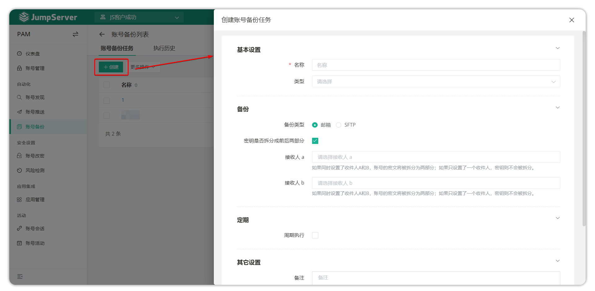
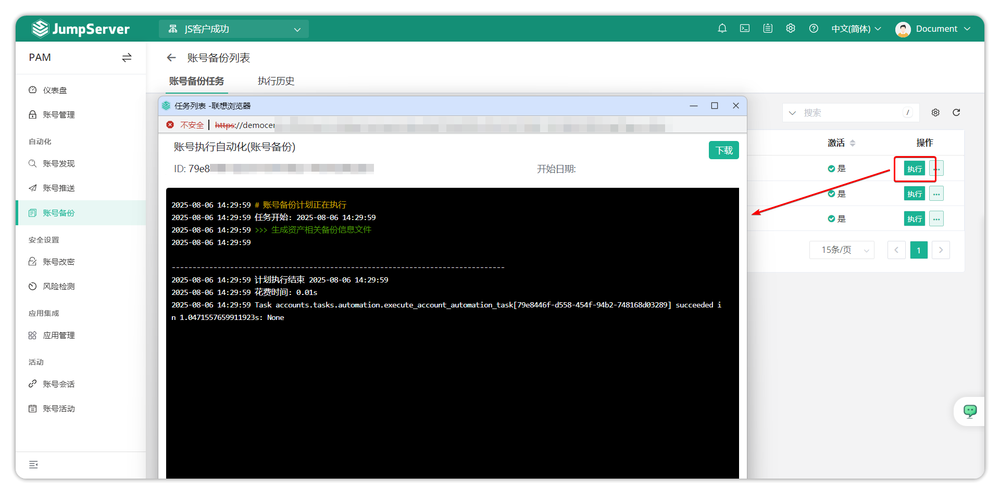
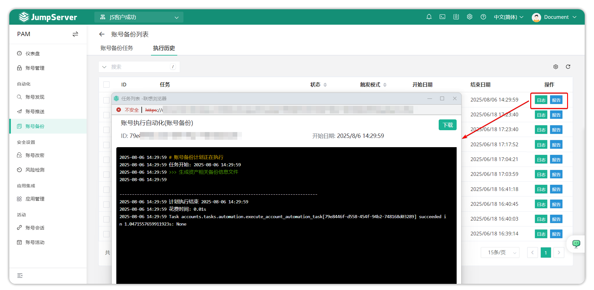

# 账号备份
## 1 功能概述
!!! tip ""
    - 进入 **PAM** 页面，点击 **自动化 > 账号备份** ，进入账号备份页面。
    - 为了防止不可控因素导致服务器出现数据损坏、资产账户丢失等问题，环境无法正常运行的情况，JumpServer 支持了账户备份功能，该功能可备份 JumpServer 上所有的资产账户。备份策略可选择即时备份和定时备份。
## 2 账号备份任务
!!! tip ""
    - 单击**账户备份任务**页面上的 **创建** 按钮，创建一个用于账户备份的自动化任务。完整填写账户备份任务的信息并确认设置以创建。

!!! tip ""
    - 详细参数说明:
|参数    |说明|
|--------|-------------------|
|名称    |账号备份任务名称|
|类型    |需备份账号的类型，可按账号类型创建备份任务|
|备份类型|账号备份方式，可选择通过邮件发送或通过 SFTP 协议存入指定服务器|
|密钥是否拆分成前后两部分|是否将账号密钥拆分为两部分以提升安全性，如同时选择两个接收人或两台服务器，密钥文件将拆分成两部分分别发送|
|接收人/接收服务器|备份文件可通过邮件发送给用户或通过 SFTP 协议上传至服务器|
|周期执行|非必填项，选择该自动化任务是否定时执行，设置定时任务执行时间|
|备注     |非必填项，任务备注信息|

!!! tip ""
    - 选择 **执行** 功能，执行推送账号功能。执行后，可以查看任务执行状态。

!!! tip ""
    - 点击账号备份任务旁边的 **更多** 按钮，进行编辑、删除和复制。

## 3 执行历史
!!! tip ""
    - 此页主要显示帐户备份任务执行的历史记录、执行日志以及有关帐户备份的详细信息。
