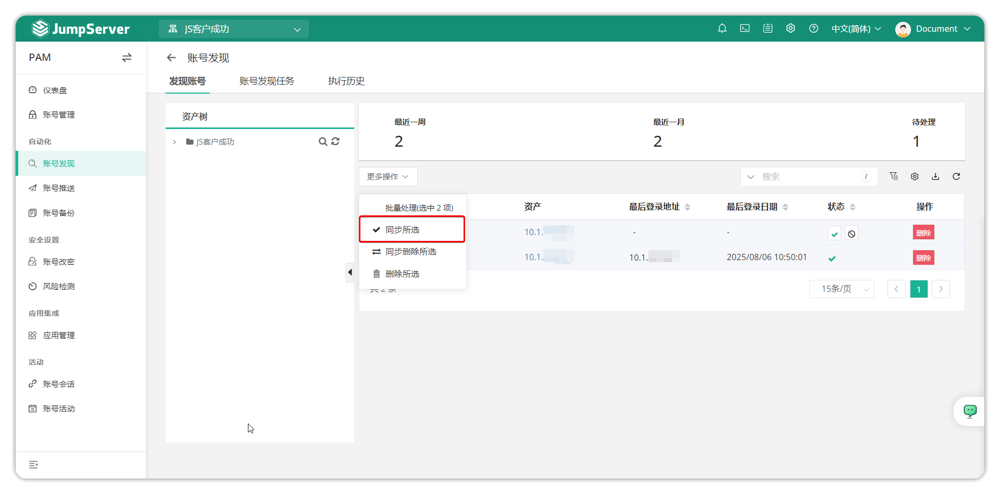
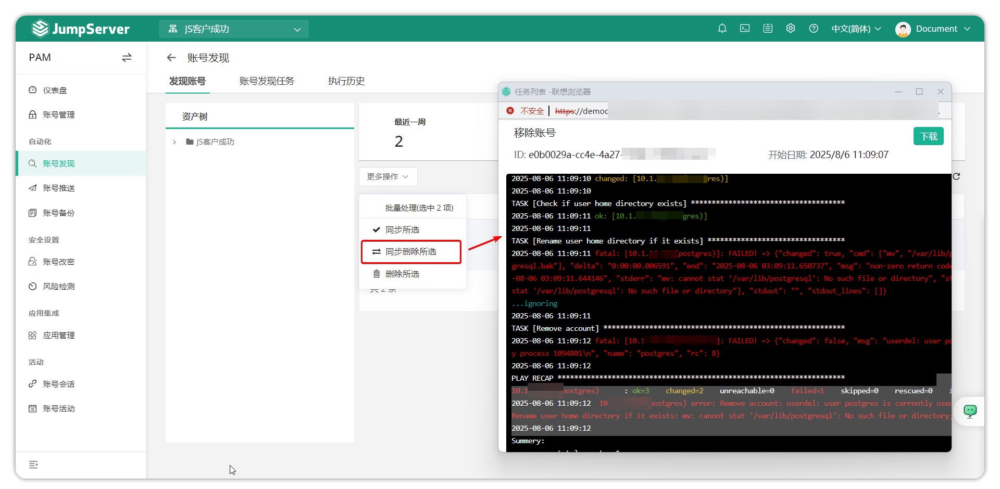
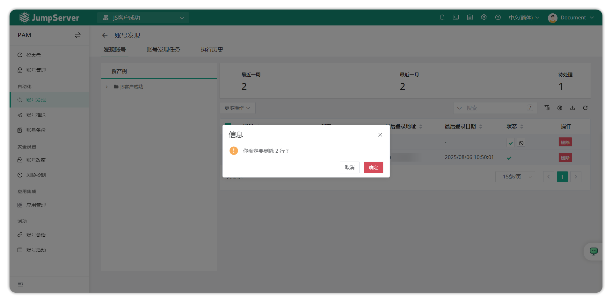
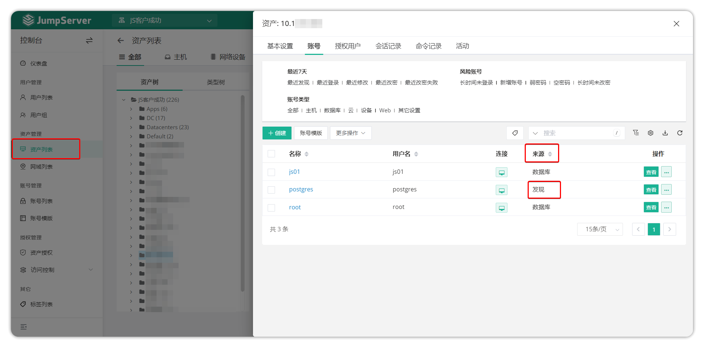
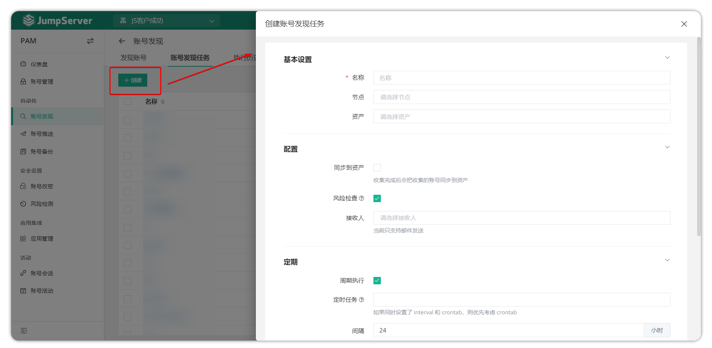
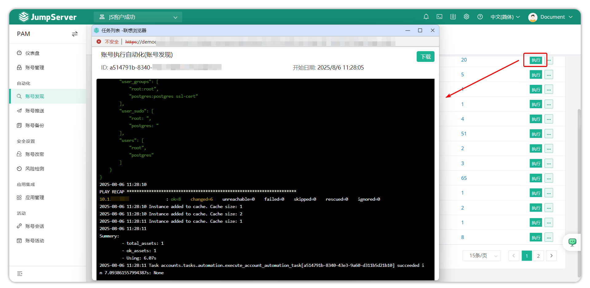
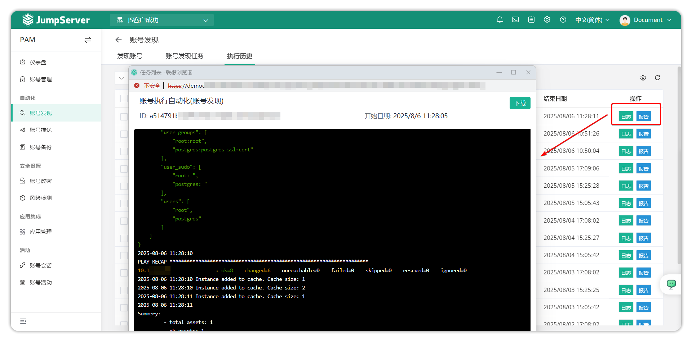

# 账号发现
## 1.功能概述
!!! tip ""
    - 进入 **PAM** 页面，点击 **自动化 > 账号发现** ，进入账号发现页面。
    - 账户发现功能可以收集 JumpServer 管理的资产上的账户信息，通过执行任务来收集资产账户信息。JumpServer 支持将发现的账户信息与 JumpServer 管理的资产绑定，减少人工操作。
## 2.发现账号
!!! tip ""
    - 选中账号后，点击 **更多** 中的 **同步所选** 按钮，将收集到的用户绑定到相应的资产。

!!! tip ""
    - 点击操作中的 **删除同步所选** 按钮，从服务器中删除账户。

!!! tip ""
    - 点击操作中的 **删除所选** 按钮，从账户发现中删除账户。

!!! tip ""
    - 账户绑定后，会发现账户来源。

## 3.账号发现任务
!!! tip ""
    - 在 **帐户发现任务** 页面中的 **创建** 按钮，以创建用户发现任务。

!!! tip ""
    - 成功创建后，选择 **执行** 按钮以执行收集用户任务。

## 4.执行历史
!!! tip ""
    - 执行列表页面主要显示已执行的发现用户任务的详细信息和日志。单击相应已执行日志旁边的 **日志** 按钮或 **报告** 按钮，查看任务执行的详细信息。
