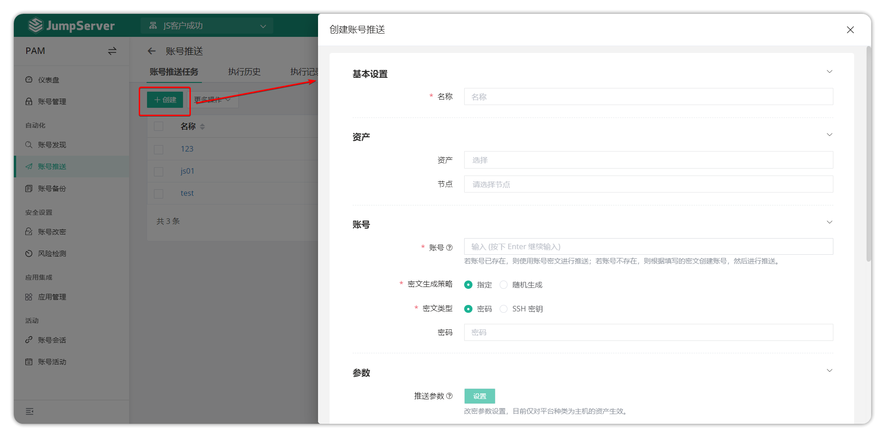
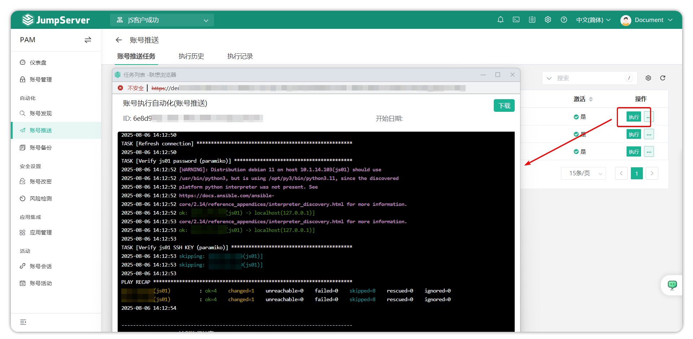
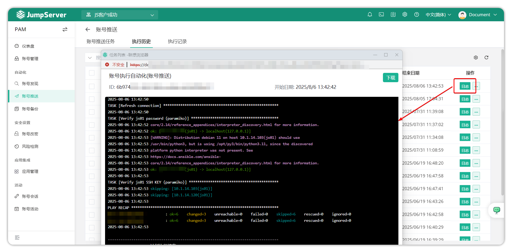
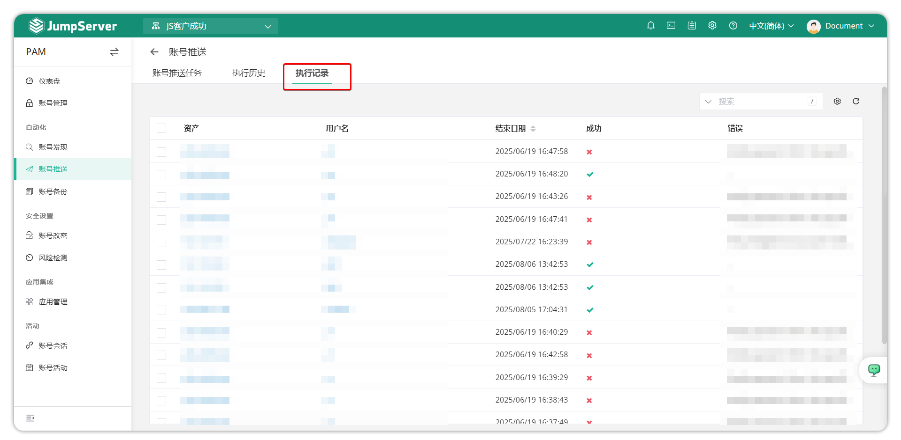

# Account Push
## 1 Overview
!!! tip ""
    - Go to the **PAM** page, click **Automation > Account Push** to open the account push page.
    - JumpServer supports automatic user configuration for managed assets. It includes pushing accounts, push task execution history, and execution records.
## 2 Account push task
!!! tip ""
    - Click the **Create** button on the **Account Push Task** page to create a user push task.

!!! tip ""
    - Detailed parameter descriptions:
|Parameter|Description|
|----------------|-------------------|
|Name|The name of the account push task|
|Assets|Assets that need to have accounts pushed to them|
|Node|Nodes that need to have accounts pushed to them|
|Username|The account name to be pushed to the asset|
|Password Policy - Cipher generation policy|Select the password policy for the user being pushed.  Specified: The administrator manually enters the password.  Random: JumpServer generates the password automatically|
|Password Policy - Cipher type|The type of cipher text for the user being pushed|
|Password|If cipher generation policy is specified, the administrator enters the password. If cipher generation policy is random, the administrator sets password generation rules, such as password length, password strength rules, etc.|
|Push parameters|Optional; Windows assets support configuring user groups for pushed accounts (such as Administrators group);  Unix-like assets support configuring Sudo permissions, shell, home directory, user groups, and user ID for pushed accounts.  **Currently only effective for assets with platform type of host**|
|Periodic execution|Optional; select whether the automation task executes periodically and set the execution time|
|Check connection after change|When enabled, the pushed account will test account connectivity|
|Active|When enabled, the pushed account will test account connectivity|
|Note|Optional; push task notes|

## 3 Execute account push
!!! tip ""
    - Select the **Execute** button to execute the account push function and view the results.

## 4 Execution history
!!! tip ""
    - This page mainly shows the execution logs of account push scheduled tasks. You can click **Logs** on the right side of the execution history to view.

## 5 Execution records
!!! tip ""
    - This page is mainly used to view detailed change records of account push scheduled tasks.

