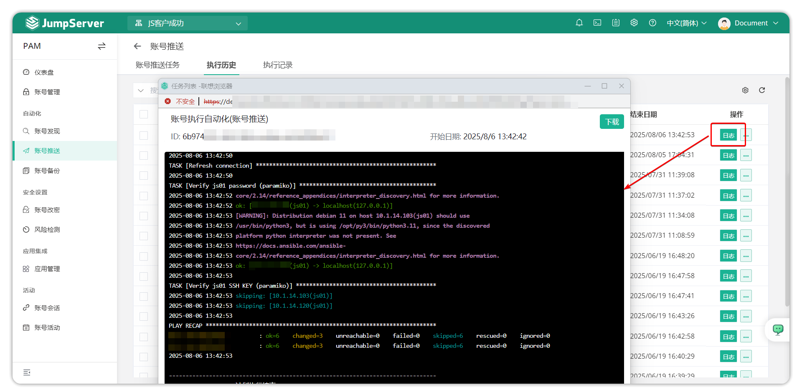

# 账号推送
## 1.功能概述
!!! tip ""
    - 进入 **PAM** 页面，点击 **自动化 > 账号推送** ，进入账号推送页面。
    - JumpServer 支持对托管资产进行自动用户配置。它包括推送帐户、推送任务执行历史和执行记录。
## 2.账号推送任务
!!! tip ""
    - 在 **帐户推送任务** 页面中的 **创建** 按钮，以创建用户推送任务。

!!! tip ""
    - 详细参数说明:
|参数 |说明|
|----------------|-------------------|
|名称             |账号推送任务的名称。|
|资产             |需要被推送账户的资产。|
|节点            |需要被推送账户的节点。|
|用户名          |需要被推送到资产的账号名称。|
|密码策略-密文生成策略|选择被推送的用户的密码策略。 指定：管理员用户手动输入密码。 随机：JumpServer 自行生成密码。
|密码策略-密文类型|被推送的用户密文的类型。|
|密码             |选择密文生成策略为指定，管理员用户输入密码。选择密文生成策略为随机，管理员用户设置密码生成规则，例如：密码长度、密码强弱规则等等。|
|推送参数         |非必填项，Windows 资产支持配置推送账号的用户组（如 Administrators 组）； 类 UNIX 资产支持配置推送账号的 Sudo 权限、Shell、家目录、用户组及用户 ID。 **目前仅对平台类型为主机的资产生效**。|
|周期执行       |非必填项，选择该自动化任务是否定时执行，设置定时任务执行时间。|
|变更后检查连接     |打开后，推送的账号将测试账号连接性|
|激活   |打开后，推送的账号将测试账号连接性|
|备注     |	非必填项，推送任务备注信息|

## 3.执行账号推送
!!! tip ""
    - 选择 **执行** 按钮,执行推送账号功能，查看结果。

## 4.执行历史
!!! tip ""
    - 此页面主要查看账号推送计划任务的执行日志。可以点击执行历史右侧 **日志** 查看。

## 5.执行记录
!!! tip ""
    - 此页面主要用于查看账号推送计划任务的详细变更记录。

