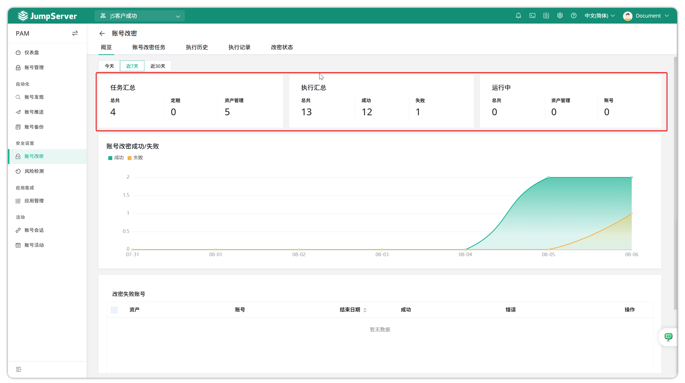
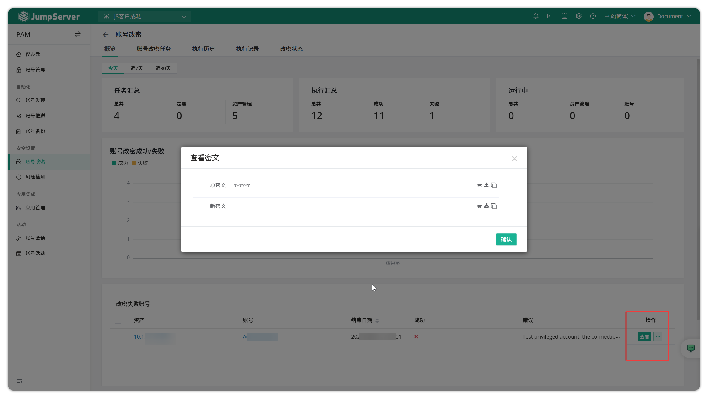
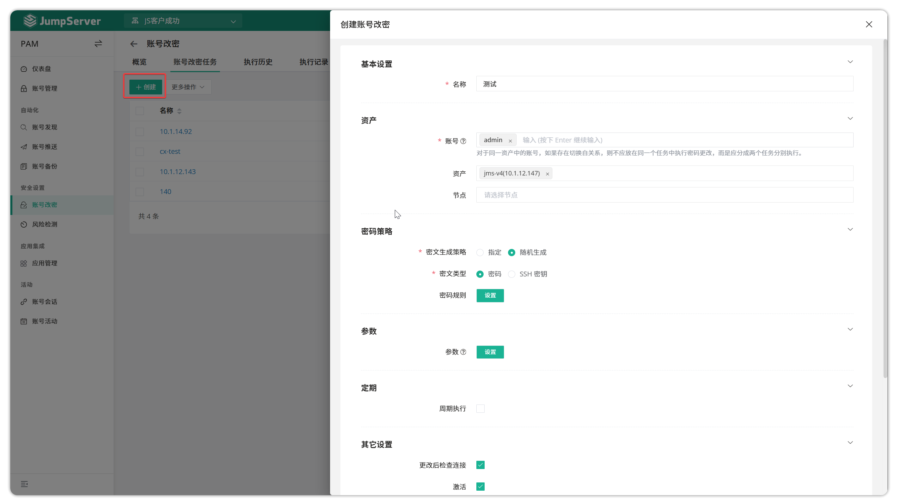
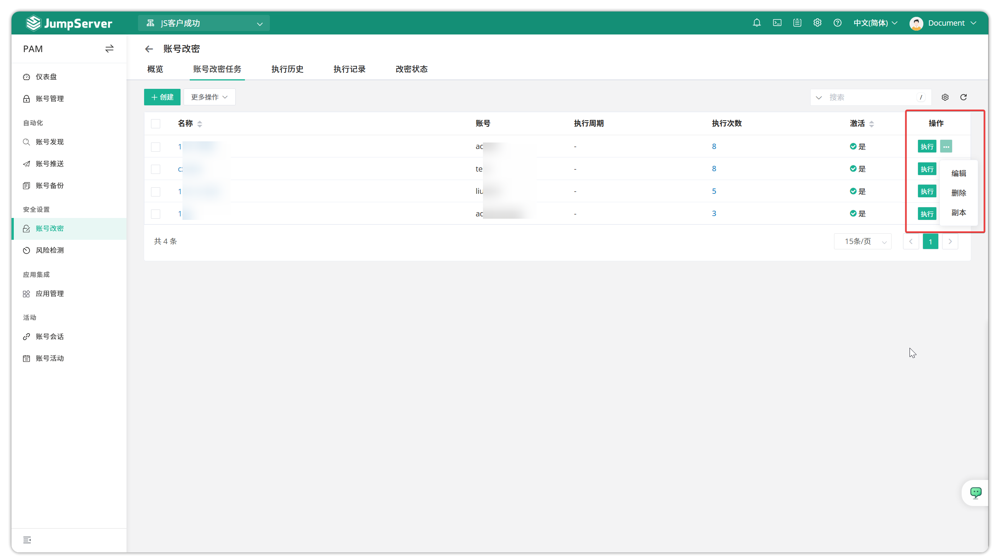
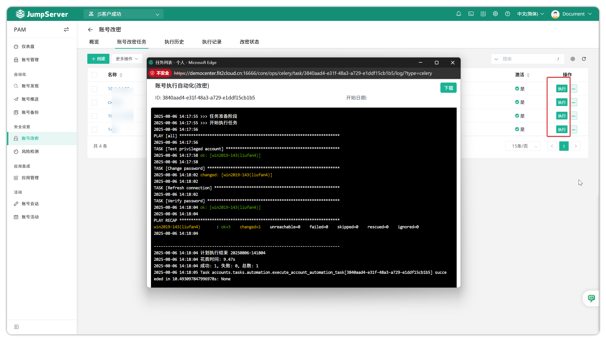
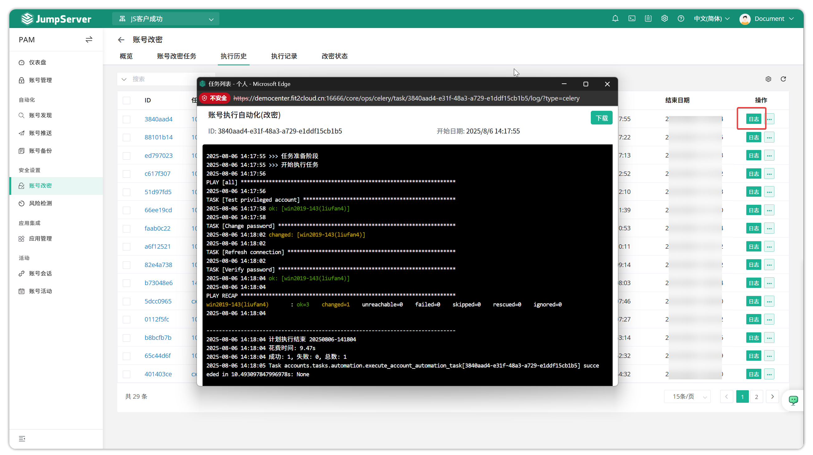
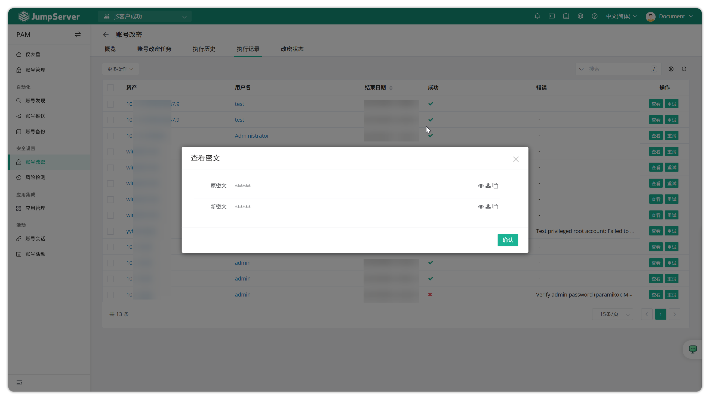

# Account Password Change
## 1 Overview
!!! info "Note: Account password change is a JumpServer Enterprise edition feature."
!!! tip ""
    - Click the **PAM** button on the navigation bar to open the **PAM** page.
    - Click **Security Settings > Account Password Change** to open the **Account Password Change** page.
    - Account password change is designed to meet user security requirements by regularly or manually executing tasks to modify user passwords on assets.
    - The account password change task changes user passwords on assets using the privileged account of the asset **This operation requires a privileged account in the asset's account list**.

!!! warning ""
    - Since **modifying privileged user passwords** is a high-risk operation, JumpServer does not allow modifying privileged user passwords by default. The function to modify asset privileged account passwords is disabled by default and requires administrators to add the option `CHANGE_AUTH_PLAN_SECURE_MODE_ENABLED=false` in the configuration file and restart the bastion machine service to take effect.

## 2 Overview
!!! tip ""
    - JumpServer supports an overview of account password change tasks, where you can view a summary of recent account password change tasks, task execution results, and statistics on successful and failed password changes. The account password change overview page is as follows:

!!! tip ""
    You can view specific failed accounts and reasons for failure in **Failed Password Change Accounts**. If you want to view old and new passwords in password change tasks, click **View** in the operations. This step requires a user with query password permissions to perform MFA verification in JumpServer.

## 3 Account password change task
!!! tip "" 
    - Click the **Create** button on the **Account Password Change Task** page to create an automation task for changing account passwords.

!!! tip ""
    - Detailed parameter descriptions:

| Parameter | Description |
|-----------|-------------|
| Name | The name of the account password change automation task |
| Username | The user whose password will be changed |
| Assets | Assets whose passwords need to be changed |
| Node | Asset node groups whose passwords need to be changed |
| Password Policy - Cipher generation policy | Select the password policy for the user whose password will be changed |
| | • Specified: Administrator manually enters the password |
| | • Random: JumpServer generates the password automatically |
| Password Policy - Cipher type | The type of cipher text for the user whose password will be changed |
| Password | If cipher generation policy is specified, administrator enters the password |
| | If cipher generation policy is random, administrator sets password generation rules, such as password length, password strength rules, etc. |
| Parameters | Parameters are currently only effective for Unix, AIX, Linux type assets |
| Periodic execution | Select whether the automation task executes periodically and set the execution time |
| Recipients | Select users to receive password change notification emails |

!!! tip ""
    - Click the **Execute** button to immediately run the automation task. Click the **More** button to edit, delete, or copy.

!!! tip ""
    - Check the execution logs.

## 4 Execution history
!!! tip ""
    - This page mainly displays detailed information about scheduled account password change tasks, such as execution logs and reports. View the execution logs.

## 5 Execution records
!!! tip ""
    - This page mainly displays records of each account whose password has been changed. You can view new and old passwords and retry changing account passwords. Viewing new and old passwords requires users to perform MFA verification.

