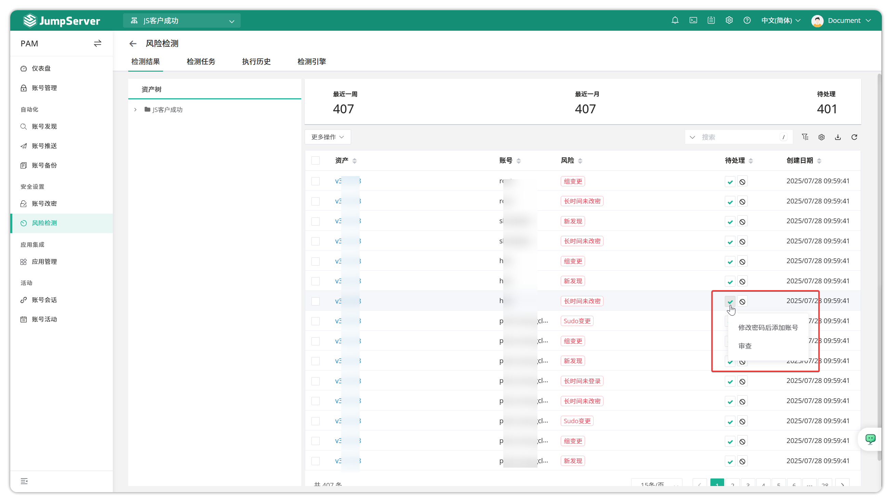
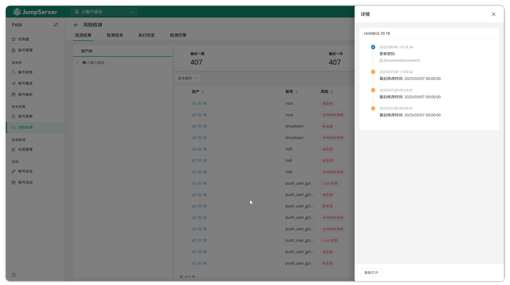
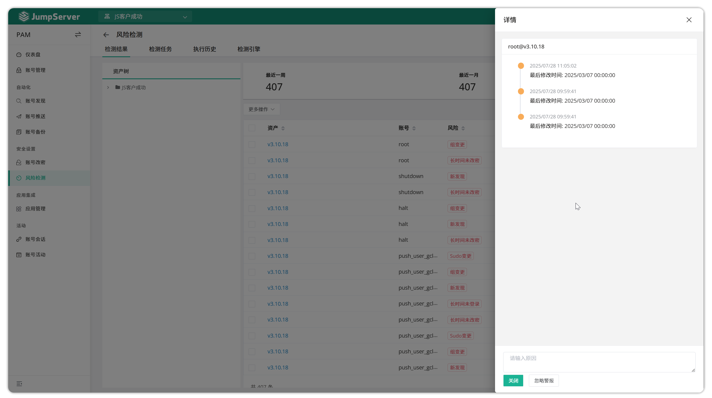
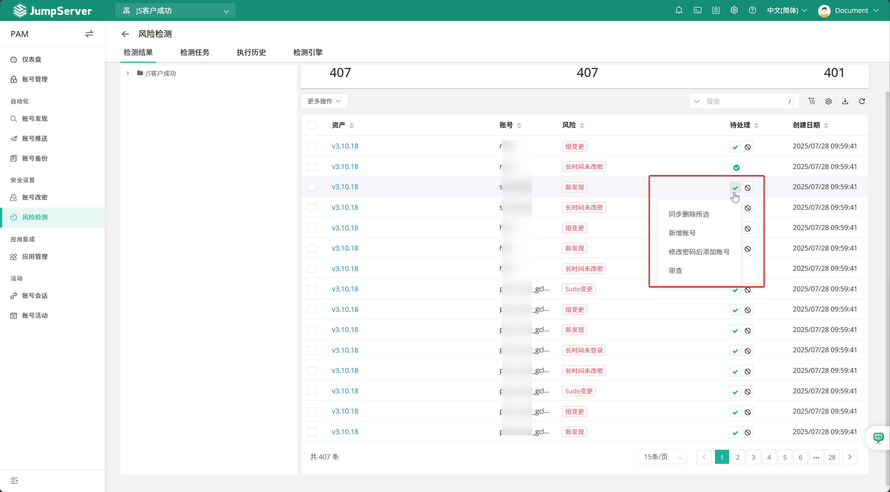
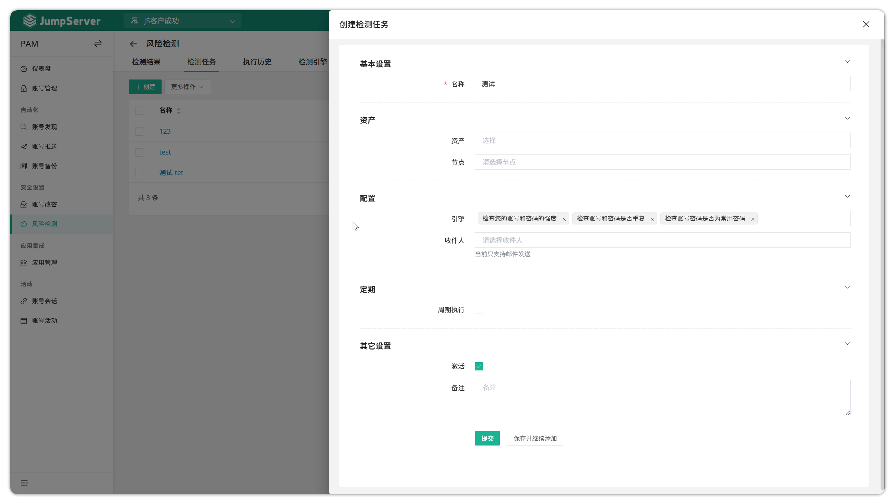
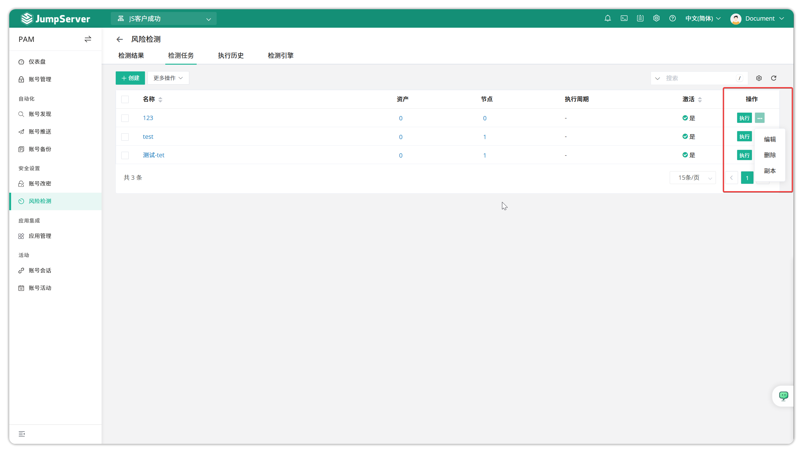
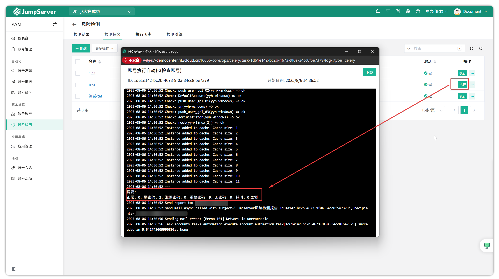
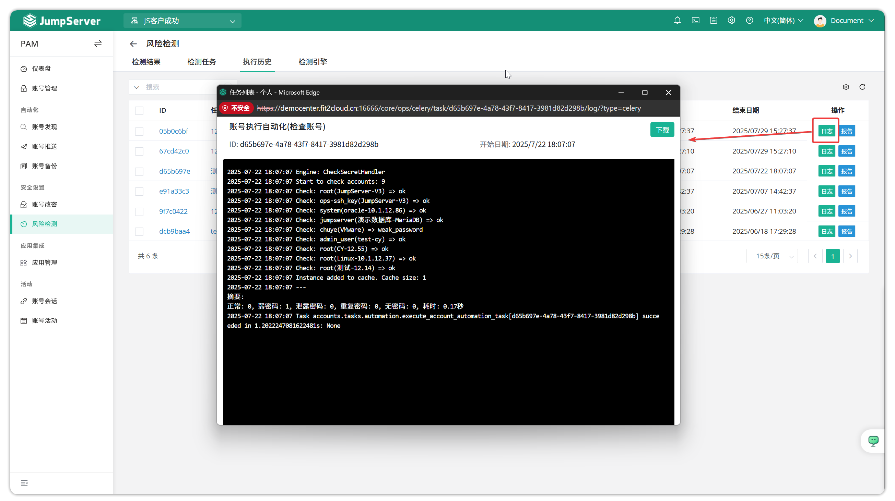
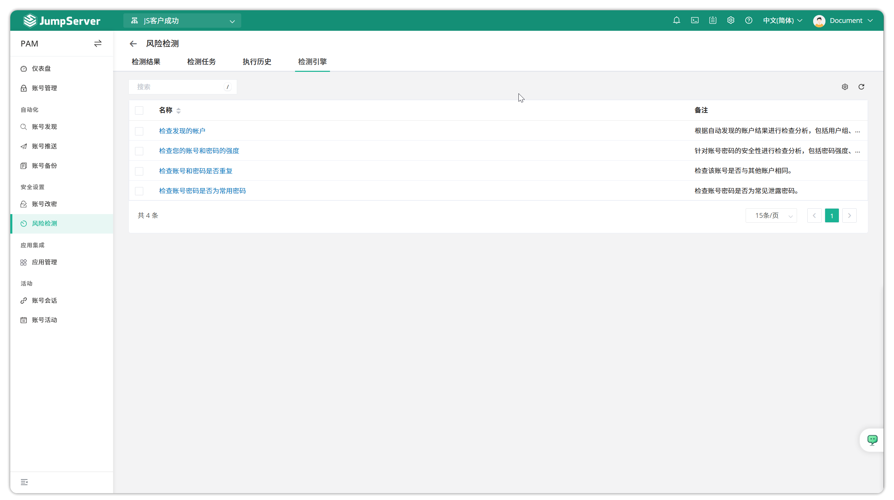

# Risk Detection

## 1 Overview
!!! info "Note: Risk detection is a JumpServer Enterprise edition feature."
!!! tip ""
    - Click the **PAM** button on the navigation bar to open the **PAM** page.
    - Click **Security Settings > Risk Detection** to open the **Risk Detection** page.
    - JumpServer supports account risk detection features that can detect risks such as accounts not logged in for a long time, expired passwords, weak passwords, duplicate passwords, etc., and can export the risk list for review, handling, or ignoring.

## 2 Detection results
!!! tip ""
    - The detection results page displays all account risk types and handling suggestions. You can export the risk list for review, handling, or ignoring.
    - If risks such as duplicate passwords or long periods without password changes are detected, you can click the dropdown arrow to the right of the account to update the password or add the account as prompted. You can also directly review the risk content.
    - Weak password detection rules include: password length less than 8 characters, containing only a single character type, digits only, or common weak passwords (such as 123456, password, abc123, etc.)
    - For different risk types, you can choose operations such as "sync delete", "add account", "add after password change", etc. After handling, the risk status changes to confirmed. If ignored, the status changes to ignored.

## 3 Detection task
!!! tip ""
    - Click the **Create** button on the detection task page to create an account risk detection task by filling in relevant information.

!!! tip ""
    - Detailed parameter descriptions:
| Parameter | Description |
|-----------|------|
| Name | The name of the risk detection task |
| Assets | Assets with accounts that need to be detected |
| Node | Asset node groups with accounts that need to be detected |
| Engine | Check account password strength, whether account passwords are duplicated, whether they are common passwords |
| Recipients | Currently only supports email delivery |
| Periodic execution | Periodic execution settings |
| Active | Whether the task is effective |
| Note | Optional; risk detection task notes |

!!! tip ""
    - Click the **Execute** button to immediately run the detection task. Click **More** to edit, delete, or copy the task.

!!! tip ""
    - You can view the execution logs of the detection task.

## 4 Execution history
!!! tip ""
    - Displays the history of account risk detection tasks. You can view logs or reports.

## 5 Detection engine
!!! tip ""
    - Displays currently supported detection engines and their descriptions.

