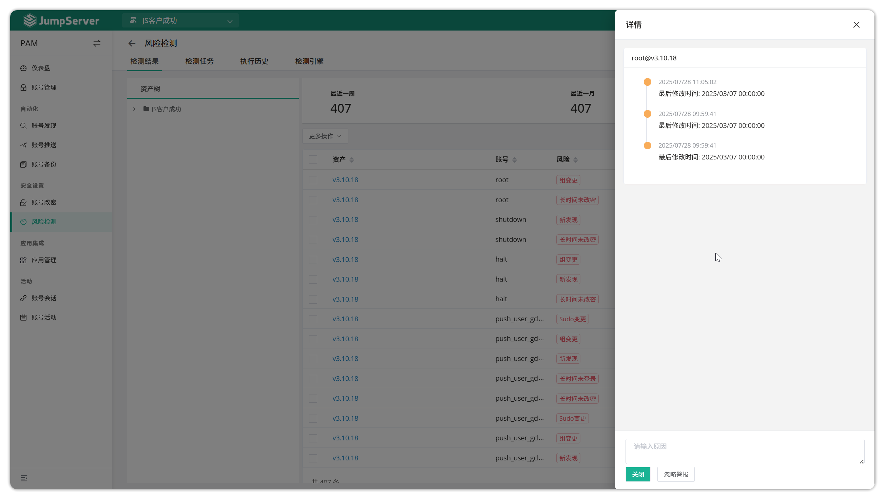
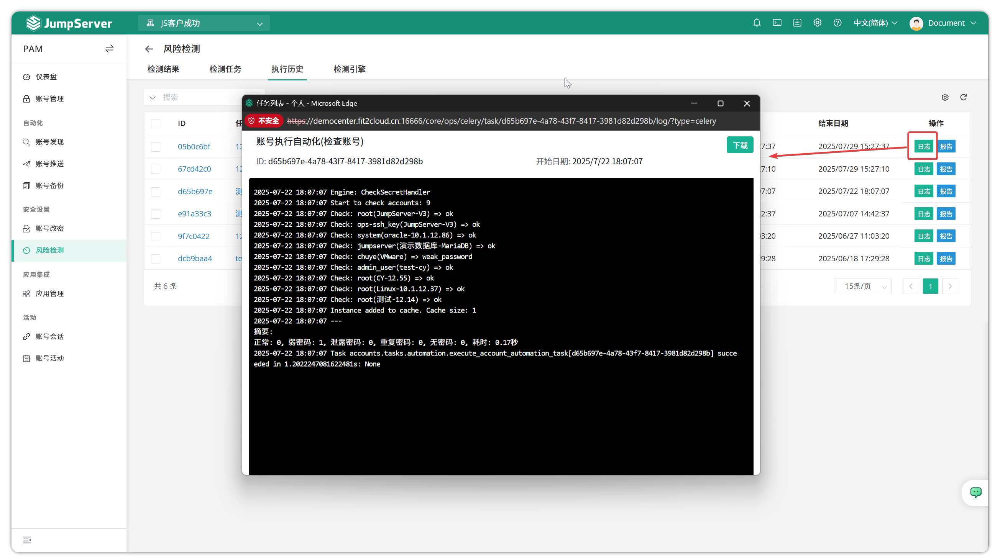
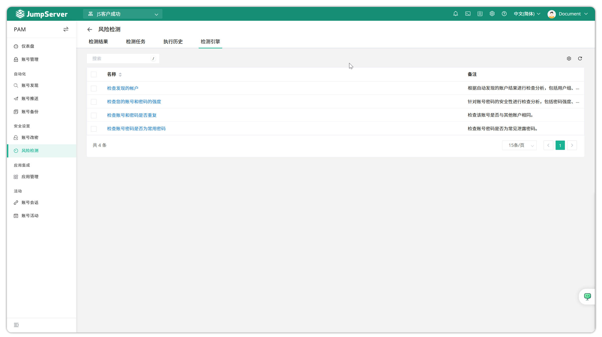

# 风险检测

## 1.功能概述
!!! info "注: 风险检测为 JumpServer 企业版功能。"
!!! tip ""
    - 进入 **PAM** 页面，点击 **安全设置 > 风险检测**，进入风险检测页面
    - JumpServer 支持账号风险检测功能，可检测账号长时间未登录、密码过期、弱密码、重复密码等风险，并可导出风险列表进行审核、处理或忽略

## 2.检测结果
!!! tip ""
    - 检测结果页面展示所有账号风险类型及处理建议，可导出风险列表进行审核、处理或忽略
    - 若检测到密码重复、长时间未改密等风险，可点击账号右侧下拉箭头，按提示更新密码或添加账号，也可直接审核风险内容
    - 弱密码检测规则包括：密码长度小于 8 位、仅包含单一字符类型、仅为数字，或为常见弱密码（如 123456、password、abc123 等）
    - 针对不同风险类型，可选择“同步删除”“添加账户”“密码修改后添加”等操作，处理后风险状态变为已确认，若选择忽略则状态变为已忽略

## 3.检测任务
!!! tip ""
    - 点击检测任务页面的 **创建** 按钮，填写相关信息创建账号风险检测任务

!!! tip ""
    - 详细参数说明:
| 参数    | 说明 |
|---------|------|
| 名称    | 风险检测任务名称 |
| 资产    | 需检测账号的资产 |
| 节点    | 需检测账号的资产节点组 |
| 引擎    | 检查账号密码强度、账号密码是否重复、是否为常用密码 |
| 收件人  | 目前仅支持邮件发送 |
| 周期执行    | 周期执行设置 |
|激活   | 任务是否生效|
|备注     |	非必填项，检测任务备注信息|

!!! tip ""
    - 点击 **执行** 按钮可立即运行检测任务，点击 **更多** 可编辑、删除或复制任务

!!! tip ""
    - 可查看检测任务的执行日志

## 4.执行历史
!!! tip ""
    - 显示账号风险检测任务的历史记录，可查看日志或报告

## 5.检测引擎
!!! tip ""
    - 显示当前支持的检测引擎及其说明
