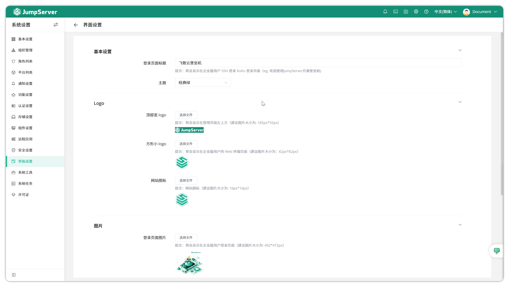
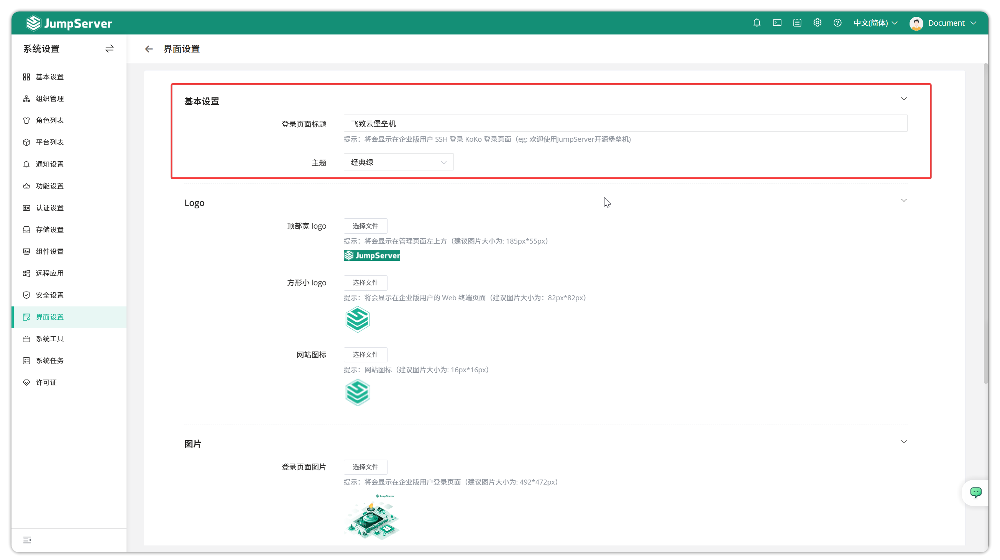
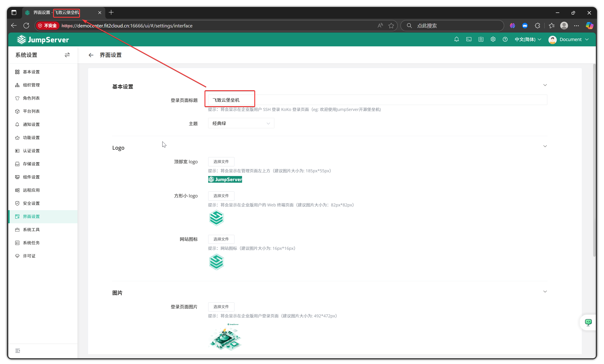
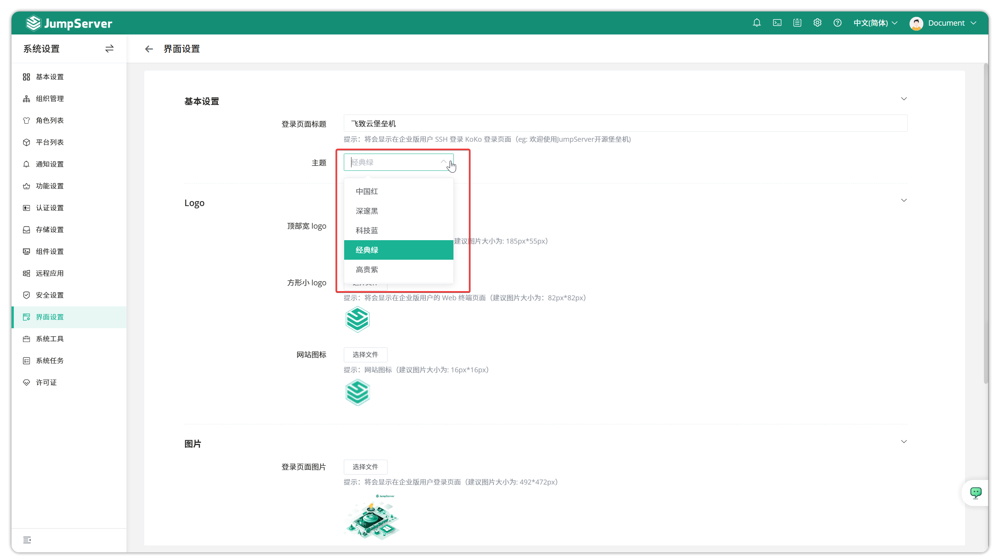
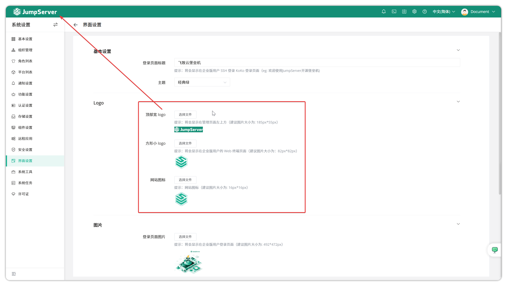
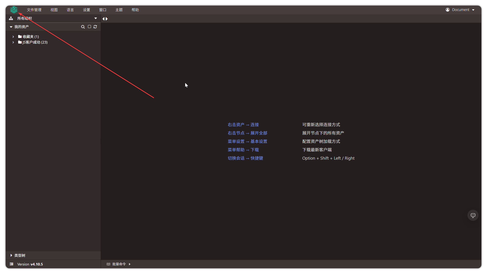
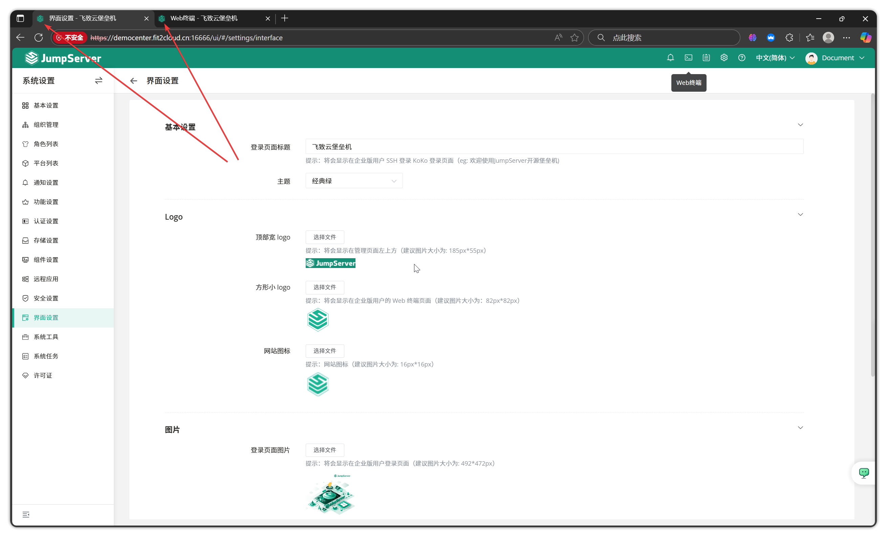
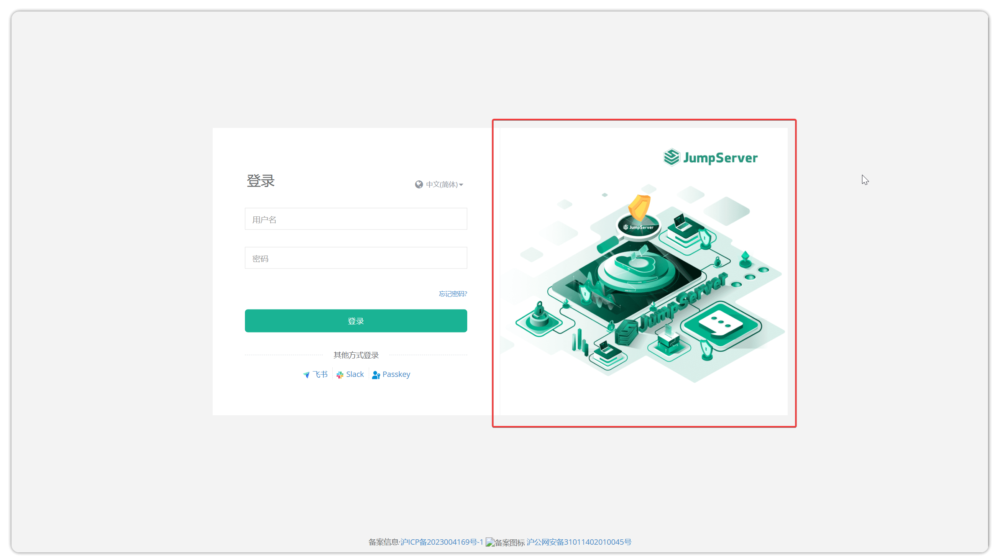
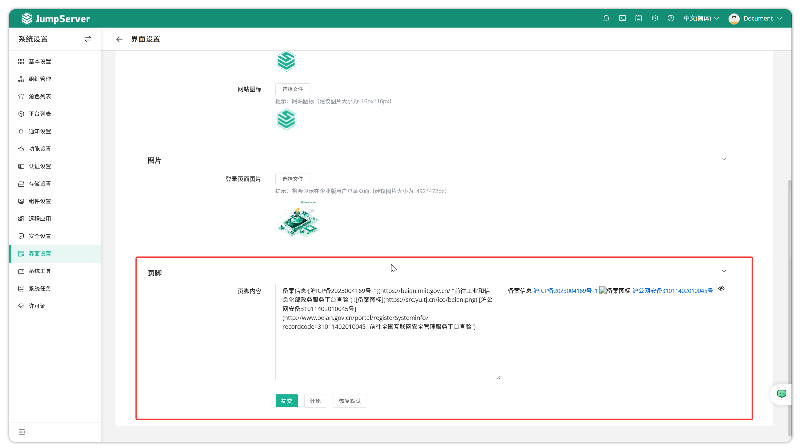
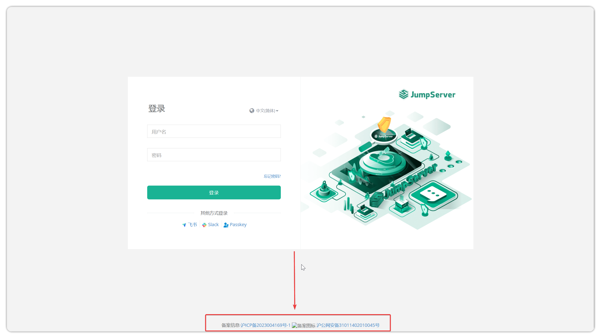

# Appearance Settings
!!! tip ""
    - Click the settings icon in the top right corner of the page to enter the **System Settings** page, then click **Appearance Settings** to access the appearance configuration page.
    - Appearance settings mainly include: login page title settings, JumpServer overall theme settings, JumpServer logo settings, login page image settings, and ICP filing number settings.

## 1 Basic Settings
!!! tip ""
    - Basic settings include login page title and theme. The login page title can be customized. After customization, it displays as follows:

!!! tip ""
    - View the title settings on the page:

!!! tip ""
    - JumpServer supports multiple theme switches. Currently supported themes include: China Red, Deep Black, Tech Blue, Classic Green, and Noble Purple.

## 2 Logo
!!! tip ""
    - The `Top Wide Logo` option, after adjustment, will be displayed in the top left of the admin page, as shown below:

!!! tip ""
    - After adjusting the `Small Square Logo` option, it will be displayed as a small icon on the web terminal for enterprise edition users, as shown below:

!!! tip ""
    - After adjusting the `Website Icon` option, it will be displayed as a small icon on the left side of the browser tab, as shown below:

## 3 Images
!!! tip ""
    - The `Login Page Image`, after adjustment, is displayed on the right side of the login input box, as follows:

## 4 Footer
!!! tip ""
    - Update the footer content on the appearance page:

!!! tip ""
    - After adjusting the record information, it will be displayed at the bottom of the login page, as shown below:

