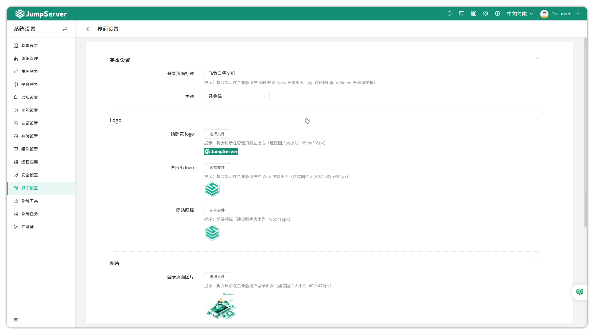
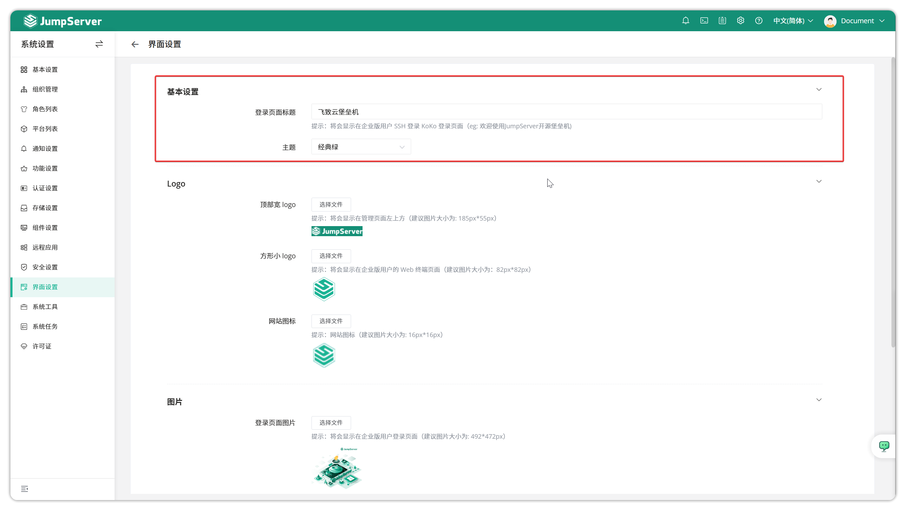
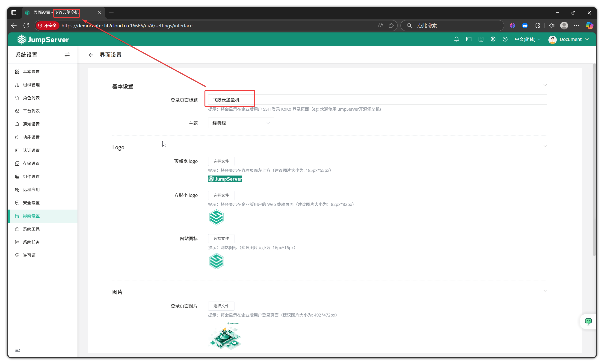
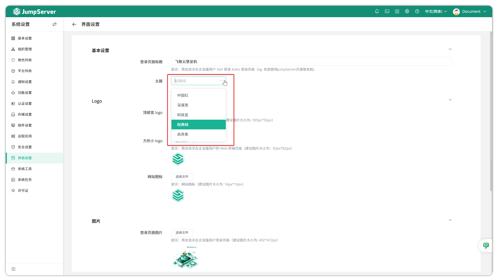
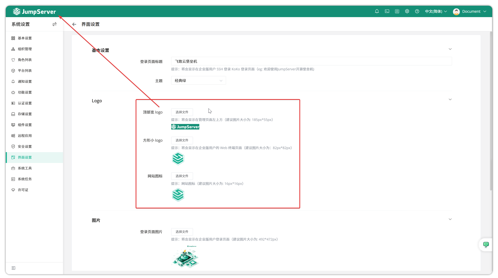
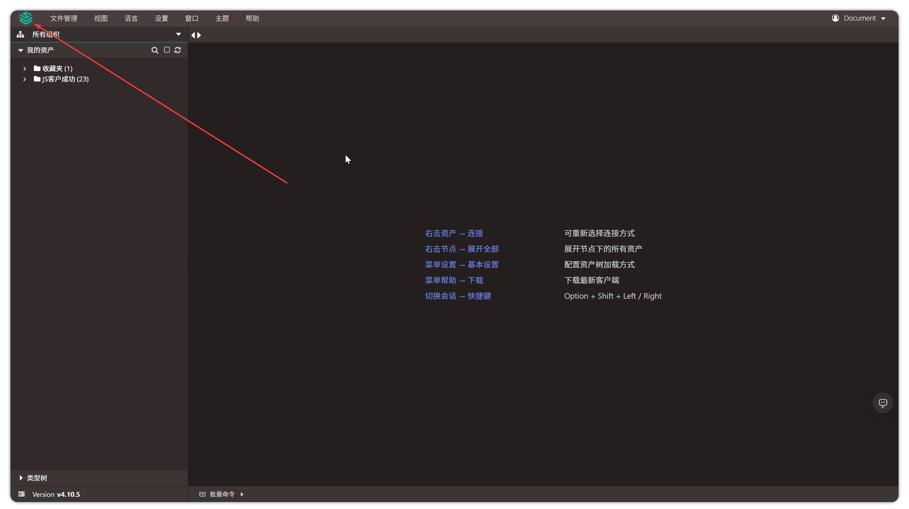
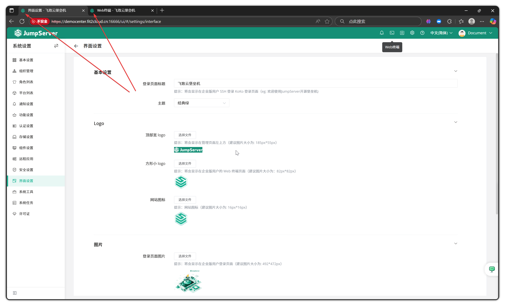
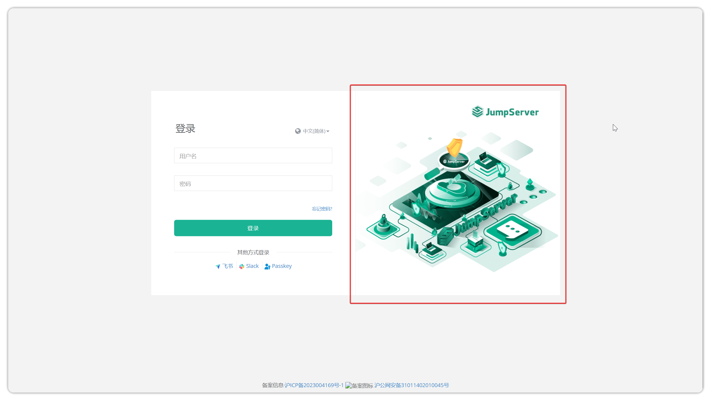
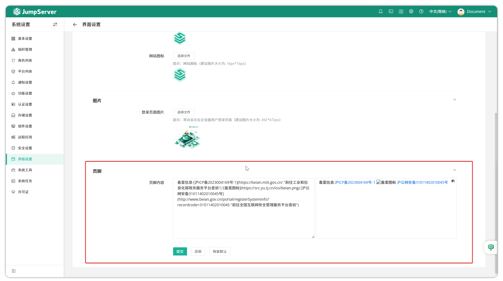
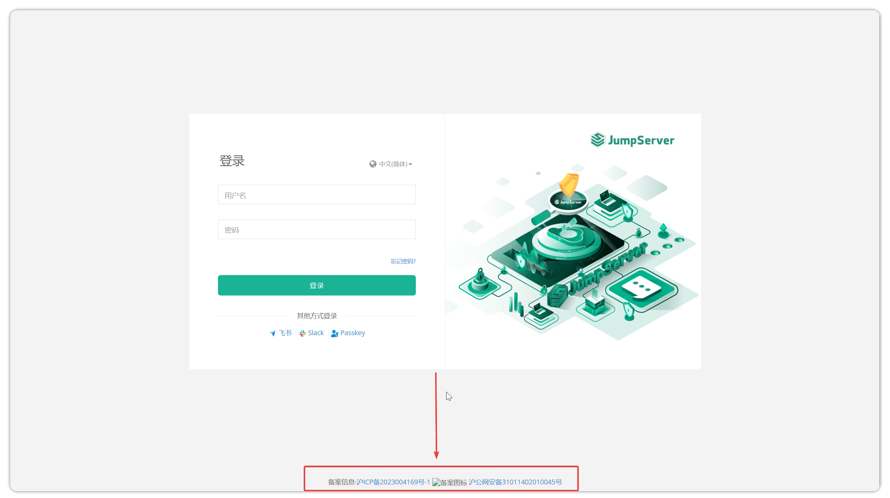

# 界面设置
!!! tip ""
    - 点击页面左侧的`界面设置`按钮，进入界面设置页面。
    - 界面设置主要包含：登录页面标题设置、JumpServer 整体主题设置，JumpServer 相关 Logo 设置、登录页面图片设置以及备案号设置。

## 1.基本设置
!!! tip ""
    - 基本设置包含登录页面标题与主题。登录页面标题可自定义，自定义后显示如下：

!!! tip ""
    - 查看页面上的标题设置：

!!! tip ""
    - JumpServer 支持多种主题切换，目前支持的主题有：中国红、深邃黑、科技蓝、经典绿、高贵紫。

## 2.Logo
!!! tip ""
    - `顶部宽logo`的选项调整后将会显示在管理页面左上方，如下图所示：

!!! tip ""
    - 调整`方形小logo`选项后，会在企业版用户 web 终端上显示为一个小图标，如下图所示：

!!! tip ""
    - 调整`网站图标`选项后，它将显示为浏览器标签左侧的小图标，如下图所示：

## 3.图片
!!! tip ""
    - `登录页面图片`调整后显示页面位于登录输入框的右侧，如下所示：

## 4.页脚
!!! tip ""
    - 更新外观页面上的页脚内容：

!!! tip ""
    - 调整记录信息后，将显示在登录页面底部，如下图所示：

