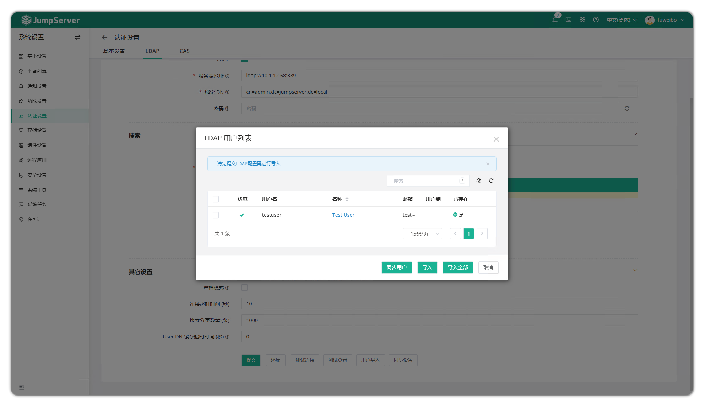
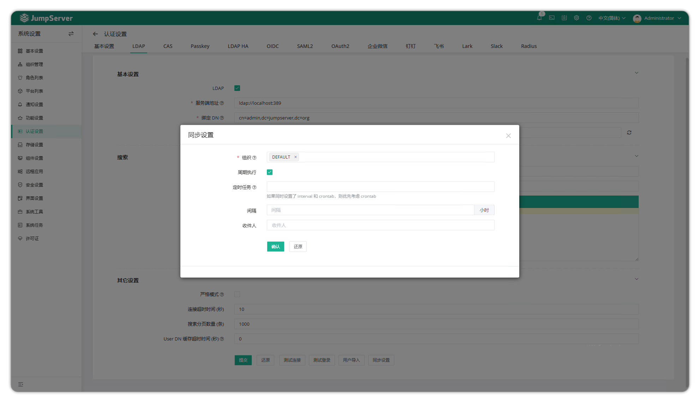

# LDAP Authentication

## About LDAP

!!! tip ""
    - Click the gear icon in the top-right corner to enter the **System Settings** page, then click **Authentication Settings > LDAP** to open the LDAP configuration page.
    - **Lightweight Directory Access Protocol (LDAP)** is an open protocol used to access and manage distributed directory information. It is primarily used for centralized identity authentication and directory services, such as storing user accounts, permissions, and organizational structure information. LDAP is widely used in enterprise identity management, single sign-on (SSO), and access control systems.
    - **Distinguished Name (DN)** is the unique identifier for each entry in the LDAP directory, similar to the full path in a file system, for example `cn=admin,ou=Users,dc=example,dc=com`.
    - **Organizational Unit (OU)** is used to organize and manage objects in the LDAP directory, similar to directory structure in a file system. For example, an organization may contain multiple OUs such as `ou=HR` and `ou=IT` to distinguish users and resources from different departments.

## Basic Configuration

!!! tip ""
    - Click the settings button in the top-right corner
    - Navigate to **System Settings > Authentication Settings > LDAP**

!!! info ""
    - To configure LDAP TLS certificates, upload `ldap_ca.pem`, `ldap_cert.pem`, and `ldap_cert.key` files to the JumpServer `/opt/jumpserver/config/certs` directory, then restart JumpServer using the command `jmsctl restart`.

!!! tip ""
    Detailed parameter descriptions:

| Parameter | Description | Example |
| --- | --- | --- |
| LDAP | Enable LDAP authentication | Enable/Disable |
| Server | LDAP server URI | `ldap://example.com:389` or `ldaps://example.com:636` |
| Bind DN | User DN with query permissions for querying and filtering users | `cn=admin,dc=example,dc=com` or `user@domain.com` format |
| Password | Password for bind DN user | |
| User OU | Search starting OU, specifying where to start searching for users; multiple values separated by `\|` | `ou=users,dc=example,dc=com\|ou=tech,dc=example,dc=com` |
| User Filter | Filter expression for searching LDAP users | Default expression: `(cn=%(user)s)` |
| Mapped Attributes | User attribute mapping; key represents JumpServer user attribute name, value corresponds to LDAP user attribute name | See example below |
| Strict Mode | When strict mode is enabled, full or automatic synchronization will disable users not found in LDAP | |
| Connection Timeout | LDAP connection timeout (unit: seconds) | Default: 30 seconds |
| Search Pagination (items) | Page size for searching users | Default: 1000 |
| User DN Cache Timeout (seconds) | Cache duration for user DN (unit: seconds) to improve login verification speed. If user DN changes, resubmit the form to clear cache, or authentication will fail | Default: 3600 seconds |

LDAP User Attribute Example

!!! tip ""
    - The **Mapped Attributes** field is used to set user attribute mapping. The key represents JumpServer user attribute name, and the value corresponds to LDAP user attribute name.

```json
{
    "name": "sAMAccountName",
    "username": "cn",
    "email": "mail",
    "is_active": "useraccountcontrol",
    "phone": "telephoneNumber",
    "groups": "memberof"
}
```

## Test LDAP Connection

!!! tip ""
    - Click the settings button in the top-right corner
    - Navigate to **System Settings > Authentication Settings > LDAP**
    - Scroll to the bottom of the page
    - Click **Test Connection**

## Test LDAP Login

!!! tip ""
    - Click the settings button in the top-right corner
    - Navigate to **System Settings > Authentication Settings > LDAP**
    - Ensure LDAP configuration has been successfully completed and tested
    - Scroll to the bottom of the page
    - Click **Test Login**
    - Enter LDAP user's username and password in the popup window

## Import LDAP Users

!!! tip ""
    - Click the settings button in the top-right corner
    - Navigate to **System Settings > Authentication Settings > LDAP**
    - Ensure LDAP configuration has been successfully completed and tested
    - Scroll to the bottom of the page
    - Click **User Import**
    - In the popup window, you can import LDAP users in the following ways
    - Click **Sync Users** to synchronize LDAP users to the list
    - In the **Import Organization** field, select one or more organizations to import to
    - Select users to import and click **Import** to proceed; or click **Import All** to import all users



## Set LDAP User Synchronization

!!! tip ""
    - Click the settings button in the top-right corner
    - Navigate to **System Settings > Authentication Settings > LDAP**
    - Ensure LDAP configuration has been successfully completed and tested
    - Scroll to the bottom of the page
    - Click **Sync Settings**
    - In the popup window, enter the following configuration information
    - In the **Organization** field, select one or more organizations to sync
    - In the **Periodic Execution** field, check to enable periodic execution
    - In the **Scheduled Task** field, enter a crontab expression. If empty, **Interval** setting will be used
    - In the **Interval** field, enter sync interval time (unit: hours)
    - Note: If **Scheduled Task** has a value, **Scheduled Task** takes priority
    - In the **Recipients** field, select one or more users to receive sync results
    - Click **Confirm**


