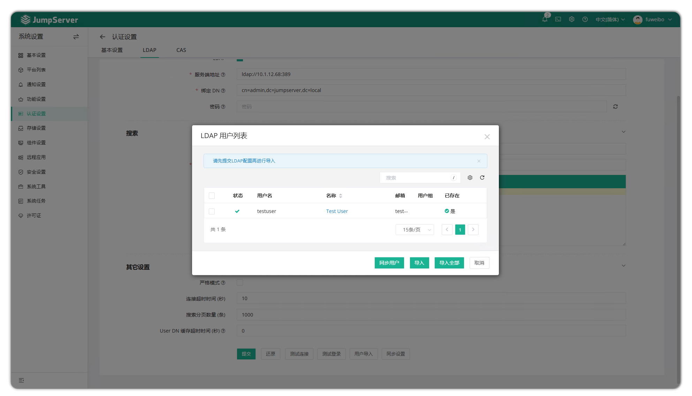
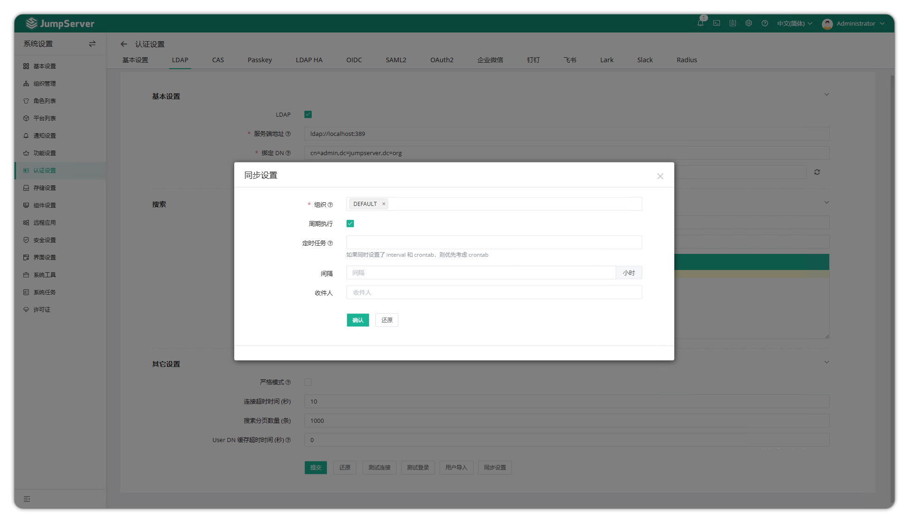

# LDAP 认证

## 关于 LDAP

!!! tip ""
    - 进入 **系统设置**，点击 **认证设置 > LDAP**，进入 LDAP 配置页面。
    - **轻量级目录访问协议(LDAP)** 是一种开放式协议，用于访问和管理分布式目录信息。主要应用于集中式身份验证和目录服务，如存储用户账户、权限及组织结构信息等。LDAP 被广泛应用于企业身份管理、单点登录(SSO)和访问控制系统中。
    - **可分辨名称(DN)** 是 LDAP 目录中每个条目的唯一标识符，类似于文件系统中的完整路径，例如 `cn=admin，ou=Users，dc=example，dc=com`。
    - **组织单位(OU)** 用于组织和管理 LDAP 目录中的对象，类似于文件系统中的目录结构。例如，一个组织可能包含多个 OU，如 `ou=HR` 和 `ou=IT`，用于区分不同部门的用户和资源。

## 基础配置

!!! tip ""
    - 点击页面右上角的设置按钮
    - 导航至 **系统设置 > 认证设置 > LDAP**

!!! info ""
    - 若需配置 LDAP TLS 证书，请将 `ldap_ca.pem、ldap_cert.pem、ldap_cert.key` 文件上传至 JumpServer 服务器 `/data/jumpserver/core/data/certs` 目录，然后通过命令 `jmsctl restart` 重启 JumpServer 服务。

!!! tip ""
    详细参数说明：

| 参数 | 说明 | 示例 |
|------|------|------|
| LDAP | 勾选启用 LDAP 身份验证 | 启用/禁用 |
| 服务器 |  LDAP 服务器 URI | `ldap://example.com:389` 或 `ldaps://example.com:636` |
| 绑定 DN | 具有查询权限的用户 DN，用于查询和筛选用户 | `cn=admin，dc=example，dc=com` 或者 `user@domain.com` 格式 |
| 密码 | 绑定 DN 用户的密码 |   |
| 用户 OU | 搜索起始 OU，指定从何处开始搜索用户，多个值用 `|` 分隔 | `ou=users，dc=example，dc=com |ou=tech，dc=example，dc=com` |
| 用户过滤器 | 搜索 LDAP 用户的过滤器表达式 | 默认表达式为 `(cn=%(user)s)` |
| 映射属性 | 用户属性映射。键表示 JumpServer 用户属性名称，值对应 LDAP 用户属性名称 | 示例见下文 |
| 严格模式 | 启用严格模式后，全量或自动同步将禁用系统中未在 LDAP 中发现的用户 |  |
| 连接超时时间 | LDAP 连接超时时间(单位：秒) | 默认值：30秒 |
| 搜索分页数量(条) | 搜索用户的分页大小 | 默认值：1000 |
| User DN 缓存超时时间(秒) | 用户 DN 的缓存时长(单位：秒)，用于提高登录验证速度。如果用户 DN 发生变更，需要重新提交表单以清除缓存，否则身份验证将失败 | 默认值：3600秒 |

LDAP 用户属性示例

!!! tip ""
    -  **映射属性** 字段用于设置用户属性映射。键表示 JumpServer 用户属性名称，值对应 LDAP 用户属性名称。

```json 
{  
    "name": "sAMAccountName",
	"username": "cn",  
    "email": "mail",  
	"is_active": "useraccountcontrol",  
    "phone": "telephoneNumber",
	"groups": "memberof"
}
```

## 测试 LDAP 连接
!!! tip ""
    - 点击页面右上角的设置按钮

    - 导航至 **系统设置 > 认证设置 > LDAP**

    - 滚动至页面底部

    - 点击 **测试连接**

## 测试 LDAP 登录
!!! tip ""
    - 点击页面右上角的设置按钮

    - 导航至 **系统设置 > 认证设置 > LDAP**

    - 确保已成功完成并测试 LDAP 配置

    - 滚动至页面底部

    - 点击 **测试登录**

    - 在弹出窗口中输入 LDAP 用户的用户名和密码

## 导入 LDAP 用户
!!! tip ""
    - 点击页面右上角的设置按钮

    - 导航至 **系统设置 > 认证设置 > LDAP**

    - 确保已成功完成并测试 LDAP 配置

    - 滚动至页面底部

    - 点击 **用户导入**

    - 在弹出窗口中，可通过以下方式导入 LDAP 用户

    - 点击 **同步用户** 将 LDAP 用户同步到列表中

    - 在 **导入组织** 字段中选择要导入的一个或多个组织

    - 选中要导入的用户，点击 **导入** 继续；或者点击 **全部导入** 导入所有用户



## 设置 LDAP 用户同步
!!! tip ""

    - 点击页面右上角的设置按钮

    - 导航至 **系统设置 > 身份验证 > LDAP**

    - 确保已成功完成并测试 LDAP 配置

    - 滚动至页面底部

    - 点击 **同步设置**

    - 在弹出窗口中输入以下配置信息

    - 在 **组织** 字段中选择要同步的一个或多个组织

    - 在 **周期执行** 字段中勾选启用周期执行

    - 在 **定时任务** 字段中输入 crontab 表达式。如果为空，则使用 **间隔** 设置

    - 在 **间隔** 字段中输入同步间隔时间(单位：小时)

    - 注意：如果 **定时任务** 有值，则 **定时任务** 优先生效

    - 在 **收件人** 字段中选择一个或多个用户以接收同步结果

    - 点击 **确认**

