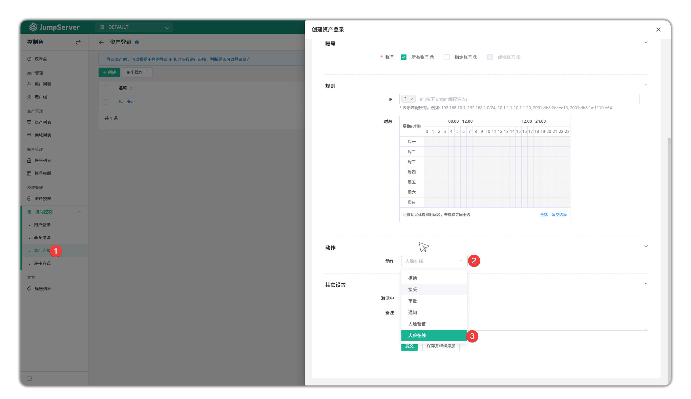

# MFA Facelive
!!! tip "前提条件"
    1. 版本：v4.6.0 及以上
    2. 许可证 5000 个以上的资产
    3. 启用 HTTPS

## 1. 配置 Faclive 
!!! tip ""
    **新增参数**
    ```sh
    vim /opt/jumpserver/config/config.txt
    #config.txt
    USE_XPACK=1
    FACE_RECOGNITION_ENABLED=true
    FACELIVE_ENABLED=1
    ```
    **重启 JumpServer**
    ```sh
    jmsctl restart
    ```

## 2. 配置 MFA 人脸识别
**在用户详细信息页面记录面部信息并启用 MFA**


**退出登录并尝试重新登录，选择人脸验证**
 

**请在30秒内完成面部验证**


## 3. 资产连接面部认证与监控
在控制台 > 访问控制 > 资产连接 > 创建  在 动作 中启用人脸验证。操作可以是“人脸验证”或“人脸在线”。


**连接到资产前需要进行人脸验证**


**如果面部识别未检测到用户，会暂停会话**


暂停会话期间将无法进行对资产的任何操作