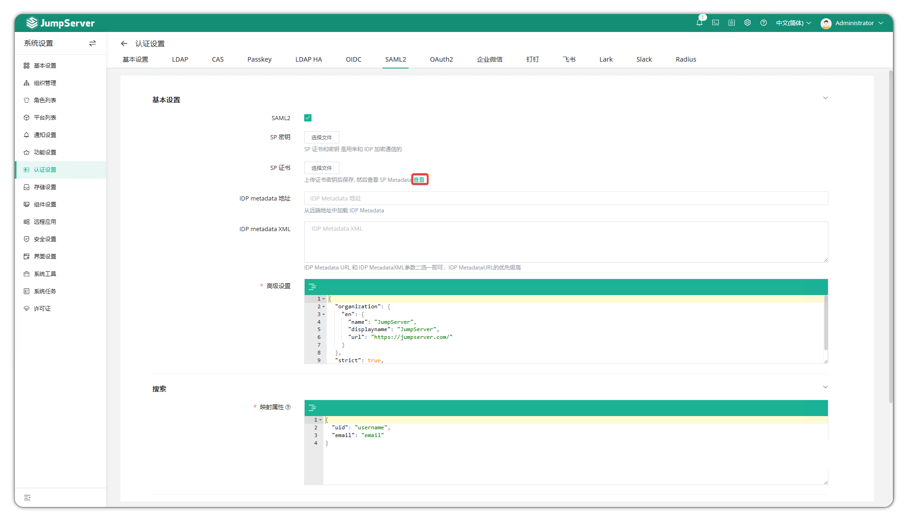

# SAML2 Authentication

## 1 About SAML2

!!! info "Note: SAML2 authentication is an enterprise feature of JumpServer."

!!! tip ""
    - Click the gear icon in the top-right corner to enter the **System Settings** page, then click **Authentication Settings > SAML2** to open the SAML2 configuration page.
    - **SAML2 (Security Assertion Markup Language 2.0)** is an open standard for securely exchanging identity authentication and authorization data between identity providers (IdP) and service providers (SP). JumpServer authentication supports standard SAML2.

## 2 Configuration Parameters

!!! tip ""
    Detailed parameter descriptions:

| Parameter | Description | Example |
| --- | --- | --- |
| SAML2 | Enable SAML2 authentication | Enable/Disable |
| SP Private Key | Upload SP private key file used to sign SAML requests and decrypt IdP responses | |
| SP Certificate | Upload SP certificate file generated from SP private key; used by IdP to verify signatures and encrypt responses | |
| IdP Metadata Address | IdP metadata address URL | `https://saml2.example.com/realms/JumpServer/protocol/saml/descriptor` |
| IdP Metadata XML | Manually enter IdP metadata XML; lower priority than address | |
| Advanced Settings | Advanced parameters for generating SP Metadata; see example below | |
| Mapped Attributes | User attribute mapping; correspondence between SAML2 and JumpServer fields | See JSON example below |
| Organization | After authentication and creation, user will be added to the selected organization | |
| Always Update User Info | When enabled, synchronize user info on every authentication (only name, username, email, phone, comment; groups only on first sync) | |
| Sync Logout | When enabled, logout will also sync SAML2 service logout | |

!!! tip ""
    - SP Private Key and SP Certificate must be used together to ensure SAML2 authentication communication security. SP private key is used for signing and decryption, SP certificate is used for verification and encryption.
    - Only one of IdP Metadata Address and XML needs to be filled. If both are filled, the address takes priority.

!!! tip ""
    - Advanced settings example:

```json
{
    "organization": {},
    "security": {}
}
```

!!! tip ""
    - SP Metadata provides service provider entity ID, endpoint URLs, certificates, and other information, facilitating IdP configuration.
    - You can click **View** below the **SP Certificate** field to get SP Metadata.



!!! tip ""
    - Attribute mapping example:

```json
{
    "name": "http://schemas.xmlsoap.org/ws/2005/05/identity/claims/name",
    "username": "uid",
    "email": "http://schemas.xmlsoap.org/ws/2005/05/identity/claims/emailaddress"
}
```
