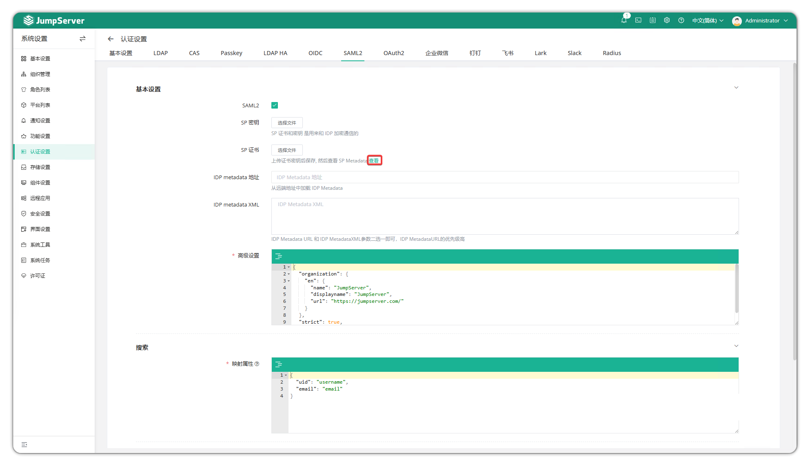

## 关于 SAML2
!!! info "注: SAML2 认证方式为 JumpServer 企业版功能。"
!!! tip ""
    - 进入 **系统设置** 页面，点击 **认证设置 > SAML2**，进入 SAML2 配置页面。
    - **SAML2(Security Assertion Markup Language 2.0)** 是一种开放标准，用于在身份提供者(IdP)和服务提供者(SP)之间安全交换身份认证和授权数据。JumpServer 认证支持标准 SAML2。

## 配置参数

!!! tip ""
    详细参数说明：

| 参数 | 说明 | 示例 |
|------|------|------|
| SAML2 | 启用 SAML2 身份认证 | 启用/禁用 |
| SP 密钥 | 上传 SP 私钥文件，用于签名 SAML 请求和解密 IdP 响应 |  |
| SP 证书 | 上传 SP 证书文件，由 SP 私钥生成，供 IdP 验证签名和加密响应 |  |
| IdP Metadata 地址 | IdP 元数据地址 URL | `https://saml2.example.com/realms/JumpServer/protocol/saml/descriptor` |
| IdP Metadata XML | 手动输入 IdP 元数据 XML，优先级低于地址 |  |
| 高级设置 | 生成 SP Metadata 的高级参数，详见下方示例 |  |
| 映射属性 | 用户属性映射，SAML2 字段与 JumpServer 字段对应关系 | 见下方 JSON 示例 |
| 组织 | 认证和创建后，用户将被添加到所选组织 |  |
| 总是更新用户信息 | 启用后，每次认证均同步用户信息(仅限姓名、用户名、邮箱、电话、评论，群组仅首次同步) |  |
| 同步注销 | 启用后，注销也会同步注销 SAML2 服务 |  |

!!! tip ""
    - SP 密钥和 SP 证书需配套使用，确保 SAML2 认证通信安全。SP 私钥用于签名和解密，SP 证书用于验证和加密。
    - IdP Metadata 地址和 XML 只需填写其一，若都填写则优先使用地址。

!!! tip ""
    - 高级设置示例:

```json
{
    "organization": {
        "en": {
            "name": "JumpServer",
            "displayname": "JumpServer",
            "url": "https://jumpserver.com/"
        }
    },
    "strict": true,
    "security": {}
}
```

!!! tip ""
    - SP Metadata 提供服务提供者的实体 ID、端点 URL、证书等信息，便于 IdP 配置。
    - 可在 **SP 证书** 字段下方点击 **查看** 获取 SP Metadata。



!!! tip ""
    - 属性映射示例:

```json
{
    "uid": "username",
    "email": "email",
    "member": "groups"
}
```

## JumpServer SAML2 URL 说明

!!! tip ""
    详细 URL 说明：

| URL 类型 | 地址 | 说明 |
|----------|------|------|
| Login URL | `https://jumpserver.example.com/core/auth/saml2/login/` | SAML2 登录入口地址 |
| Login Success Callback URL | `https://jumpserver.example.com/core/auth/saml2/callback/` | SAML2 登录成功后的回调地址 |
| Logout URL | `https://jumpserver.example.com/core/auth/saml2/logout/` | SAML2 注销地址 |
| SP Metadata URL | `https://jumpserver.example.com/core/auth/saml2/metadata/` | SAML2 服务提供者元数据地址 |
