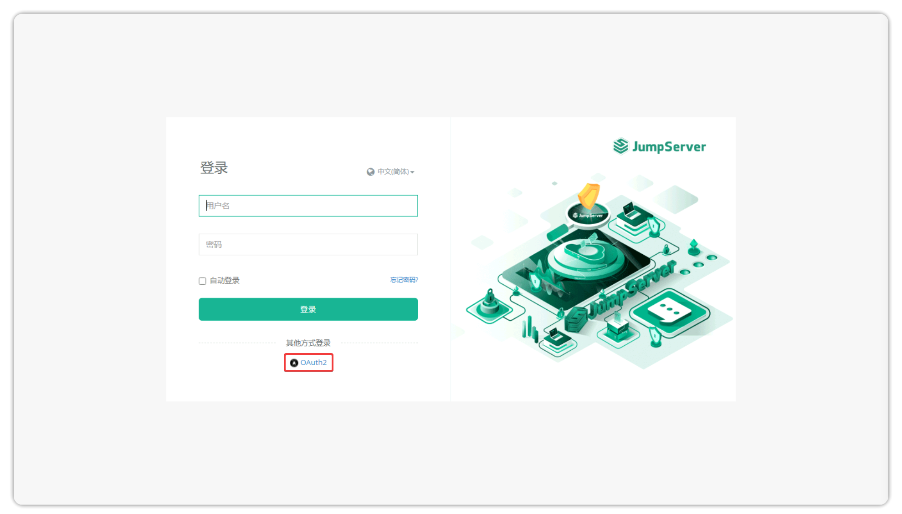

# OAuth2 认证

## 关于 OAuth2

!!! tip "OAuth2"
    - **开放授权2.0（OAuth2）** 是一种开放授权协议，允许第三方应用程序访问存储在其他服务提供商（如 Google、Facebook、GitHub 等）上的用户资源，而无需暴露用户的密码。OAuth2 允许用户在不共享登录凭据的情况下授予第三方应用程序特定的资源权限。

## 如何配置

!!! tip ""
    - 在页面右上角，单击设置
    - 导航到 **系统设置 > 认证设置 > OAuth2。**
    - 在 **OAuth2** 字段中，选中以启用 OAuth2 身份认证。
    - 在 **服务提供商** 字段中，输入 OAuth2 服务提供商名称，如 GitHub、Google、Facebook 等。
    - 在 **图标** 字段中，上传 OAuth2 服务提供商图标，推荐使用 64px * 64px 的大小。服务提供商和图标将显示在登录页面上。



!!! tip ""
    - 在 **客户端 ID** 字段中，输入 OAuth2 服务提供商提供的客户端ID。
    - 在 **客户端密钥** 字段中，输入 OAuth2 服务提供程序提供的客户端密钥。
    - 在 **客户端认证方式** 字段中，选择一种方法来获取令牌。

!!! tip "获取令牌方法说明"

    | 请求方法      | 描述                                                         |
    | ------------- | ------------------------------------------------------------ |
    | GET       | 使用 GET 方法获取令牌，请求标头中包含客户端 ID 和客户端密钥。  |
    | POST-DATA | 使用 POST 方法获取令牌，其中客户端 ID 和客户端密钥作为“原始数据”包含在请求体中。 |
    | POST-JSON | 使用 POST 方法获取令牌，其中客户端 ID 和客户端密钥作为“JSON 数据”包含在请求体中。 |

!!! tip ""
    - 在 **范围** 字段中，定义客户端在授权请求中请求访问的用户信息的范围。多条信息用空格分隔，例如“用户 用户:电子邮件 用户:登录”。
    - 在 **授权端点地址** 字段中，输入 OAuth2 授权端点地址，例如“https://github.com/login/oauth/authenticate”。
    - 在 **Token 端点地址** 字段中，输入 OAuth2 Token 端点地址，例如“https://github.com/login/oauth/access_token”。
    - 在 **用户信息端点地址** 字段中，输入 OAuth2 用户信息端点地址，例如“https://api.github.com/user”。
    - 在 **注销会话端点地址** 字段中，输入 OAuth2 注销会话端点地址，例如“https://github.com/logout”，当用户注销时，将调用此端点。
    - 在 **映射属性** 字段中，输入用户映射属性。键表示 JumpServer 用户属性名称（可用选项：名称、用户名、电子邮件、组、电话、评论），而值对应于 OAuth2 用户属性名称。

OAuth2 映射属性示例

```json
{
  "name": "user",
  "username": "name",
  "email": "user:email"
}
```

!!! tip ""
    - 在 **组织** 字段中，经过身份认证和创建后，用户将被添加到所选组织中。
    - 在 **总是更新用户信息** 字段中，选中后，在 OAuth2 用户身份认证后，每次都会更新用户信息（仅包括：姓名、用户名、电子邮件、电话、评论），“组”仅在创建用户时同步。
    - 在 **同步注销** 字段中，选中后，用户将在注销时通过调用“结束会话端点”从 OAuth2 服务中注销。
    - 点击 **提交**。

## JumpServer OAuth2 URLs
登录 URL
```bash
https://jumpserver.example.com/core/auth/oauth2/login/
```
登录成功回调 URL
```bash
https://jumpserver.example.com/core/auth/oauth2/callback/
```
登出 URL
```bash
https://jumpserver.example.com/core/auth/oauth2/logout/
```