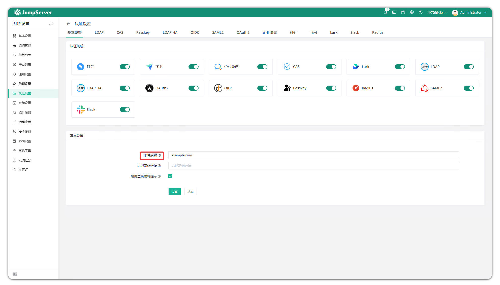
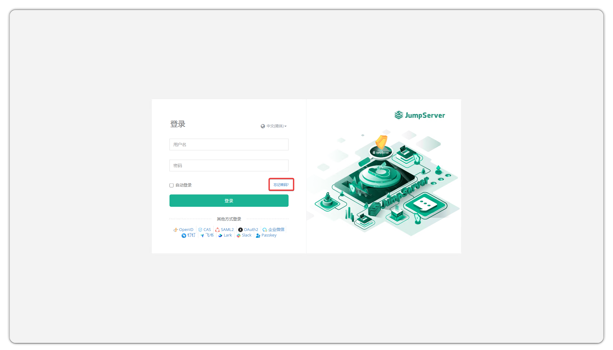
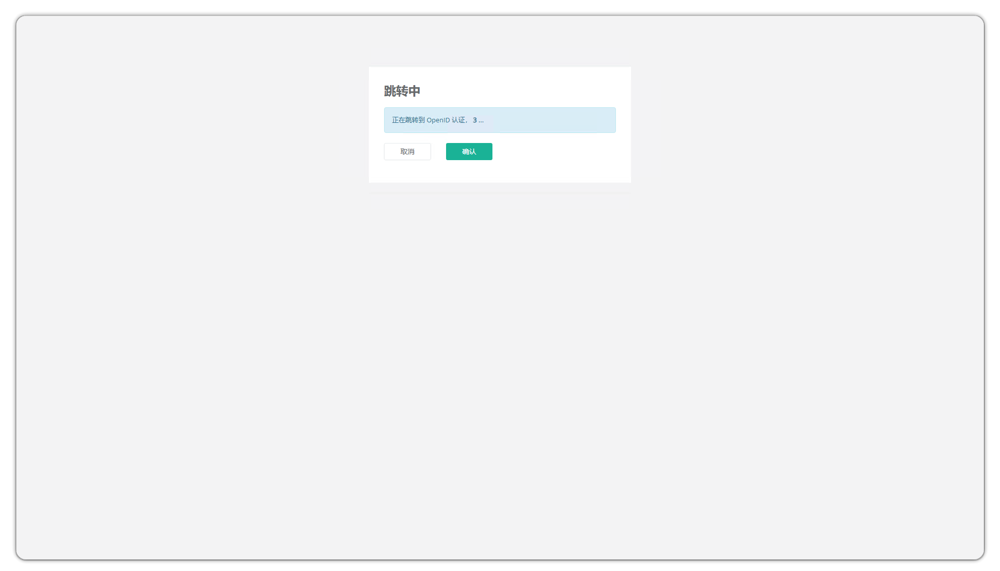
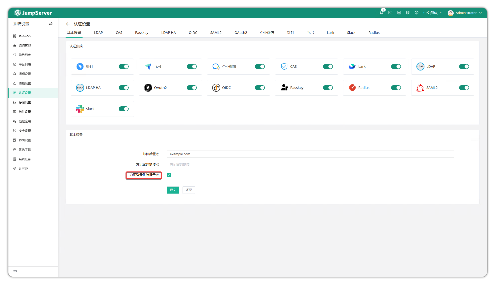

# 基本设置

!!! tip ""
    - 通过点击页面右上角小齿轮进入 **系统设置** 页面，点击 **认证设置 > 基本设置** ，进入基本设置页面。
    - 可以选择开启特定的认证方式配置。
## 1.邮件后缀

!!! tip ""
    如果第三方身份验证中的用户未配置电子邮件字段，则电子邮件后缀用于通过将用户名与后缀组合来自动生成用户电子邮件地址。

在页面右上角，单击设置。

导航到 **系统设置>认证设置>基本设置** 。

在 **邮件后缀** 字段中，输入邮件后缀，例如“example.com”。

单击 **提交**

## 2.忘记密码链接

!!! tip ""
    - 当用户点击登录页面上的 **忘记密码** 时，他们将被重定向到此 URL。

## 3.登录重定向
!!! tip ""
    - 当未经身份验证的用户访问 JumpServer 时，如果选中，系统将提示他们取消并返回默认登录页面或确认以继续进行第三方身份验证。如果未选中，它们将直接重定向到第三方身份验证页面。

