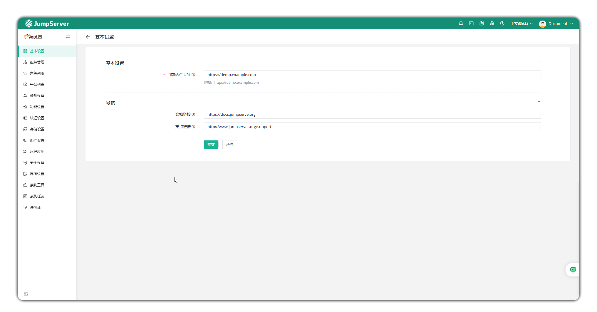

# Basic Settings

## 1 Feature Overview
!!! tip ""
    - Click the settings icon in the top right corner of the page to enter the **System Settings** page, then click **Basic Settings** to access the basic settings page.
    - You can edit basic information, including the current site URL and navigation bar link configuration.

## 2 Basic Information
!!! tip ""
    - On this page, you can configure the current site URL (users can access the bastion host through external links, such as email, so you can fill in a domain name or IP here).
    - Supports configuring navigation bar links.

