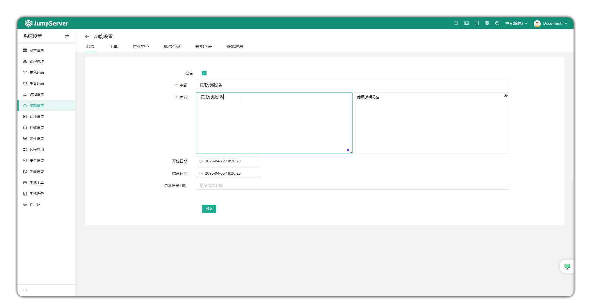
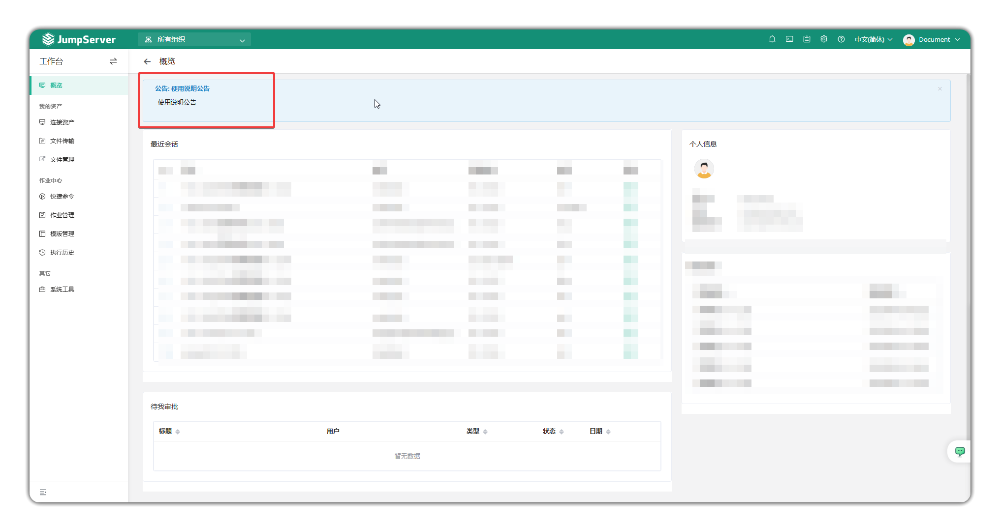
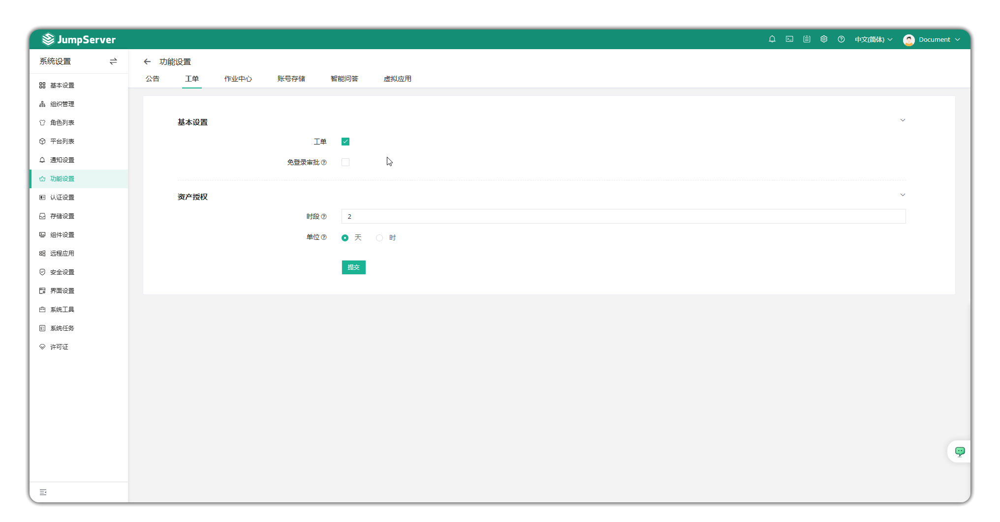
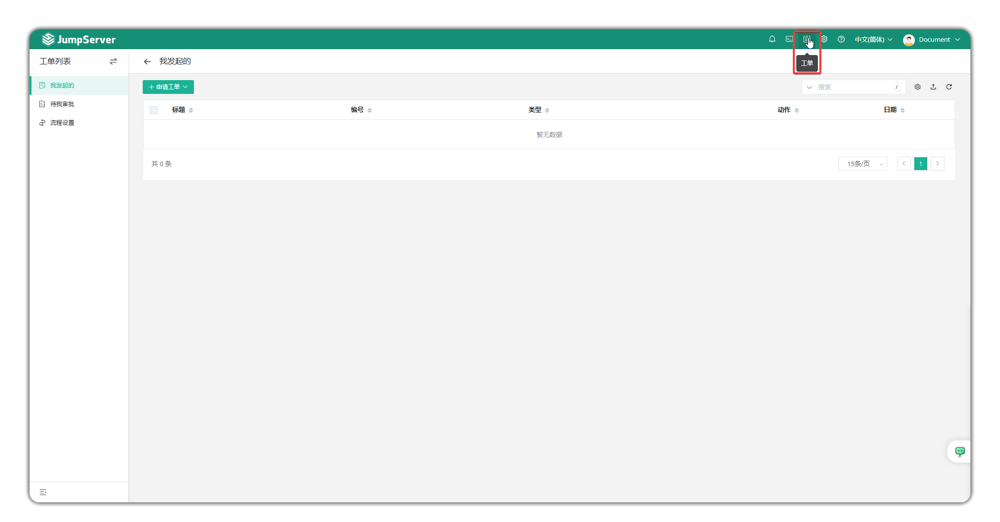
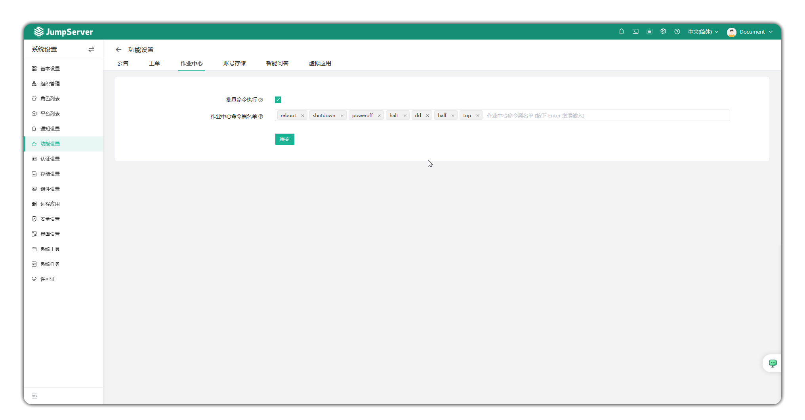
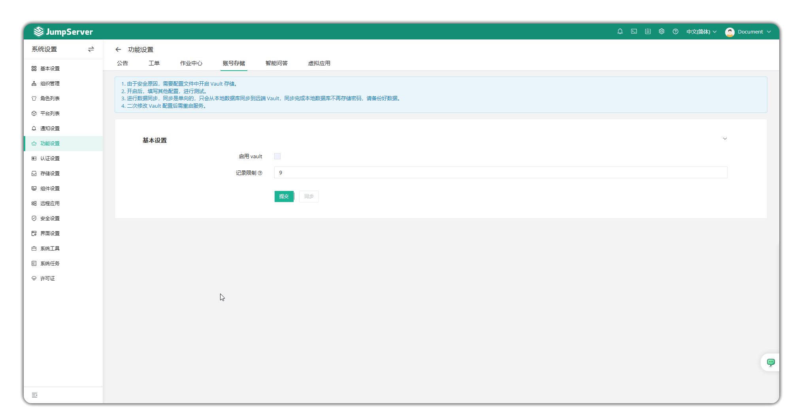
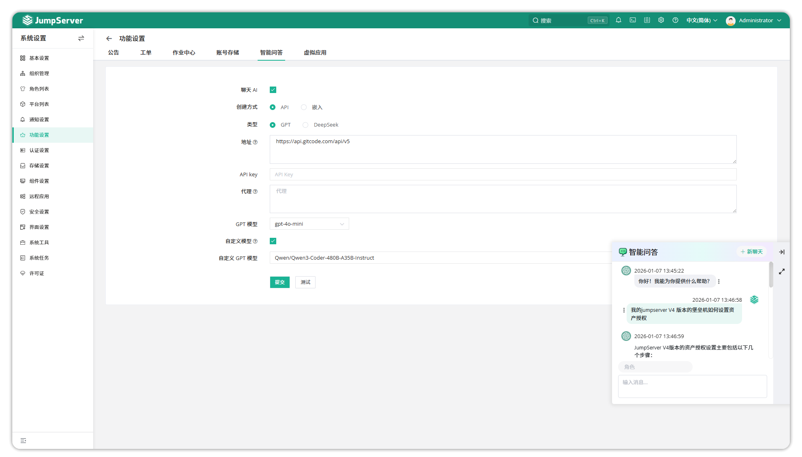
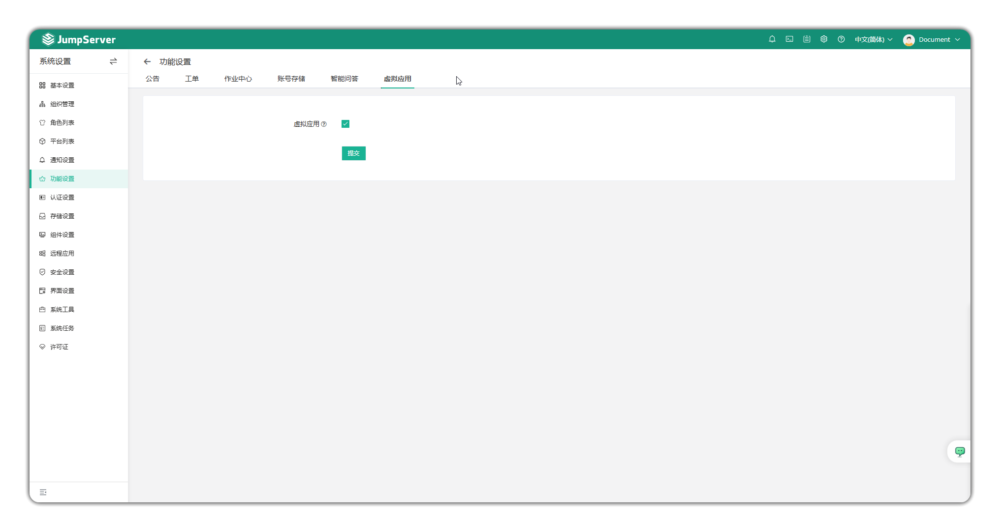

# Feature Settings

!!! tip ""
    - Enter the **System Settings** page by clicking the gear icon in the top-right corner, then click **Feature Settings** to open the feature settings page.

## 1 Announcements
!!! tip ""
    - Click **Announcements** at the top of the page to enter the announcement settings page.
    - This page allows you to customize whether to enable announcement functionality and set announcement content to be displayed globally on the JumpServer page.

!!! tip ""
    - The effect after enabling announcements is shown below.

## 2 Tickets
!!! tip ""
    - Click **Tickets** at the top of the page to enter the ticket settings page.
    - You can customize whether to enable the ticket feature for users to request resource authorizations through tickets.

!!! tip ""
    - The effect after enabling tickets is shown below.

## 3 Job Center
!!! tip ""
    - Click **Job Center** at the top of the page to enter the job center settings page.
    - The batch command execution option determines whether to allow users to execute batch commands in **Workbench > Job Center**.
    - The job center command blacklist settings prevent certain commands from being used in batch commands.

## 4 Account Storage
!!! info "Note: Account storage is an Enterprise edition feature."

!!! tip ""
    - Click **Account Storage** at the top of the page to enter the account storage settings page.
    - Account secrets support integration with HashiCorp Vault third-party secret storage system. Users need to modify the `VAULT_ENABLED = true` parameter in the `config.txt` configuration file and configure the `VAULT_BACKEND = [local/hcp/azure/aws]` parameter according to the storage engine, then return to the page to configure.
    - Perform data synchronization, which is one-way and only syncs from the local database to the remote Vault. After synchronization completes, the local database no longer stores passwords; please backup your data.
    - Restarting the service is required after modifying the Vault configuration.

## 5 Smart Q&A

!!! tip ""
    - Click **Smart Q&A** at the top of the page to enter the Smart Q&A settings page.
    - Smart Q&A supports integration with ChatGPT, Deepseek, and custom model services (custom model feature is available in v4.10.14 and above). After enabling, you can start the chat AI feature for smart Q&A.
    - Fill in the base address and API Key of the chat service, click **Save**, then click **Test**. After successful connection test, you can start chatting with the smart assistant.

## 6 Virtual Applications
!!! info "Note: Virtual applications are an Enterprise edition feature."

!!! tip ""
    - Click **Virtual Applications** at the top of the page to enter the virtual applications settings page.
    - JumpServer supports using Linux systems as the runtime carrier for remote application functionality. Enable virtual application functionality based on Linux systems on this page.
    - For usage configuration, see [Virtual Applications Configuration](virtual_apps.md).

