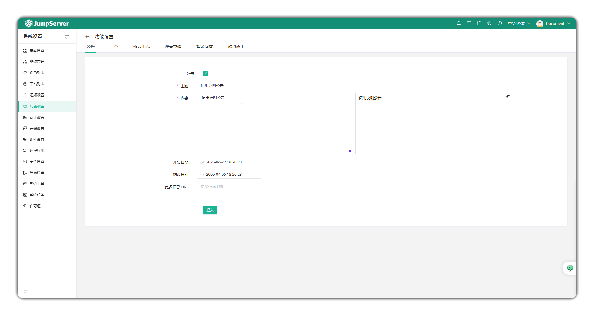
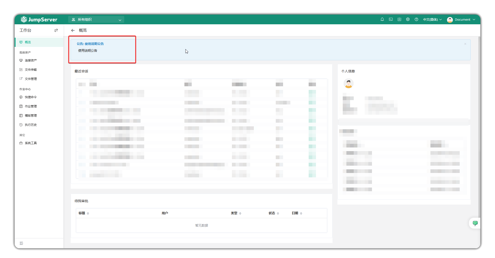
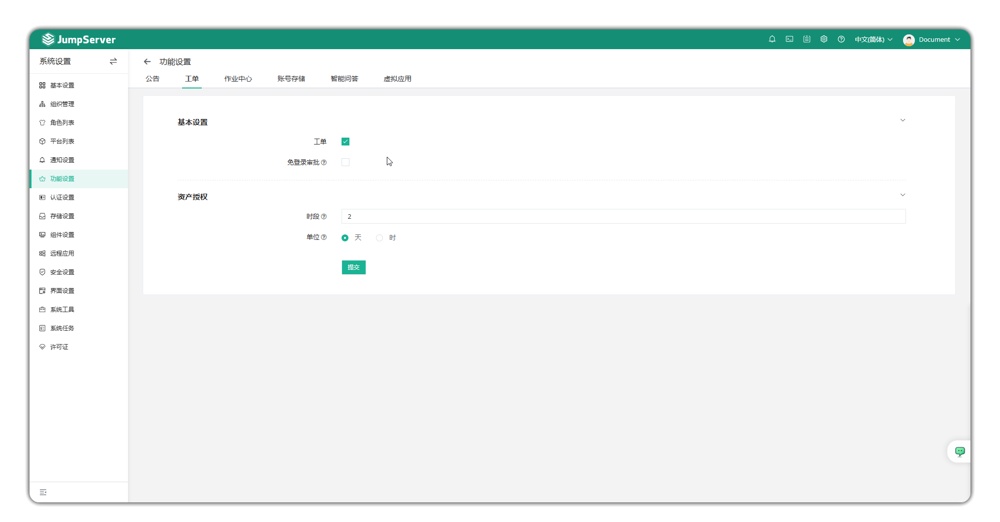
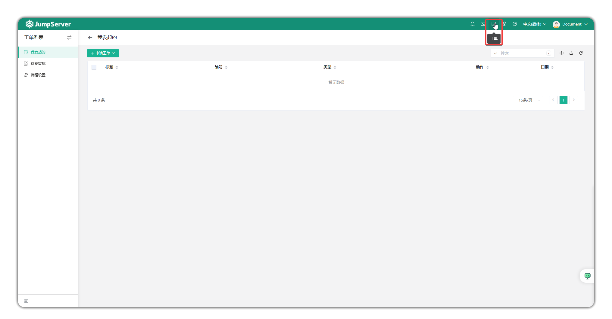
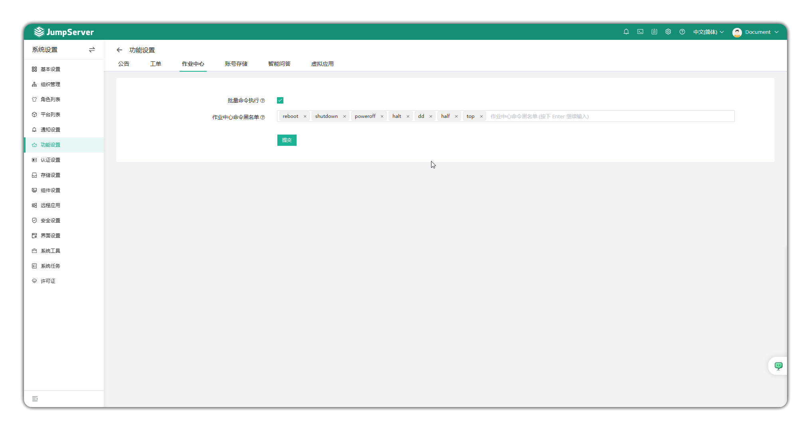
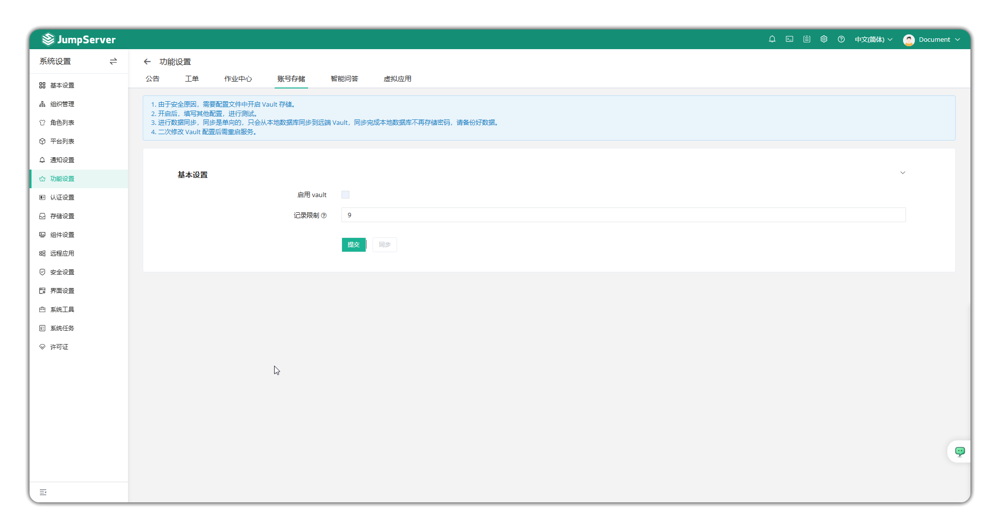
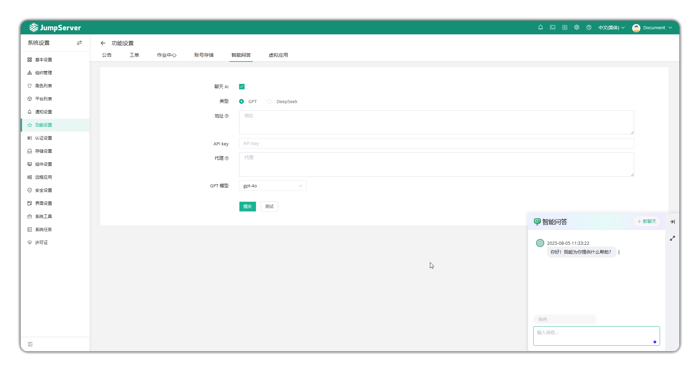
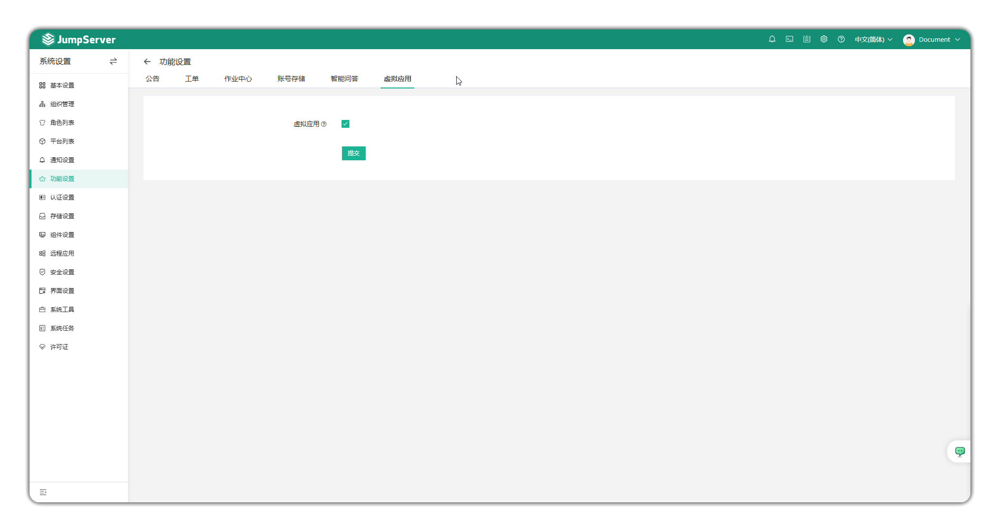

# 功能设置

!!! tip ""
    - 通过点击页面右上角小齿轮进入 **系统设置** 页面，点击 **功能设置** ，进入功能设置页面。

## 1 公告
!!! tip ""
    - 点击页面上方的 **公告** ，即进入公告设置页面。
    - 该页面可以自定义是否启用公告功能，并设置公告内容，在JumpServer页面全局展示。

!!! tip ""
    - 启用公告后效果如下。

## 2 工单
!!! tip ""
    - 点击页面上方的 **工单** ，即进入工单设置页面。
    - 可以自定义是否启用工单功能，用户可以通过工单来申请资源授权。

!!! tip ""
    - 启用工单后效果如下。

## 3 作业中心
!!! tip ""
    - 点击页面上方的 **作业中心** ，即进入作业中心设置页面。
    - 批量命令执行选项决定是否允许用户在 **工作台 > 作业中心** 中执行批量命令。
    - 作业中心命令黑名单设置不允许在批量命令中使用的命令。

## 4 账号存储
!!! info "注：账号存储为企业版功能。"

!!! tip ""
    - 点击页面上方的 **账号存储** ，即进入账号存储设置页面。
    - 账号密钥支持对接HashiCorp Vault第三方密钥存储系统，用户需要在 `config.txt` 配置文件中修改参数 `VAULT_ENABLED = true` 以及按照存储引擎配置 `VAULT_BACKEND = [local/hcp/azure/aws]` 参数，然后回到页面进行配置即可。
    - 进行数据同步，同步是单向的，只会从本地数据库同步到远端 Vault，同步完成后本地数据库不再存储密码，请备份好数据。
    - 二次修改 Vault 配置后需重启服务。

## 5 智能问答

!!! tip ""
    - 点击页面上方的 **智能问答** ，即进入智能问答设置页面。
    - 智能问答支持对接ChatGPT服务，启动ChatAI小助手功能进行智能问答。

## 6 虚拟应用
!!! info "注：虚拟应用为企业版功能。"

!!! tip ""
    - 点击页面上方的 **虚拟应用** ，即进入虚拟应用设置页面。
    - JumpServer支持使用Linux系统作为远程应用功能的运行载体，在此页面开启以Linux系统为底层的虚拟应用功能。
    - 使用配置见[虚拟应用配置说明](virtual_apps.md)。
