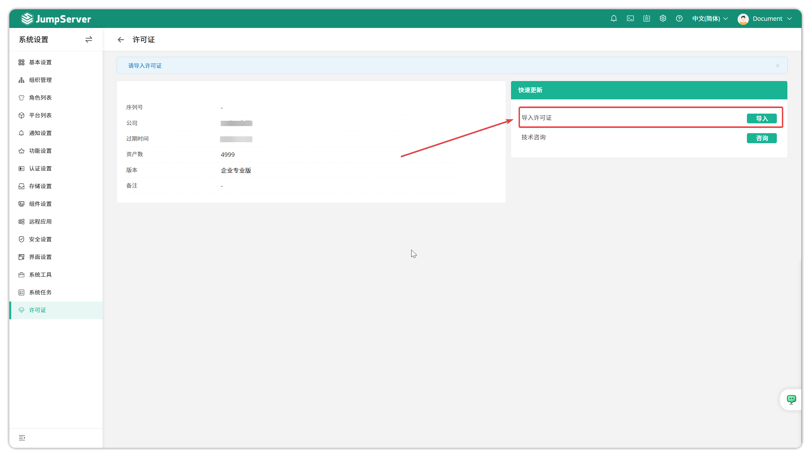

# Licenses
!!! tip ""
    - Enter the **System Settings** page by clicking the gear icon in the top-right corner, then click **Licenses** to open the licenses page.
    - Click the **Licenses** button on the left side of the page to enter the licenses page. This page allows you to import FIT2CLOUD Enterprise License to use enterprise features, and you can view the number of asset authorizations and the expiration time of JumpServer Enterprise License.
!!! warning "Non-enterprise installation packages cannot import License."
!!! tip ""
    - You can import licenses by clicking the **Import** button.

