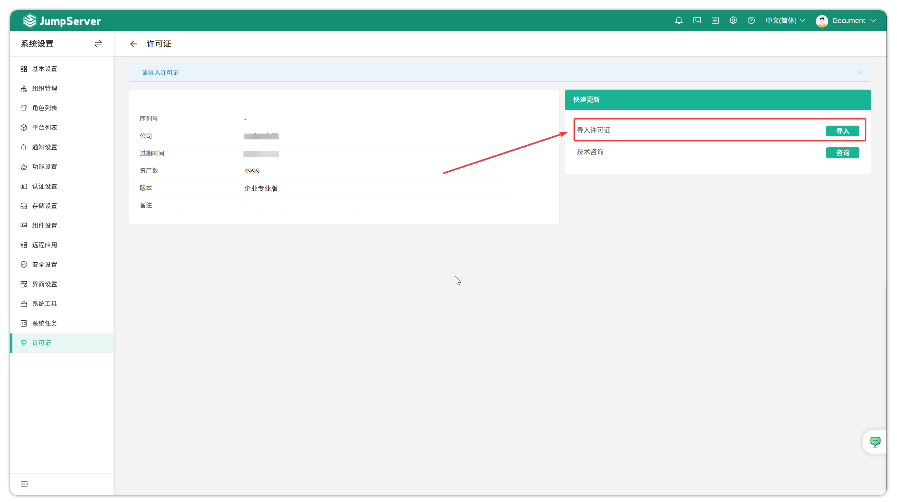

# 许可证
!!! tip ""
    - 通过点击页面右上角小齿轮进入 **系统设置** 页面，点击 **许可证** ，进入许可证页面。
    - 点击页面左侧的  **许可证**  按钮，进入许可证页面。该页面可以导入飞致云企业 License 使用企业版功能，可以查看资产授权数量以及 JumpServer 企业版 License 过期时间。  
!!! warning "非企业版安装包，不能导入 License。"
!!! tip ""
    - 可以通过按钮 **导入** 导入许可证。
