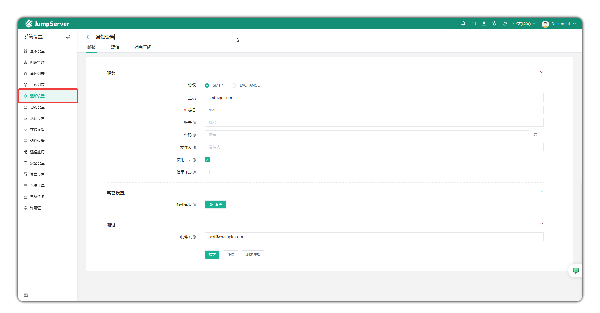
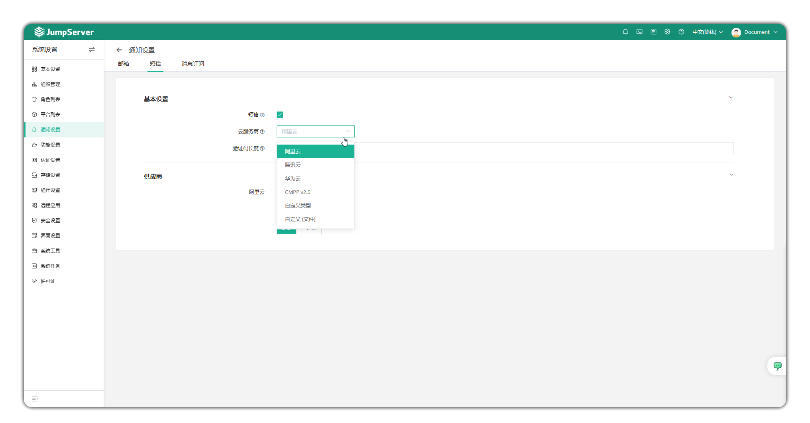
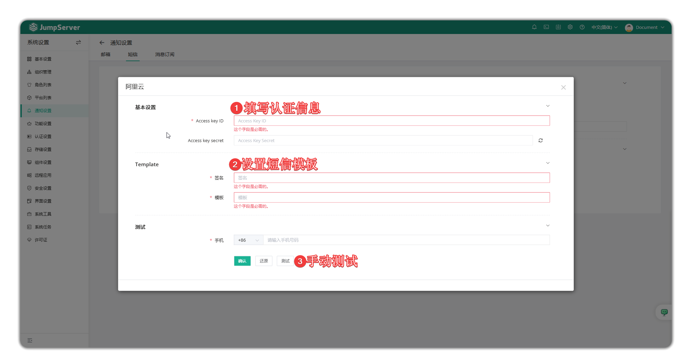
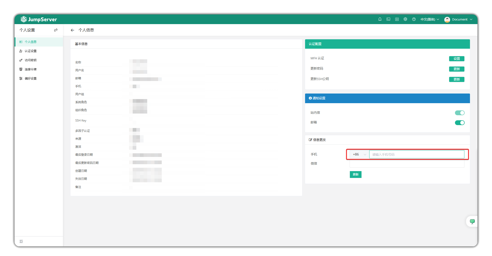
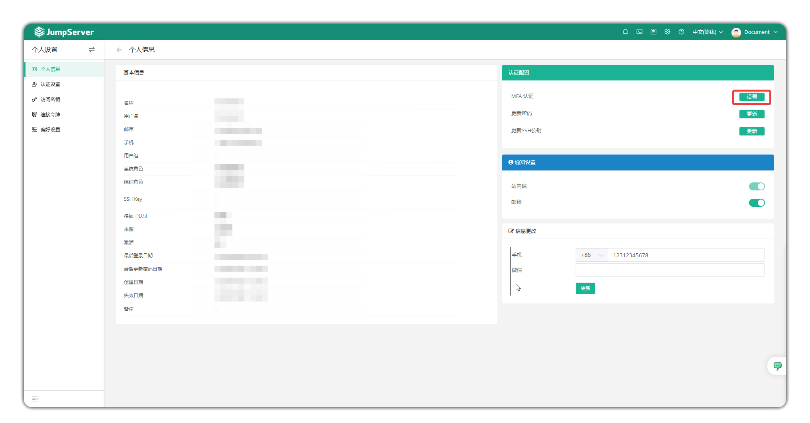
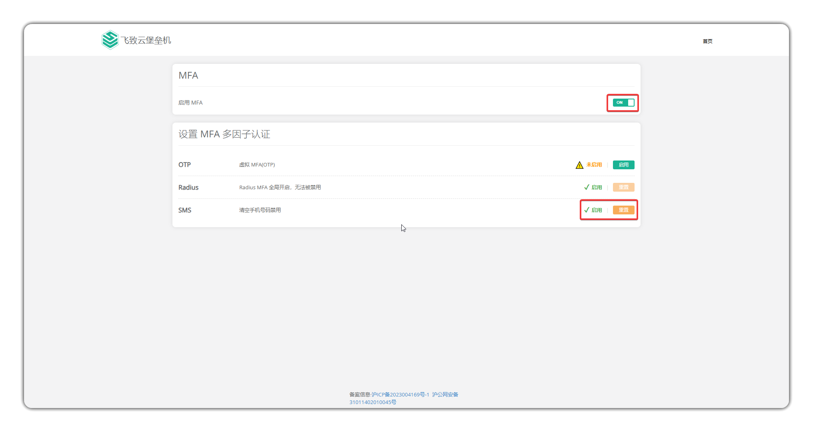
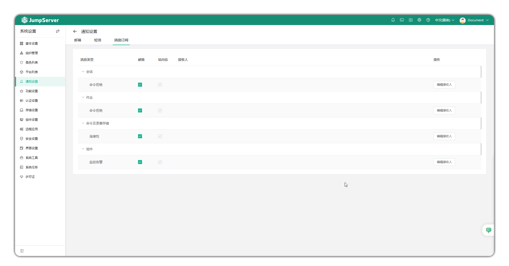
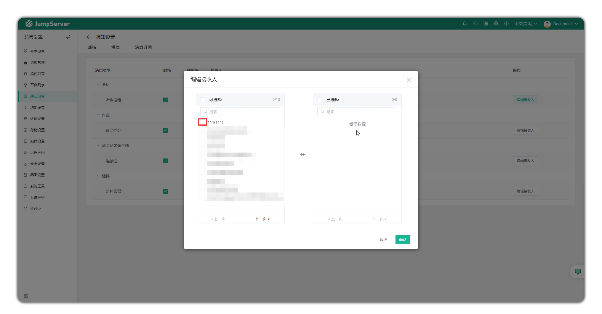

# Notification Settings

!!! tip ""
    - Enter the **System Settings** page by clicking the gear icon in the top-right corner, then click **Notification Settings** to open the notification settings page.

## 1 Email Settings
!!! tip ""
    - The email settings interface primarily configures the sender email information for sending emails such as user password setup emails, dangerous command emails, authorization expiration emails, etc. to JumpServer user mailboxes.

!!! tip "Parameter Description"
| Parameter | Description |
|-----------|-------------|
| Protocol | Protocol used by the email service |
| Host | Email server address |
| Port | Port used by the email server |
| Account | Username to log in to the email server |
| Password | Password to log in to the email server |
| Sender | Email address of the sender |
| Use SSL | Whether to use implicit TLS connection when communicating with SMTP server |
| Use TLS | Whether to use TLS connection when communicating with SMTP server |
| Email Template | Template for sending emails, including email title prefix and email content |
| Recipient | Test mailbox address for testing email server connectivity |

## 2 SMS Settings
!!! info "Note: SMS service is a JumpServer Enterprise edition feature."

### 2.1 Overview
!!! tip ""
    - You can set SMS MFA authentication method (currently supports Alibaba Cloud, Tencent Cloud, Huawei Cloud, CMPP V2.0, and custom integration).
    - JumpServer also supports using SMS to recover user passwords. Administrators need to enable SMS service, and user information needs to have a phone number configured.

### 2.2 Configuration Description
!!! tip ""
    - Select the corresponding SMS service provider and fill in the authentication information from the service provider platform. Click the **Test** button to test whether the configuration is correct.

!!! tip "SMS Configuration Template Example"
    - Your JumpServer verification code is: ${code}, valid within 1 minute. Do not share!

### 2.3 User-side Configuration
!!! tip ""
    - Click your avatar - Personal Information to configure your personal phone number in the phone section.

!!! tip ""
    - Click the MFA authentication settings button to open the settings page.
    - Click the Enable MFA button, then click the Enable SMS button to use SMS authentication.

## 3 Message Subscriptions
### 3.1 Overview
!!! tip ""
    - You can set the recipients of JumpServer platform monitoring messages.
    - You can set the sending method for monitoring messages (in-site and email).

### 3.2 Set Message Recipients
!!! tip ""
    - Configure message recipients to receive platform monitoring notifications.

