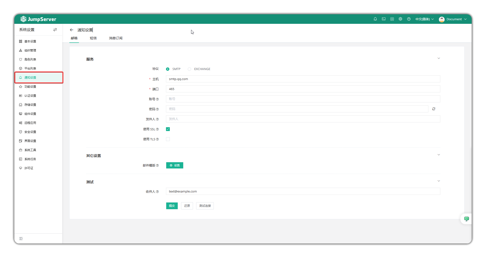
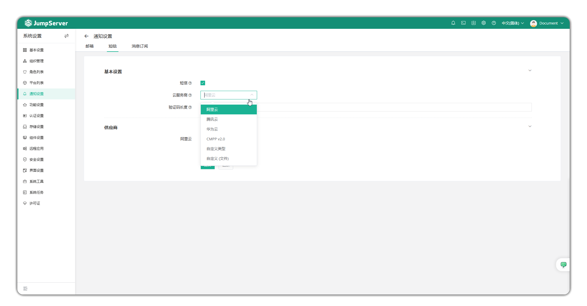
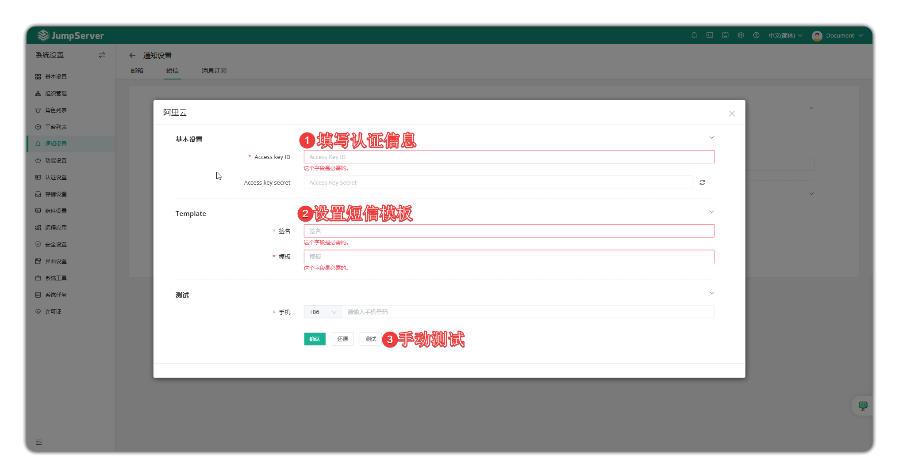
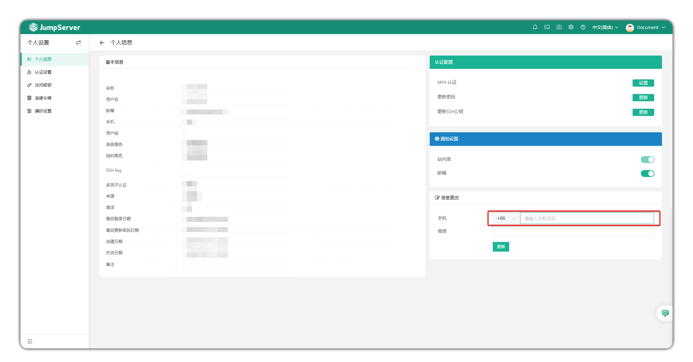
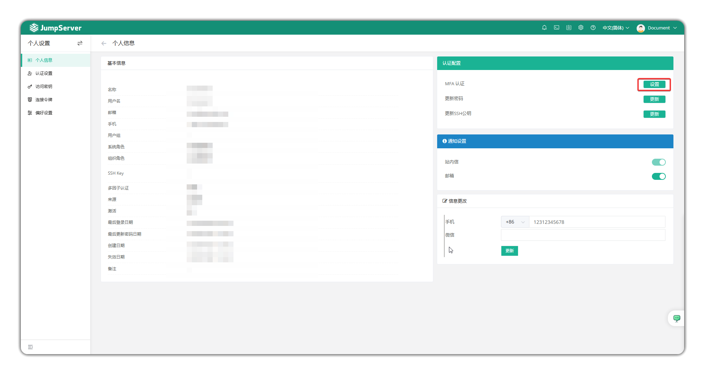
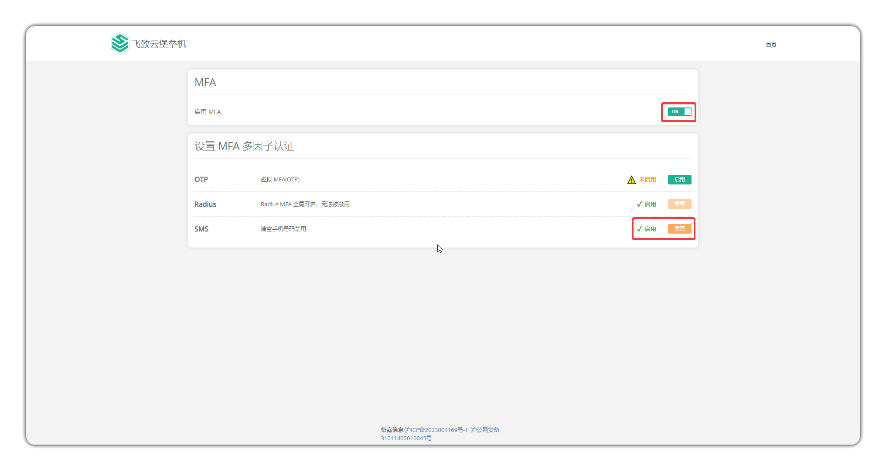
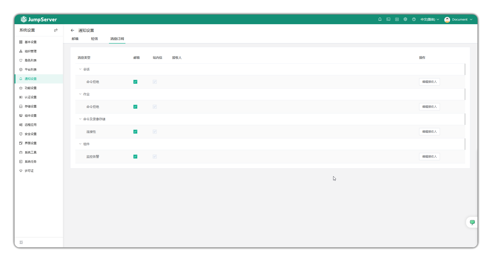
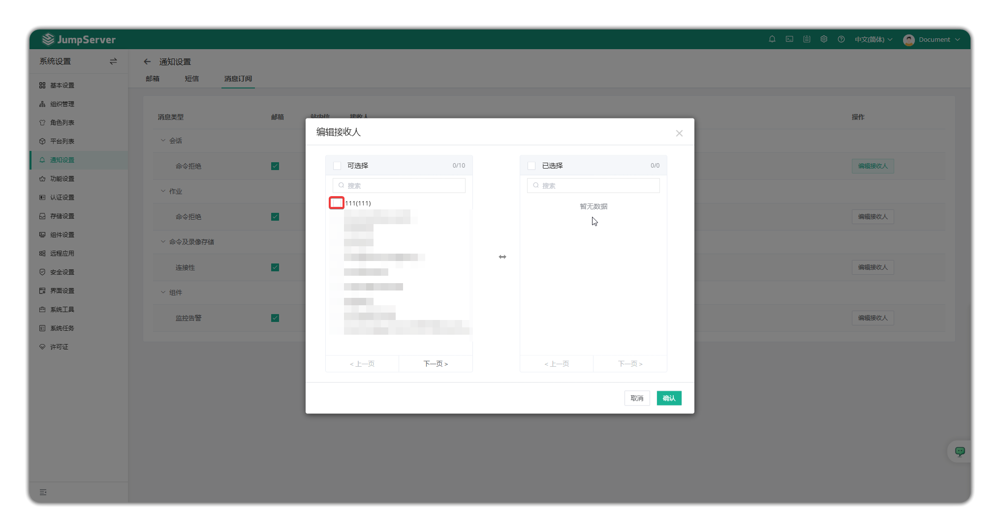

# 通知设置

## 1 邮箱设置
!!! tip ""
    - 点击页面左侧的`通知设置`按钮，即进入邮件设置页面。
    - 邮件设置界面主要配置邮件的发件邮箱信息，用于发送创建用户密码设置邮件、危险命令邮件、授权过期邮件等邮件到JumpServer用户邮箱。

!!! tip "参数说明"
| 参数 | 说明 |
|----------|----------|
| 协议 | 邮件服务使用的协议 |
| 主机 | 邮件服务器的地址 |
| 端口 | 邮件服务器使用的端口 |
| 账户 | 登录到邮件服务器的用户名 |
| 密码 | 登录到邮件服务器的密码 |
| 发件人 | 发件人的电子邮件地址 |
| 使用SSL | 与SMTP服务器通信时是否使用隐式TLS连接 |
| 使用TLS | 与SMTP服务器通信时是否使用TLS连接 |
| 邮件模板 | 用于发送邮件的模版，包括邮件标题前缀和邮件内容 |
| 收件人 | 用于测试电子邮件服务器是否连通的测试邮箱地址 |

## 2 短信设置
!!! info "短信服务为JumpServer企业版功能。"

### 2.1 功能概述
!!! tip ""
    - 可以设置短信MFA认证方式(目前支持阿里云、腾讯云、华为云、CMPP V2.0和自定义方式对接)。
    - JumpServer还支持使用手机短信找回用户密码，管理员需要开启SMS服务，且用户信息需要配置手机号。

### 2.2 配置说明
!!! tip ""
    - 选择对应的短信服务商，填入服务商平台认证相关信息，点击`测试`按钮可测试配置是否正确。

!!! tip "短信配置模板示例"
    - 您的 JumpServer 动态码为：${code}，验证码 1 分钟内有效，请勿泄露！

### 2.3 用户侧配置
!!! tip ""
    - 点击用户头像-个人信息在手机一栏配置用户个人手机号。

!!! tip ""
    - 点击MFA认证设置按钮，进入设置页面。
    - 点击启用MFA按钮，再点击启用SMS按钮即可使用短信认证功能。

## 3 消息订阅
### 3.1 功能概述
!!! tip ""
    - 可以设置JumpServer平台监控消息的接收人。
    - 可以设置监控消息的发送方式(站内信和邮件)。

### 3.2 设置消息接收人
!!! tip ""
    - 点击`修改消息接收人`按钮，进入设置界面。
    - 在可选择列表中勾选用户，会将其移入已选择。在已选择列表中勾选用户，会将其移入未选择。
