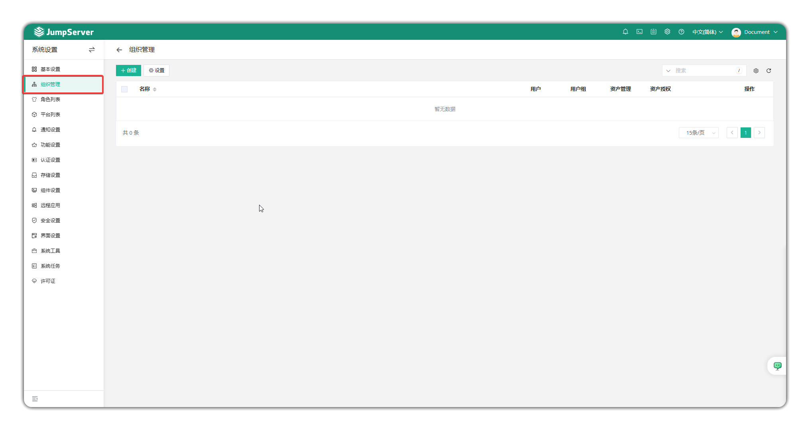
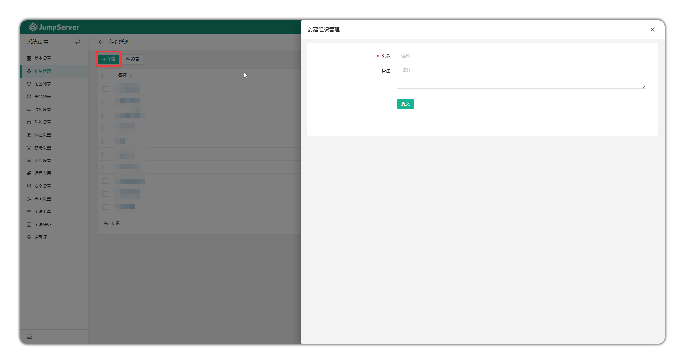
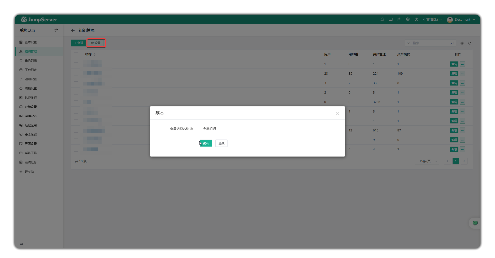

# Organization Management

!!! info "Note: Organization management is a JumpServer Enterprise edition feature."

## 1 Overview
!!! tip ""
    - Enter the **System Settings** page by clicking the gear icon in the top-right corner, then click **Organization Management** to open the organization management page.
    - JumpServer supports organization-based management methods, enabling authorization administrators to create and view operational audit information for different organizational environments according to company organizational structure, including administrators, users, user groups, assets, domains, accounts, labels, permission management, etc.

## 2 Create Organization
!!! tip ""
    - Click the **Create** button to create a new organization and enter the organization name and notes.
    - Click the **Settings** button to set the display name of the global organization.

!!! warning "Updates and deletions of roles, assets, accounts and other information within organizations should be performed within their respective organizations."
