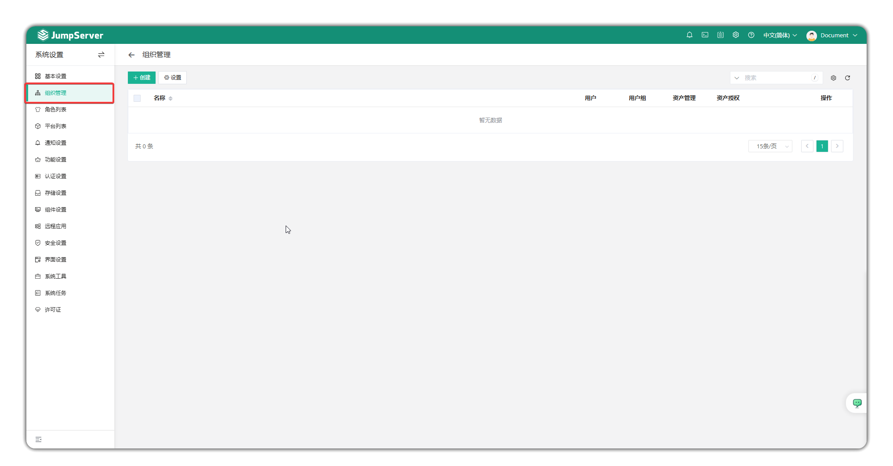

# 组织管理

!!! note "注：组织管理为 JumpServer 企业版功能。"

## 功能概述
!!! tip ""
    - 点击页面左侧的`组织管理`按钮，进入组织管理页面。
    - JumpServer支持按组织的管理方式，方便授权管理员根据公司组织结构创建和查看不同组织环境的运维审计信息，包括管理员、用户、用户组、资产、网域、账号、标签、权限管理等。

## 创建组织
!!! tip ""
    - 点击`创建`按钮创建新组织，输入组织的名称和备注。
    - 点击`设置`按钮可以设置全局组织的显示名称。

!!! warning "组织内的角色、资产、账户等信息的更新、删除操作，都应切换至各自的组织内进行操作。"