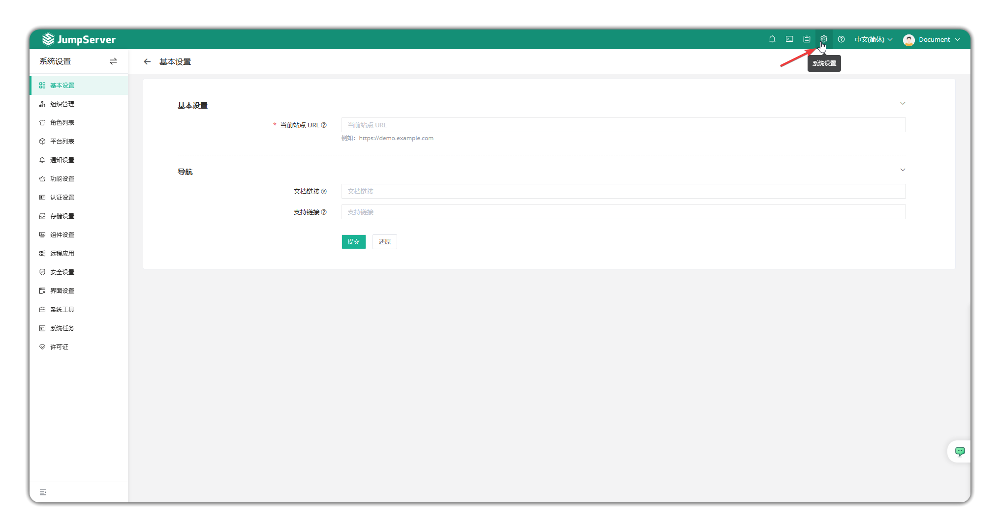

# Overview

## 1 Overview
!!! tip ""
    - Enter the **System Settings** page by clicking the gear icon in the top-right corner.
    - System Settings is the operation entry point for global JumpServer settings. Through System Settings, you can configure various types of system parameters such as JumpServer roles, platforms, remote applications, security, etc.

