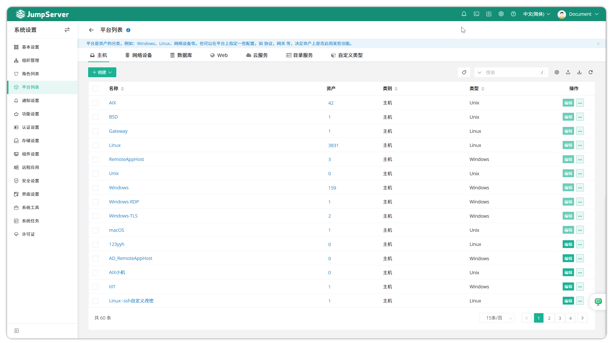
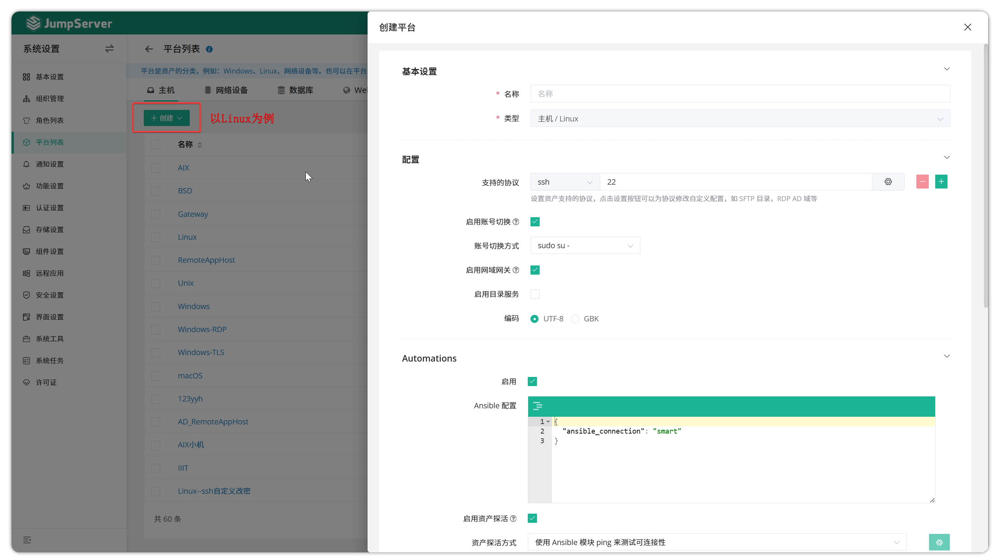
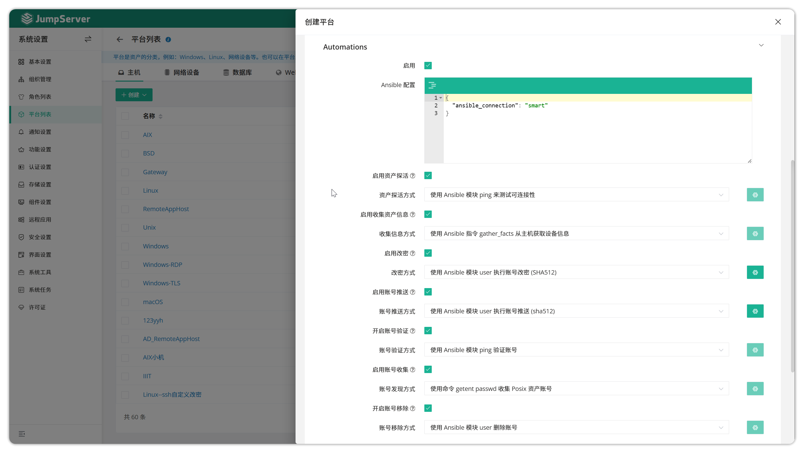
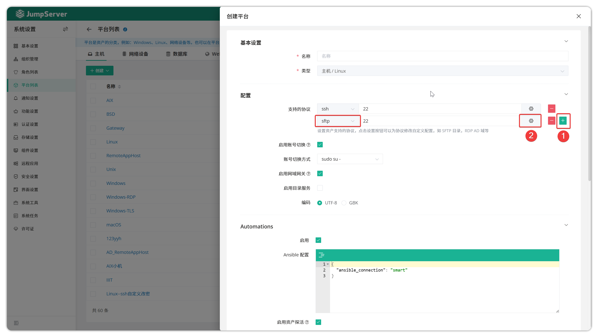
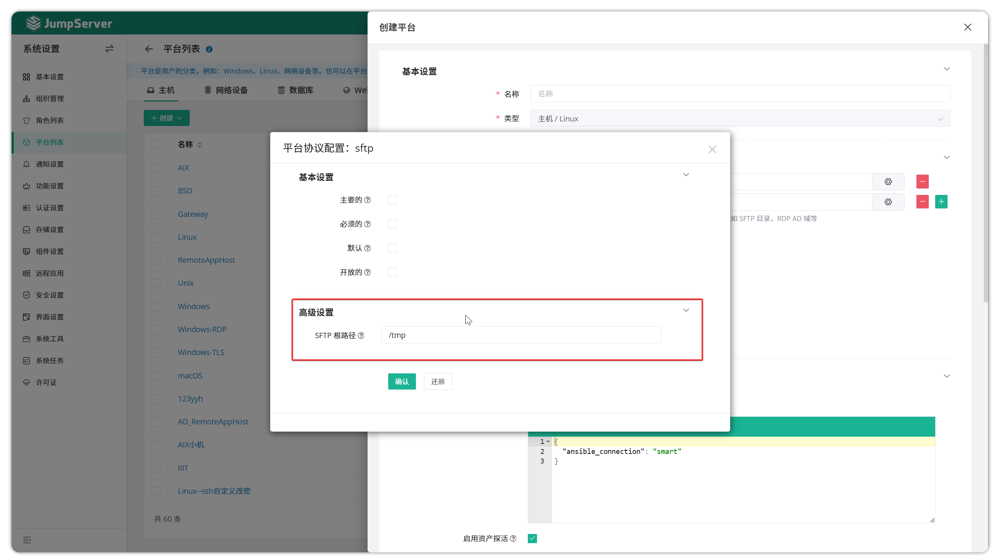

# Platform List

!!! warning "Note: Starting from v4.9, JumpServer platform-related settings have been moved to System Settings"

## 1 Overview
!!! tip ""
    - Enter the **System Settings** page by clicking the gear icon in the top-right corner, then click **Platform List** to open the platform list page.
    - The platform list is selectable when creating assets. Users can select different system types such as Linux, Windows, etc. when creating assets.
    - At the same time, you can create new platform types by selecting a specified base platform, which can then be specified as the new platform type in asset creation.

## 2 Create Asset Platform
!!! tip ""
    - Click the **Create** button on the platform list page and fill in the asset platform information to create a new asset platform, using Linux as an example.

!!! tip ""
    - Detailed parameter descriptions:
    
| Parameter | Description |
|-----------|-------------|
| Name | The name of the asset platform |
| Type | The type of asset platform; different system types determine different encodings and automation methods |
| Encoding | The encoding method for the asset platform, selectable between "UTF-8" or "GBK" |
| Enable Domain | Whether to enable domain; some platform types cannot enable domain meaning those platform types do not support domain functionality |
| Supported Protocols | Set the protocols supported by the asset platform; default protocols for each platform cannot be deleted; default port numbers for protocols can be modified |
    
!!! tip ""
    - Account switching parameter description:
    
| Option | Description |
|--------|-------------|
| Enable Account Switching | Enable account switching with supported account switching methods such as `sudo su -` and `su -` |
| Disable Account Switching | Disable account switching functionality; some asset platforms do not support account switching meaning those platforms do not support account switching |
    
!!! tip ""
    - Automation parameter description (enabled state); disabled means automation tasks are closed:
    
| Parameter | Description |
|-----------|-------------|
| Ansible Configuration | Ansible connection and other information configuration; generally not modified |
| Enable Asset Probing | Whether to enable asset probing for connectivity detection |
| Asset Probing Method | Set the asset probing method |
| Collect Asset Info | Whether to enable asset information collection for hardware info, etc. |
| Information Collection Method | Set the information collection method |
| Enable Account Password Change | Whether to enable account password change |
| Account Password Change Method | Set the account password change method |
| Enable Account Push | Whether to enable account push |
| Account Push Method | Set the account push method; can be modified in account push |
| Enable Account Validation | Whether to enable account validation |
| Account Validation Method | Set the account validation method |
| Enable Account Collection | Whether to enable account collection functionality |
| Account Collection Method | Set the account collection method |
    
    
## 3 Custom SFTP Directory Path
!!! tip ""
    - The default SFTP directory path is `/tmp`, and custom directories are supported.
    - Click the **Create** button on the platform list page, add the SFTP protocol, then click the **gear** button behind the configuration.
    - Customize the SFTP root directory modification.

