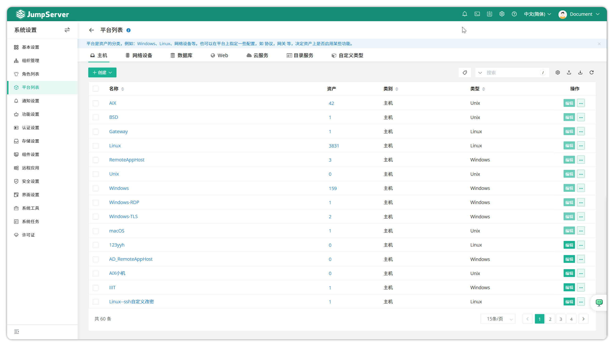
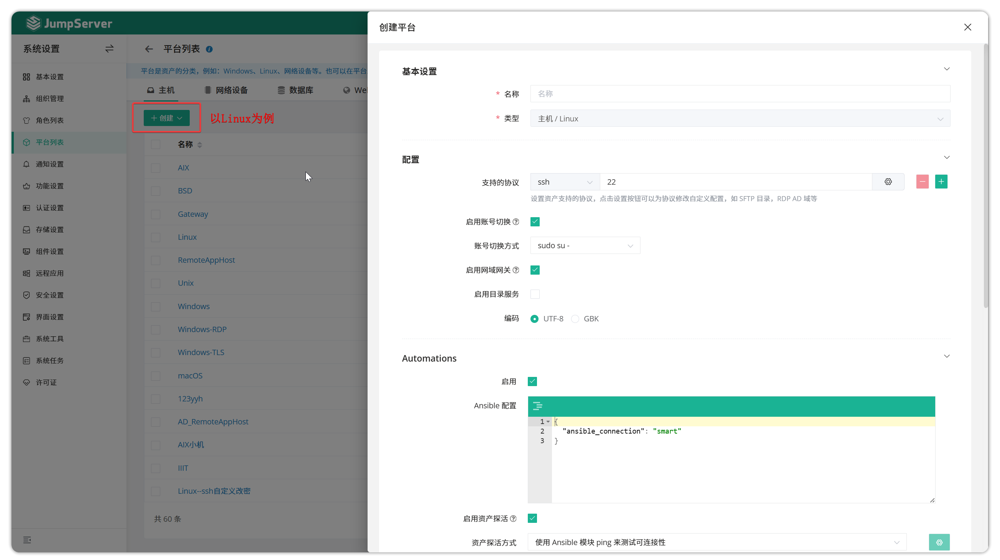
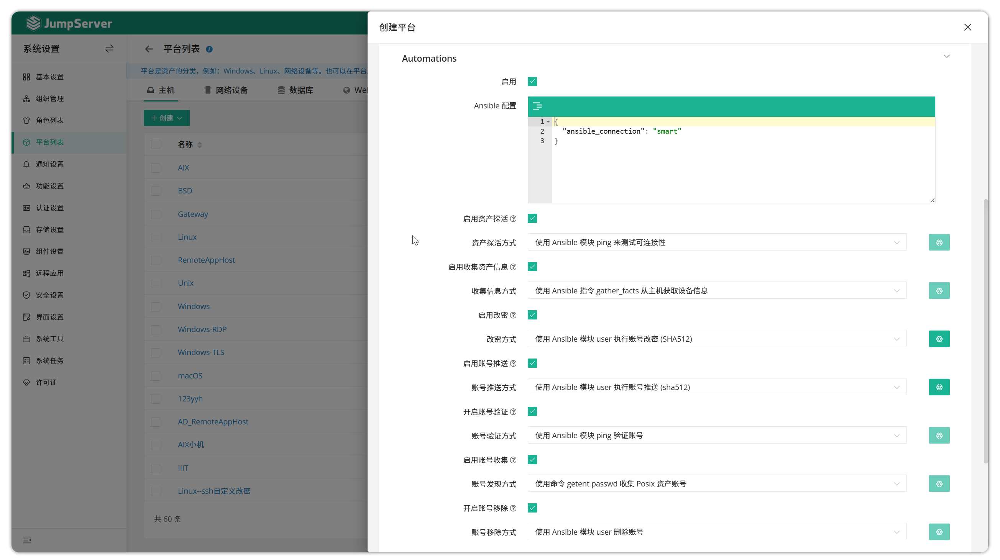
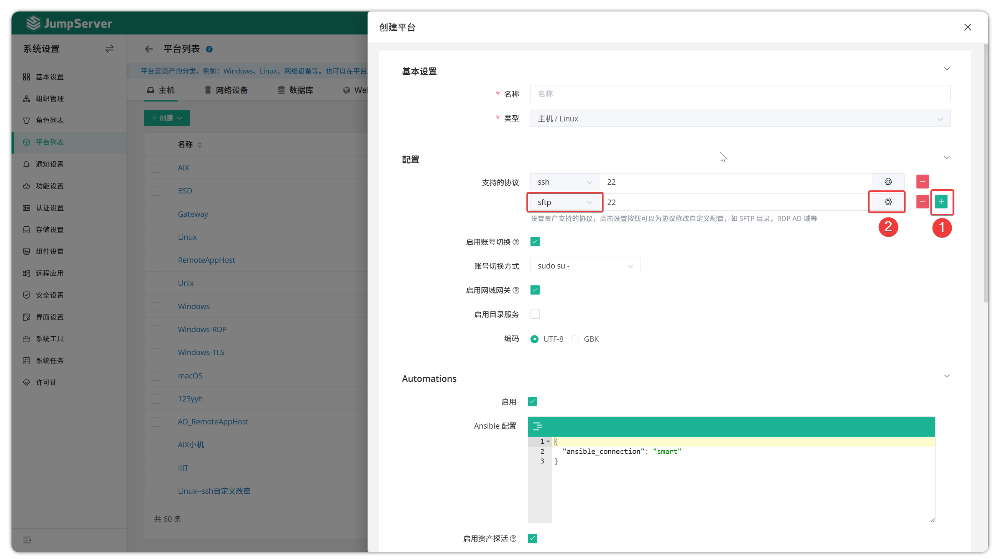
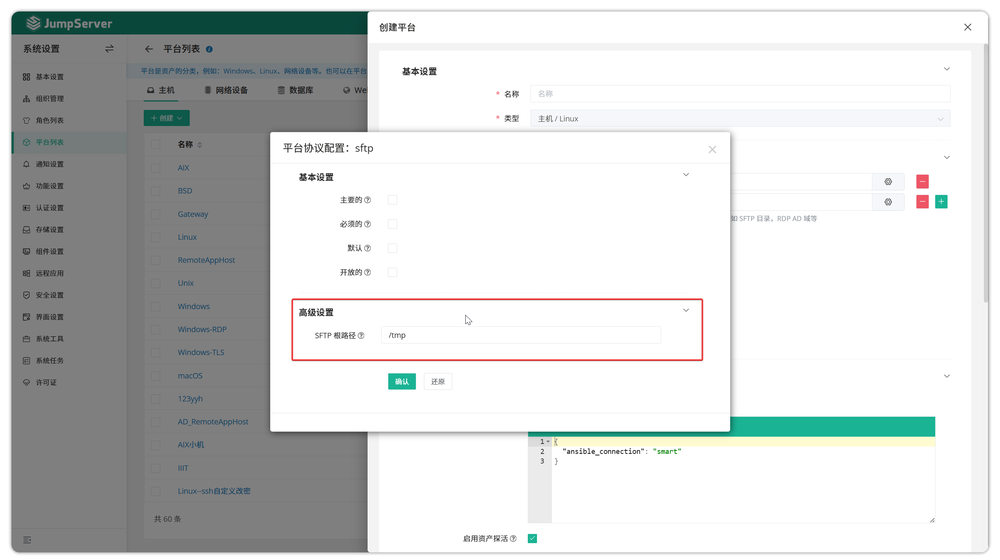

# 平台列表

## 1 功能描述
!!! tip ""
	- JumpServer 支持用户自定义平台列表。
	- 平台列表在创建资产时供选择，用户可以在创建资产时为资产选择不同的系统类型，如Linux、Windows 等。
	- 用户也可以新建一个平台类型，并选择指定的基础平台，就可以在创建资产中指定新建的平台类型。

## 2 资产平台的创建
!!! tip ""
	- 点击平台列表页面的`创建`按钮，填写资产平台的信息即可创建新的资产平台，以 Linux 为例。

!!! tip ""
	- 详细参数说明：
	
	| 参数       | 说明                                                                 |
    |------------|----------------------------------------------------------------------|
    | 名称       | 资产平台的名称。                                                     |
    | 类型       | 资产平台的类型，不同的系统类型决定不同的编码与自动化方式。             |
    | 编码       | 资产平台选择的编码方式，可选择"UTF8"或"GBK"。                         |
    | 启用网域    | 是否启用网域，某些类型的平台中不可开启即该平台类型不支持启用网域。       |
    | 支持的协议  | 设置资产平台支持的协议，每个平台中默认的协议不可删除。协议的默认端口号支持修改。 |
    
!!! tip ""
	- 切换账号参数说明：
	
	| 选项 | 说明 |
    |------|------|
    | **启用切换账号** | 启用切换账号，支持的帐号切换方式有 `sudo su -`、`su -`。 |
    | **不启用切换账号** | 不启用切换账号功能。某些资产平台中不支持启用切换账号即表示该资产平台不支持切换账号功能。 |
    
    
!!! tip ""
	- 自动化参数说明（启用状态），不启用为自动化任务关闭：
	
	| 参数 | 说明 |
    |------|------|
    | **Ansible配置** | Ansible 连接等信息配置。一般不进行修改。 |
    | **启用资产探测** | 是否启用资产探测，即获取资产连接性。 |
    | **资产探测方式** | 设置资产的探测方式。 |
    | **收集资产信息** | 是否启用资产信息，即获取资产硬件信息等。 |
    | **收集信息方式** | 设置收集信息的方式。 |
    | **启用账号改密** | 是否启用账号改密。 |
    | **账号改密方式** | 设置账号改密的方式。 |
    | **启用推送账号** | 是否开启推送账号。 |
    | **推送账号方式** | 设置推送账号的方式。账号推送中可更改推送账号的默认参数。 |
    | **启用校验账号** | 是否开启校验账号。 |
    | **校验账号方式** | 设置校验账号的方式。 |
    | **启用账号收集** | 是否启用账号收集功能。 |
    | **收集账号方式** | 设置收集账号的方式。 |
    
    
## 3 自定义SFTP目录路径
!!! tip ""
	- SFTP 目录的默认路径为/tmp ，我们支持自定义该目录。
	- 点击平台列表页面的`创建`按钮，增加SFTP协议后点击配置后方的`齿轮`按钮。
	- 自定义修改 SFTP 根目录即可。

