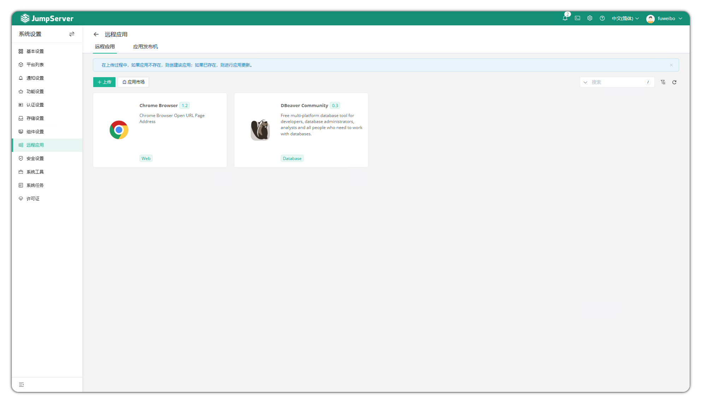
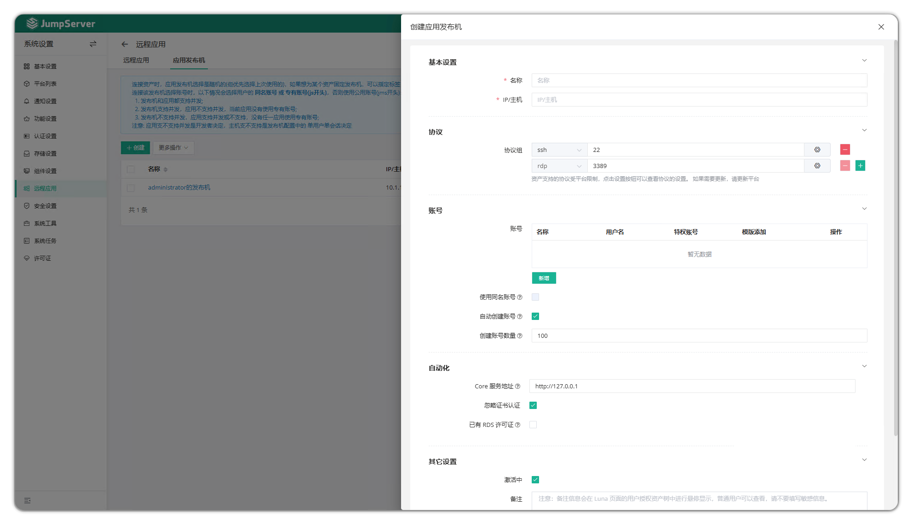
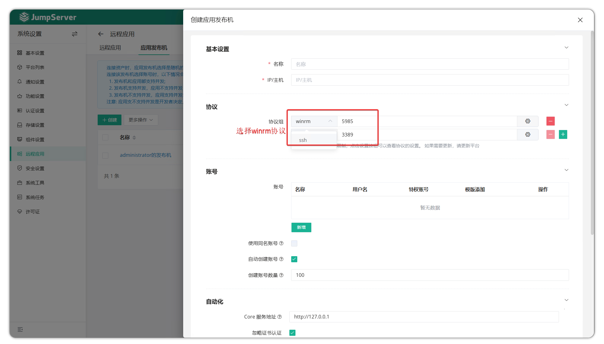
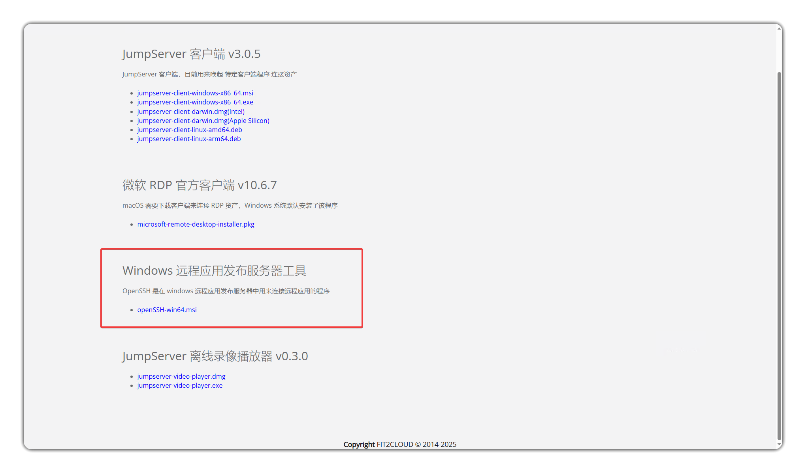
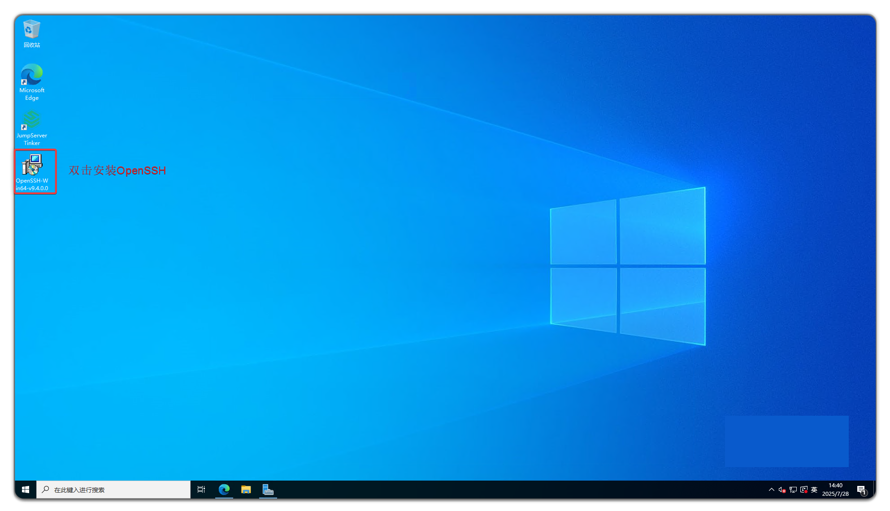

# Remote Applications
!!! warning "Note: Community edition only supports Web GUI for remote applications; local client connection (MSTSC) is an Enterprise edition feature."
## 1 Overview
!!! tip ""
    - Enter the **System Settings** page by clicking the gear icon in the top-right corner, then click **Remote Applications** to open the remote applications page.
    - RemoteApp is a service functionality integrated by Microsoft in Windows Server 2008 and later systems, allowing users to access remote desktops and programs through Remote Desktop without requiring clients to install systems and applications locally.

## 2 Application Publisher
!!! tip ""
    - RemoteApp functionality requires preparing an application publisher environment.
    - The application publisher is the runtime carrier for running Web page assets or programs using remote applications like Navicat to connect to databases.

### 2.1 System Requirements
!!! tip ""
    - The specific system requirements for the application publisher are as follows:

| Configuration | Minimum Requirement | Description |
|-----------|-----------|------|
| Operating System | Windows Server 2019 | Recommended to use Windows Server 2019 |
| CPU | 4 cores | At least 4 CPU cores |
| Memory | 8 GB | At least 8 GB RAM |
| Remote Management Protocol | WinRM or OpenSSH | One of these protocols must be installed and correctly configured |
| RDS License | Installed and activated | Remote Desktop Services license must be valid; Windows Server defaults to 120-day trial |
| Network Connection | Able to access JumpServer service via network (HTTPS/HTTP) | Required for registration and application installation |

### 2.2 Create Application Publisher
!!! tip ""
    - Click the **Create** button on the application publisher page to create a new application publisher.

!!! tip ""
    - Deploying an application publisher through OpenSSH protocol requires installing OpenSSH, which can be obtained from the JumpServer page - **Web Terminal** > **Help** > **Download**.

#### WinRM (Recommended)

!!! note ""
    WinRM is a remote management service launched by Microsoft that can be quickly enabled using the `winrm quickconfig` command in PowerShell or CMD with an administrator account.

!!! tip ""
    - Simply add the WinRM protocol when creating an application publisher. If SSH protocol also exists, JumpServer will prioritize SSH.
    

#### OpenSSH

!!! tip ""
    - Deploying an application publisher through OpenSSH protocol requires first installing the OpenSSH protocol component.
    

!!! tip ""
    - After uploading the OpenSSH installation package to the application publisher desktop, double-click to install.
    

!!! tip ""
    - Detailed parameter descriptions:

| Parameter | Description |
| ------- | --------------------- |
| Name | The name of the remote application publisher for identification |
| IP/Hostname | IP information of the remote application publisher |
| Protocol Group | Protocol family and port supported by the remote application publisher |
| Account List | Connection account information for the remote application publisher, such as **Administrator** user; at least one privileged account in the Administrator group is needed for managing remote applications |
| Auto Create Account | Accounts created by this option are used to connect to published applications |
| Create Account Count | Number of public accounts to create |
| Core Service Address | Communication address between the application publisher's Agent and JumpServer Core component service |
