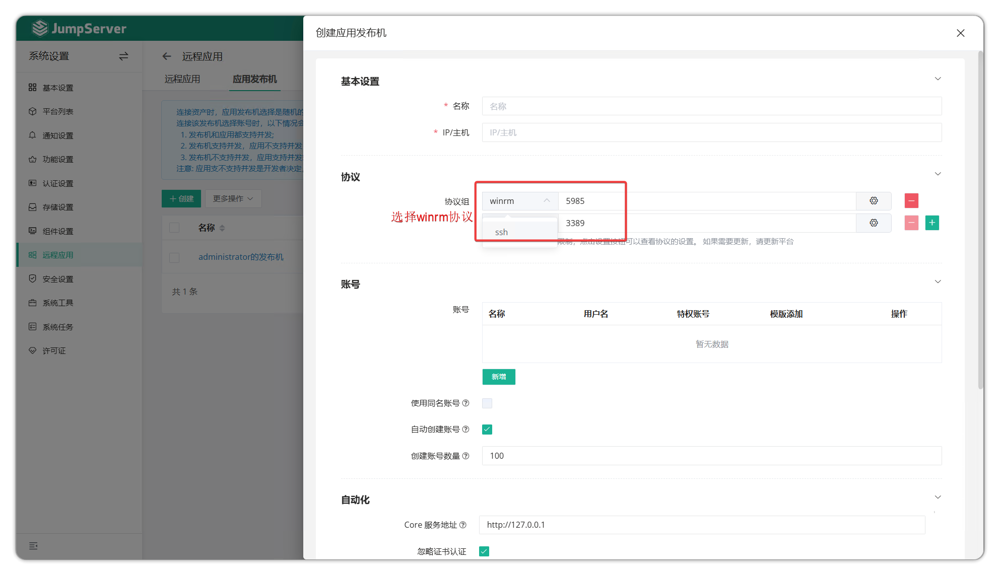

# 远程应用
!!! warning "注：社区版仅支持 Web GUI 方式使用远程应用，本地客户端连接方式(MSTSC)为企业版功能。"
## 1 功能概述
!!! info ""
    - 远程应用（RemoteApp）功能是微软在 Windows Server 2008之后，在其系统中集成的一项服务功能，使用户可以通过远程桌面访问远端的桌面与程序，客户端本机无须安装系统与应用程序的情况下也能正常使用远端发布的各种的桌面与应用。

## 2 应用发布机
!!! tip ""
    - RemoteApp 功能需准备应用发布机环境来进行支持。
    - 应用发布机是用来运行 Web 页面资产或者使用远程应用 Navicat 连接数据的程序运行主体。

### 2.1 系统要求
!!! tip ""
    - 应用发布机的具体系统要求如下：

| 配置项目 | 最低要求 | 说明 |
|----------|----------|------|
| 操作系统 | Windows Server 2019 | 推荐使用 Windows Server 2019 |
| CPU | 4 核心 | 至少 4 个 CPU 核心 |
| 内存 | 8 GB | 至少 8 GB RAM |
| 远程管理协议 | WinRM 或 OpenSSH | 需要安装并正确配置其中一种协议 |
| RDS 许可证 | 已安装并激活 | 远程桌面服务许可证必须有效，Windows Server 默认试用 120 天 |
| 网络连接 | 能够通过网络访问 JumpServer 服务(HTTPS/HTTPS) | 注册、应用安装需要 |

### 2.2 创建应用发布机
!!! tip ""
    - 点击应用发布机页面的`创建`按钮即新建一个应用发布机。

!!! tip ""
    - 通过 OpenSSH 协议部署应用发布机需要安装 OpenSSH，可在 JumpServer 页面 - `Web终端` - `帮助` - `下载` 页面获取安装包。

#### WinRM（推荐）

!!! note ""
    WinRM 是微软推出的一种远程管理服务，可使用管理员账号在 PowerShell 或 CMD 中通过 `winrm quickconfig` 快速启用。

!!! tip ""
    - 创建应用发布机时添加 WinRM 协议即可。如果同时存在 SSH 协议，JumpServer 将优先选择 SSH。
    

#### OpenSSH

!!! tip ""
    - 通过 OpenSSH 协议部署应用发布机需要先安装 OpenSSH 协议组件。
    

!!! tip ""
    - OpenSSH 安装包上传到应用发布机桌面后，双击进行安装。
    

!!! tip ""
    - 详细参数说明：

| 参数     | 说明                  |
| ------- | --------------------- |
| 名称 | 远程应用发布机的名称，识别信息。 |
| IP/主机 | 远程应用发布机的IP信息。 |
| 协议组 | 远程应用发布机支持的协议族以及协议组的端口。 |
| 账号列表 | 远程应用发布机的连接账号信息，例如 `Administrator` 用户。 |
| 自动创建帐号 | 该选项创建的帐号用于连接发布的应用。 |
| 创建帐号数量 | 公用帐号创建的数量。 |
| Core服务地址 | 远程应用发布机的 Agent 与 JumpServer 后端 Core 组件服务的通信地址。 |
| RDS 许可证 | RDS 许可证启用选项。 |
| RDS 许可服务器 | RDS 许可服务器信息。 |
| RDS 授权模式 | 选择"设备"或"用户"设置授权模式。   A.设备：允许一台设备（任何用户使用的）连接到远程应用发布机。   B.用户：授予一个用户从无限数目的客户端计算机或设备访问远程应用发布机。 |
| RDS 单用户单会话 | 选择"禁用"或"启用"设置单用户单会话模式。   A.禁用：允许每个用户可以同时多台客户端电脑连接服务器远程桌面。    B.启用：禁止每个用户可以同时多台客户端电脑连接服务器远程桌面。 |
| RDS 最大断开时间 | 如果某个会话连接达到了此最大时间，连接即断开。 |
| RDS 远程应用注销时间限制 | 远程应用会话断开后的注销时间。 |

### 2.3 部署应用发布机
!!! tip ""
    - 创建应用发布机后需手动执行应用发布机部署，安装 Chrome、DBeaver 或其他远程应用。
    - 点击 `应用发布机名称` 按钮进入应用发布机详情页中，选择 `发布机部署` 页签，点击快速更新模块的 `初始化部署` 按钮，初始化应用发布机。

### 2.4 查看应用发布机详情
!!! tip ""
    - 点击 `应用发布机名称` 进入应用发布机详情页中。
    - 此页面包含应用发布机详情信息，包括：远程应用发布机帐号列表、远程应用、发布机部署记录等。

!!! tip ""
    - 详细参数说明：

| 模块     | 说明                  |
| ------- | --------------------- |
| 基本设置 | 该模块主要包含远程应用发布机的基本信息以及简单的自动化任务，更新硬件信息、测试可连接性等。 |
| 账号列表 | 该模块主要操作远程应用发布机的账号，默认创建初 JumpServer 会创建100个系统用户支持远程应用会话。 |
| 远程应用 | 该模块中包含默认的远程应用与自建的远程应用信息，在该模块可直接对远程应用进行部署。 |
| 发布机部署 | 该模块中主要用于远程应用发布机的初始化部署，以及部署日志的查看。 |
| 活动 | 该模块中记录了远程应用发布机的活动记录信息，点击可查看活动详情。 |
