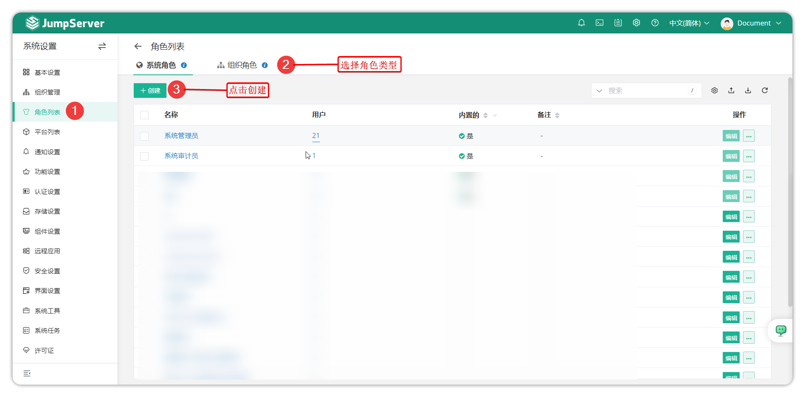
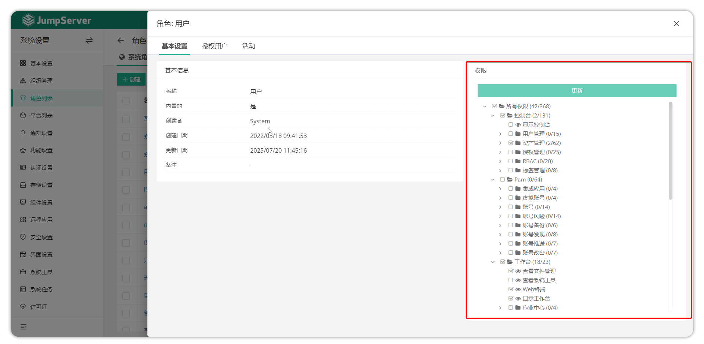
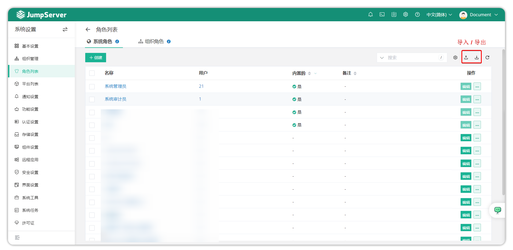
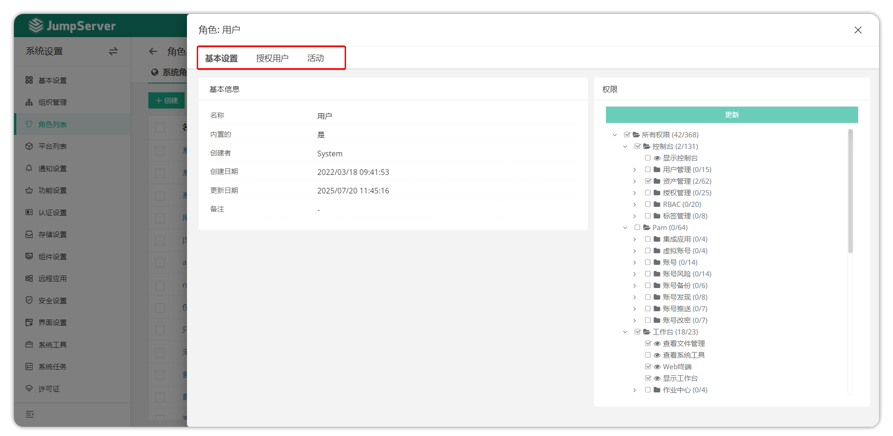
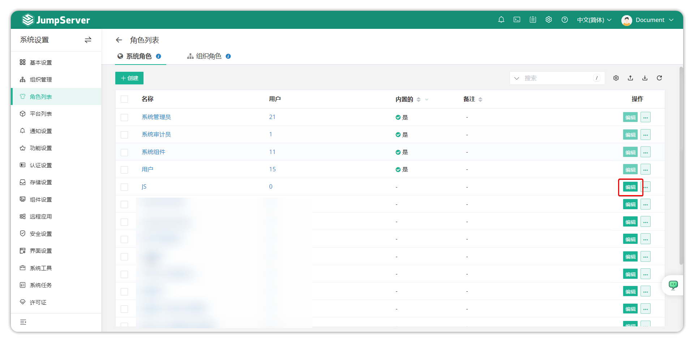
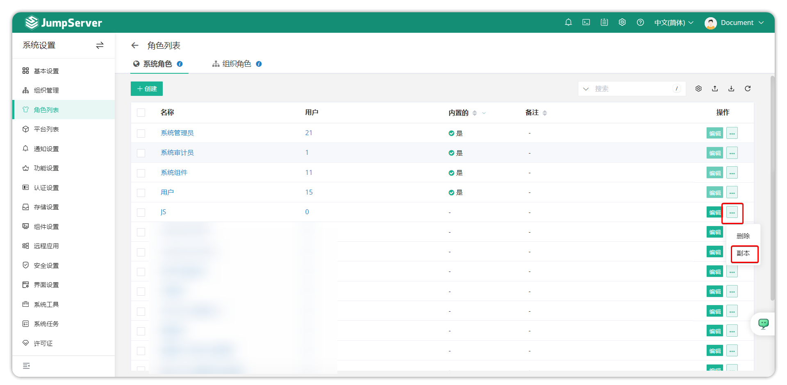
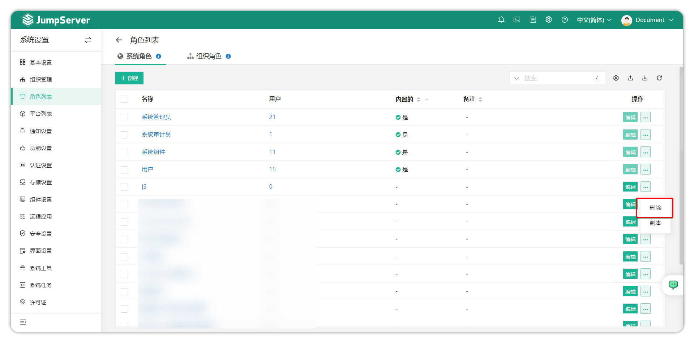

# Role List

!!! warning "Note: Starting from v4.9, JumpServer role-related settings have been moved to System Settings"

## 1 Overview
!!! tip ""
    - Enter the **System Settings** page by clicking the gear icon in the top-right corner, then click **Role List** to open the role list page.
    - The system default roles are System Administrator, System Auditor, User and System Components; organization roles default to Organization Administrator, Organization Auditor, Organization User. Default roles cannot be deleted or updated.

## 2 Create Role
!!! tip ""
    - Click the **Create** button in the top-left of the **Role List** page to open the role creation page.
    - Both system roles and organization roles can be created.

!!! tip ""
    - After successfully creating a role, enter the new role's detail page where you can set permissions for the role.
    - As shown below, the right portion shows role permission settings. After updating settings according to requirements, click the **Update** button to submit.

## 3 Role Import/Export
!!! tip ""
    - Roles support import for creation and export of existing roles in xlsx and csv table formats.
    - For the first import, click the **Import** button to download a template, fill in information as prompted, then import.

## 4 Role Details
!!! tip ""
    - Click a role name on the **Role List** page to open the role detail page.
    - The role detail page contains role basic information, role permissions, authorized users, and role activity logs.

!!! tip "Detailed parameter descriptions"
| Parameter | Description |
|-----------|-------------|
| Basic Settings | The basic settings page displays detailed role information including name, whether built-in, creator, etc. |
| Permissions | This option is used to set permissions for the current role and which features can be used |
| Authorized Users | This page binds roles with users, granting users the permissions of that role |
| Activity | This page displays activity logs for the current role |

## 5 Update Role
!!! tip ""
    - When you need to update a role's information, click the **Edit** button next to the role on the **Role List** page.

## 6 Clone Role
!!! tip ""
    - Click the **...** button next to the role and select **Copy** to open the role creation interface. After modifying relevant information and submitting, modify role permissions to complete cloning.

## 7 Delete Role
!!! tip ""
    - System default roles cannot be deleted; non-built-in roles can be deleted.
    - Click the **Delete** button next to the role to delete it.

