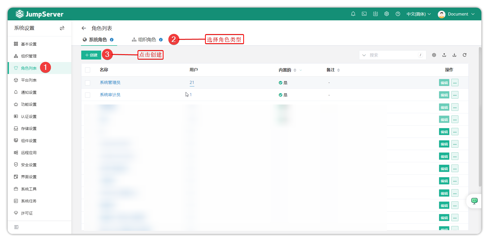
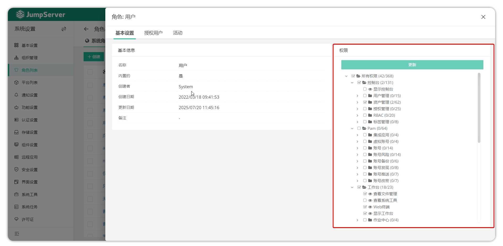
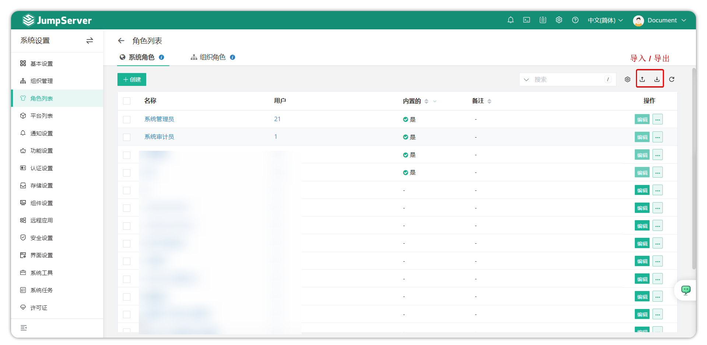
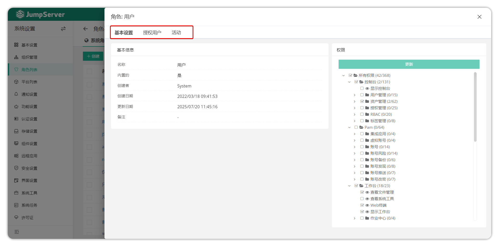
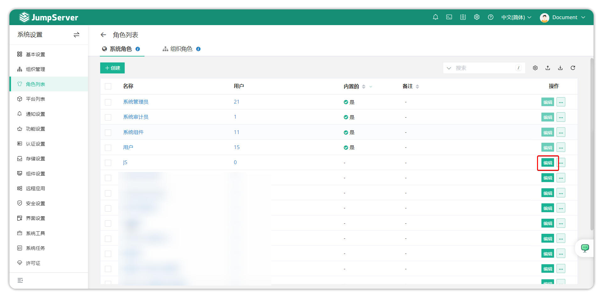
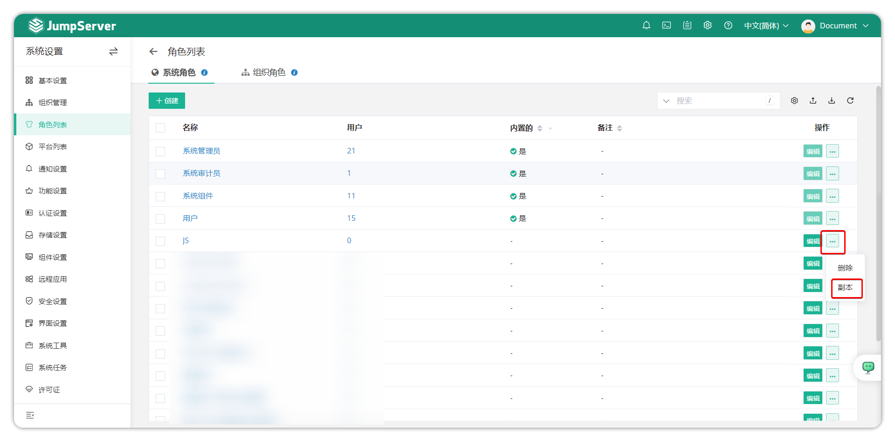
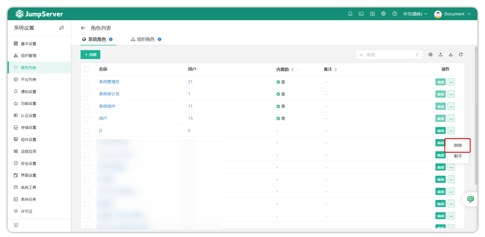

# 角色列表

!!! warning "注意: 从 v4.9 开始，JumpServer 角色相关设置已移至系统设置"

## 1 功能概述
!!! tip ""
    - 通过点击页面右上角小齿轮进入 **系统设置** 页面，点击 **角色列表** ，进入角色列表页面。
    - 系统角色默认有系统管理员、系统审计员、用户与系统组件；组织角色默认有组织管理员、组织审计员、组织用户。默认角色不可以进行删除，更新等操作。

## 2 创建角色
!!! tip ""
    - 点击 **角色列表** 页面左侧上方的 **创建** 按钮，进入角色创建页面。
    - 系统角色与组织角色均可新建。

!!! tip ""
    - 创建角色成功后，进入新创建的角色详情页，可以对该角色进行权限设置。
    - 如下图，右边部分为角色的权限设置。根据需求的权限更新设置后，点击 **更新** 按钮提交。

## 3 角色导入/导出
!!! tip ""
    - 角色支持导入创建和已存在角色导出，支持 xlxs 和 cvs 的表格格式。
    - 首次导入，可点击 **导入** 按钮下载模板后根据提示填写信息后导入。

## 4 角色详情
!!! tip ""
    - 在 **角色列表** 页面点击角色名称，进入角色详情页面。
    - 角色详情页包含的信息包括角色基本信息、角色权限、授权用户以及角色活动记录。

!!! tip "详细参数说明"
|参数    |说明                                                           |
|--------|---------------------------------------------------------------|
|基本设置|基本设置页面显示该角色的详细信息，包括名称、是否内置、创建者等信息|
|权限    |该选项用来设置当前角色的权限，是否可以使用目前这些功能           |
|授权用户|该页面用来绑定角色与用户，即给某个用户赋该角色的权限             |
|活动    |该页面显示当前角色的活动记录                                  |

## 5 更新角色
!!! tip ""
    - 当需求对某个角色的信息进行更新时，可在 **角色列表** 页面中，点击角色后方的 **编辑** 按钮进行角色信息更新。

## 6 克隆角色
!!! tip ""
    - 点击角色后方的 **...** 按钮选择 **副本** 按钮，进入角色创建界面，修改相关信息后，提交后修改角色权限即克隆完成。

## 7 删除角色
!!! tip ""
    - 系统默认角色不允许删除，非内置角色可进行删除。
    - 点击角色后方的 **删除** 按钮，删除角色。
