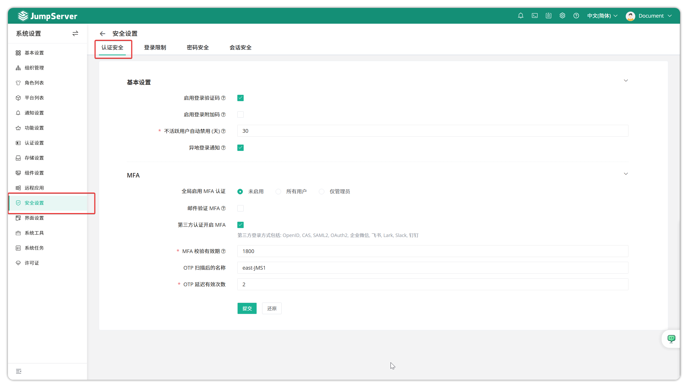
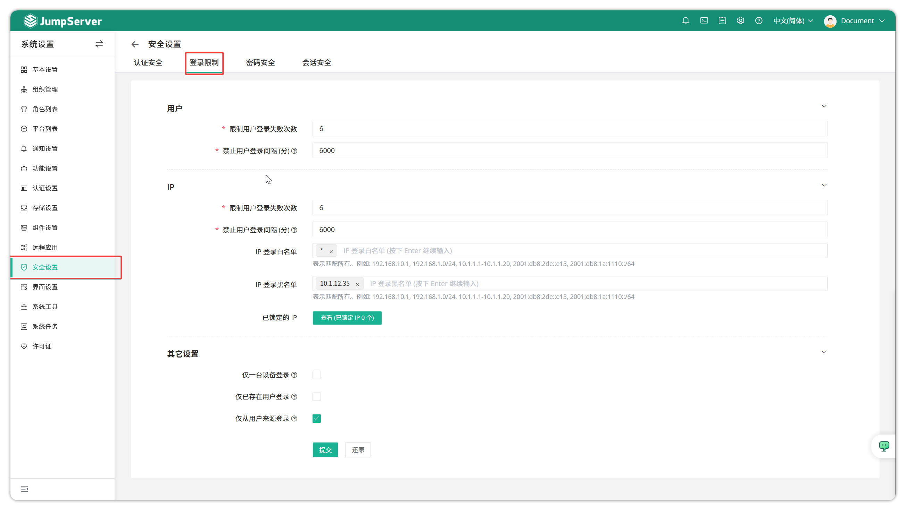
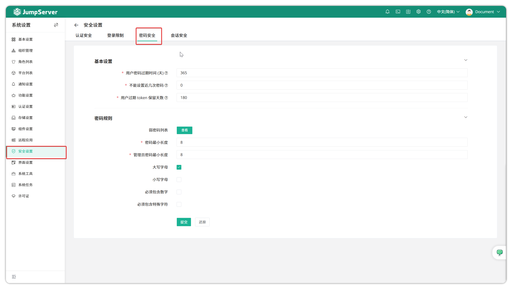
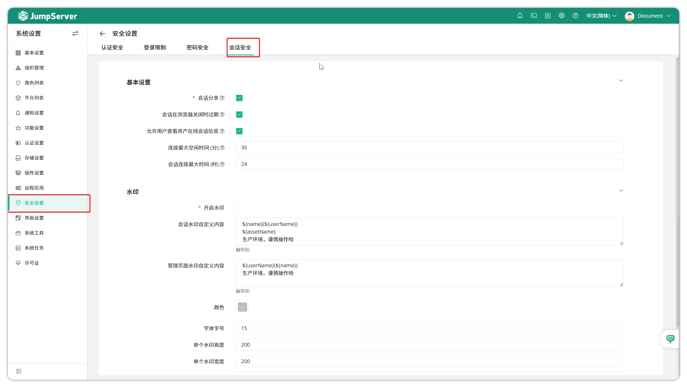

# Security Settings

!!! tip ""
    - Click the gear icon in the top-right corner to enter the **System Settings** page, then click **Security Settings** to open the security settings page.
    - The security settings page mainly configures security-related information for JumpServer, including authentication security and password validation rules.

## 1 Authentication Security

!!! tip ""
    - Detailed parameter descriptions:

    | Parameter | Description |
    | :--- | :--- |
    | Enable Login Captcha | Enable login captcha to prevent robot logins. |
    | Enable Login Additional Code | Password and additional code are sent together to third-party authentication system for verification, such as some third-party authentication systems that require password + 6-digit number to complete authentication. |
    | Automatically Disable Inactive Users (Days) | Set a preset time; users who have not logged in to JumpServer within this time will be automatically disabled. |
    | Remote Login Notification | Based on login IP, determine if it belongs to common login locations; if not, send remote login alert email to user's mailbox. |
    | Globally Enable MFA Authentication | You can set to disable MFA, enable MFA for all users, or enable only for administrators. When MFA is globally enabled, individual users cannot disable MFA verification. |
    | Third-Party Enable MFA | Support MFA authentication for users with OIDC, CAS, SAML2 authentication methods. |
    | MFA Validity Period | After MFA verification when viewing account passwords, no need to verify again within the validity period. |
    | OTP Name After Scanning | Display name of dynamic code in software after binding MFA. |
    | OTP Delayed Valid Times | Number of valid times for OTP delay. |

## 2 Login Restrictions

!!! tip ""
    - Detailed parameter descriptions:

    | Parameter | Description |
    | :--- | :--- |
    | Limit User Login Failed Attempts | Maximum number of password errors for user login; user will be locked for a period after reaching this limit. |
    | Disable User Login Interval | Duration user is locked. |
    | Limit IP Login Failed Attempts | Maximum login failures for an IP; login will be blocked for a period after reaching this limit. |
    | Disable IP Login Interval | Duration IP is locked. |
    | IP Login Whitelist | IPs allowed to login to the bastion host. |
    | IP Login Blacklist | IPs not allowed to login to the bastion host. |
    | Locked IPs | IPs locked after exceeding set login failure attempts. |
    | Only One Device Login | Only allow users to login on one device. Next device login will force off previous login. |
    | Only Existing Users Login | Only allow users existing in JumpServer user list to login. |
    | Only Login from User Source | Only allow users to login from sources listed in the user list. |

## 3 Password Security

!!! tip ""
    - Detailed parameter descriptions:

    | Parameter | Description |
    | :--- | :--- |
    | User Password Expiration Time (Days) | Interval in days users must forcibly update passwords. Unit: days. If user does not update password within this period, user password will expire and become invalid; password expiration reminder email will be automatically sent by system daily within 5 days before expiration. |
    | Cannot Set Last N Passwords | When user resets password, cannot use the last N passwords used for this user. |
    | Minimum Password Length | Set the minimum length supported for user passwords. |
    | Admin Password Minimum Length | Set the minimum length supported for administrator passwords. |
    | Must Contain Uppercase Characters | Password must contain uppercase characters. |
    | Must Contain Lowercase Characters | Password must contain lowercase characters. |
    | Must Contain Numbers | Password must contain numeric characters. |
    | Must Contain Special Characters | Password must contain special characters such as #$@% etc. |

## 4 Session Security

!!! tip ""
    - Detailed parameter descriptions:

    | Parameter | Description |
    | :--- | :--- |
    | Enable Watermark | Management interface, sessions and recordings will include watermark information of bastion host users accessing assets. RDP client-mode connections do not support watermarks. |
    | Session Sharing | When enabled, allows users to share connected asset sessions via URL to others for collaborative work. |
    | Session Expires When Browser Closes | Whether to terminate session when user closes browser. |
    | Allow Users to View Asset Session Information | When user connects to asset, account selection dialog displays current number of active sessions for asset (RDP protocol only). |
    | Connection Maximum Idle Time (Minutes) | Asset will auto-disconnect when idle time reaches this configuration. |
    | Session Connection Maximum Time (Hours) | Asset connection session will auto-disconnect after reaching this time. |
