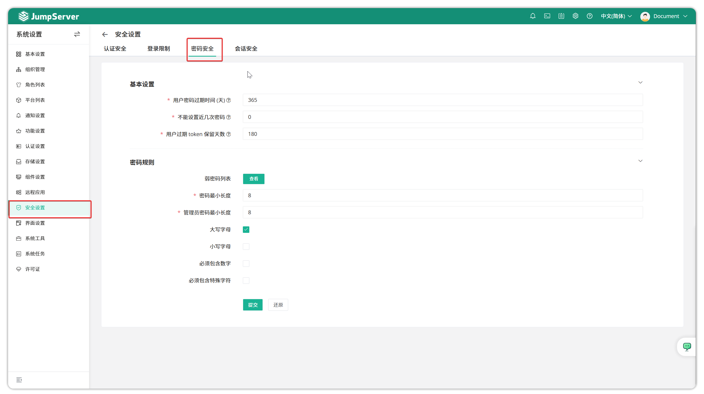

# 安全设置
!!! tip ""
    - 通过点击页面右上角小齿轮进入 **系统设置** 页面，点击 **安全设置** ，进入安全设置页面。
    - 安全设置页面主要配置 JumpServer安全相关信息，编辑认证安全以及密码等校验规则。

## 1 认证安全

!!! tip ""
    - 详细参数说明：

    | 参数                     | 说明                                                                                             |
    | :----------------------- | :----------------------------------------------------------------------------------------------- |
    | 启用登录验证码           | 启用登录验证码，防止机器人登录。                                                                 |
    | 启用登录附加码           | 密码和附加码一起发送给第三方认证系统进行校验，如：有的第三方认证系统，需要密码+6位数字完成认证。      |
    | 不活跃用户自动禁用（天） | 设置预设时间，在该时间内没有登录 JumpServer 的用户自动禁用。                                          |
    | 异地登录通知             | 根据登录 IP 判断是否属常用登录城市，如果不是，会发送异地登录提醒邮件到用户邮箱。                       |
    | 全局启用 MFA 认证        | 可以设置禁用 MFA, 或所有用户启用 MFA, 或仅管理员启用。当全局设置启动 MFA 时，单个用户无法关闭 MFA 验证。 |
    | 第三方开启 MFA           | 支持 OIDC、CAS、SAML2 认证方式的用户进行 MFA 认证。                                                |
    | MFA 有效期               | 当查看账号密码时，验证 MFA 之后有效期内不需要再次验证。                                              |
    | OTP 扫描后的名称         | 绑定 MFA 之后动态码在软件端的显示名称。                                                              |
    | OTP 延迟有效次数         | OTP 延迟的有效次数                                                                                 |

## 2 登录限制

!!! tip ""
    - 详细参数说明：

    | 参数                   | 说明                                                                 |
    | :--------------------- | :------------------------------------------------------------------- |
    | 限制用户登录失败次数   | 用户输错密码最多登录失败次数，之后将会被锁定一段时间。                     |
    | 禁止用户登录间隔       | 用户锁定的时间。                                                       |
    | 限制 IP 登录失败次数   | 某 IP 最多登录失败次数，之后将会被禁止登录一段时间。                     |
    | 禁止 IP 登录间隔       | IP 锁定的时间。                                                        |
    | IP 登录白名单          | 允许登录堡垒机的 IP。                                                  |
    | IP 登录黑名单          | 不允许登录堡垒机的 IP。                                                 |
    | 已锁定的 IP            | 超过设置的登录失败次数后被锁定的 IP。                                   |
    | 仅一台设备登录         | 仅允许用户在一台设备上登录。下个设备登录，上一个登录设备会强制下线。         |
    | 仅已存在用户登录       | 仅允许存在于 JumpServer 用户列表中的用户登录。                           |
    | 仅从用户来源登录       | 仅允许用户从用户列表中列出的来源处登录。                                 |

## 3 密码安全

!!! tip ""
    - 详细参数说明：

    | 参数                       | 说明                                                                                                                             |
    | :------------------------- | :------------------------------------------------------------------------------------------------------------------------------- |
    | 用户密码过期时间（天）     | 用户每隔多少天需要强制更新密码。单位：天，如果用户在此期间没有更新密码，用户密码将过期失效；密码过期提醒邮件将在密码过期前5天内由系统（每天）自动发送给用户。 |
    | 不能设置近几次密码         | 用户重置密码时，不能为该用户前几次使用过的密码。                                                                                     |
    | 密码最小长度               | 设置用户密码支持的最小长度。                                                                                                         |
    | 管理员密码最小长度         | 设置管理员密码支持的最小长度。                                                                                                       |
    | 必须包含大写字符           | 密码中必须包含大写字符。                                                                                                             |
    | 必须包含小写字符           | 密码中必须包含小写字符。                                                                                                             |
    | 必须包含数字               | 密码中必须包含数字字符。                                                                                                             |
    | 必须包含特殊字符           | 密码中必须包含特殊字符，如#$@%等。                                                                                                  |

## 4 会话安全

!!! tip ""
    - 详细参数说明：

    | 参数                         | 说明                                                                 |
    | :--------------------------- | :------------------------------------------------------------------- |
    | 开启水印                     | 管理界面、会话和录像会包含访问资产的堡垒机用户水印信息。RDP 客户端方式的连接不支持水印。 |
    | 会话分享                     | 开启后允许用户以 URL 形式分享已连接的资产会话给他人，方便协同工作。         |
    | 浏览器关闭时会话过期         | 用户关闭浏览器时是否终止会话。                                           |
    | 允许用户查看资产会话信息     | 当用户连接到资产时，帐户选择弹出窗口显示当前资产的活动会话数（仅限 RDP 协议）。 |
    | 连接最大空闲时间（分）       | 资产在空闲时间达到此配置时会自动断开。                                   |
    | 会话连接最大时间（时）       | 资产连接会话到达此时间后自动断开。                                       |
