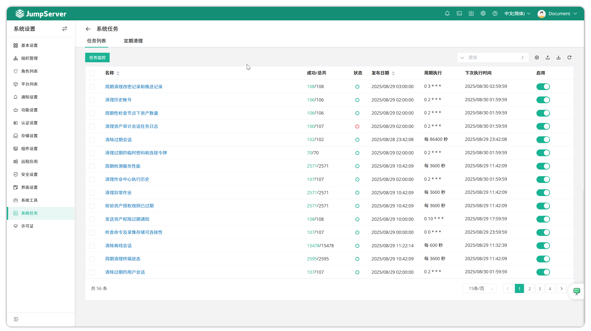
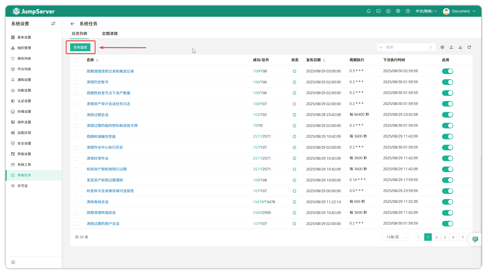
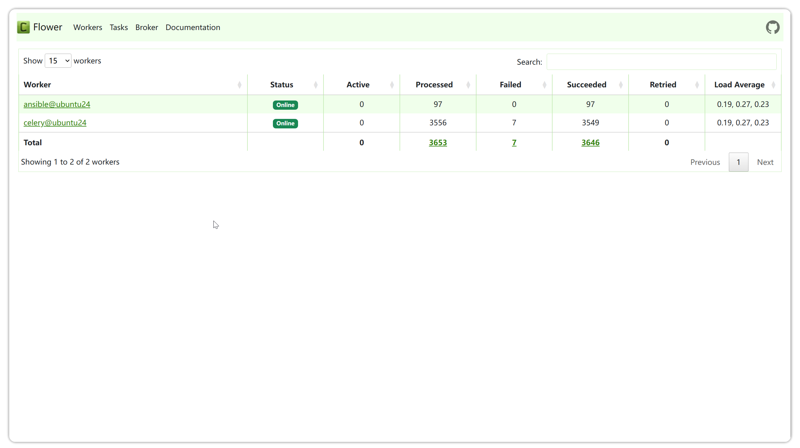
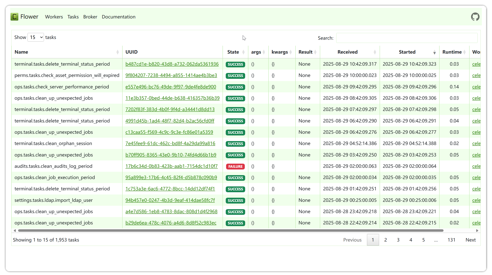
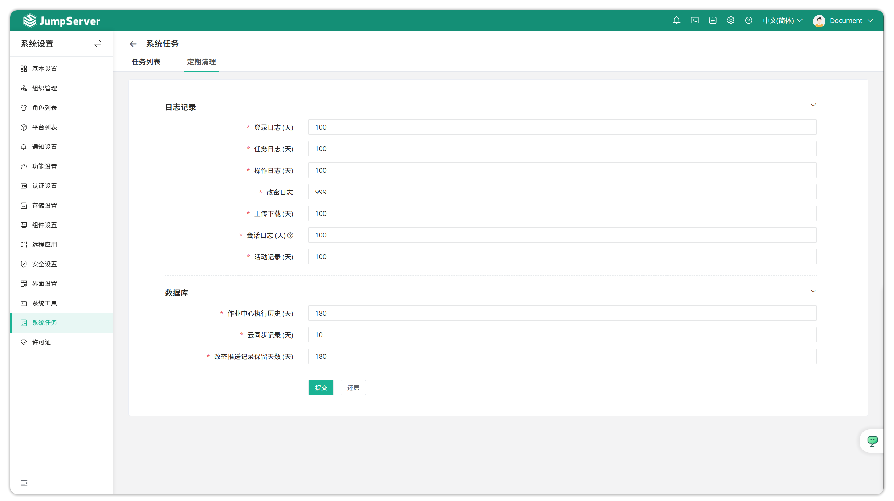

# System Tasks

!!! tip ""
    - Click the gear icon in the top-right corner to enter the **System Settings** page, then click **System Tasks** to open the system tasks view page.

## Task List

!!! tip ""
    - JumpServer supports using Ansible and other technologies to implement automated task execution. The system tasks page displays task execution logs and the status of Celery component and historical records of executed tasks.

!!! tip ""
    - This page displays all automated tasks, including account backup plans, account push, asset connectivity checks, email sending automated tasks, etc.
    - Click on an automated task name to enter the task detail page where you can view task details and execution history.

!!! tip ""
    - Click the **Task Monitor** button in the top-left of the page to view related status of JumpServer's backend batch task component.

!!! tip ""
    - Click on task status in the upper section of the page to view logs of successful tasks or logs of failed tasks, and check related information of backend celery component and ansible service.

!!! tip ""
    - Click on processed count and success total to display detailed task information.

## Periodic Cleanup

!!! tip ""
    - Click the **Periodic Cleanup** button to enter the periodic cleanup settings page where you can configure scheduled cleanup cycles for login, task, operation, upload/download logs, and database records audit tasks, reducing pressure on server storage.
    - The configuration on this page mainly controls locally saved records; when recordings and logs are stored in external storage, this page configuration does not affect them.

!!! tip ""
    Detailed parameter descriptions:

    | Parameter | Description |
    | --- | --- |
    | Login Logs | Login logs mainly record JumpServer user login information, including username, type, Agent, login IP address, login location, and login date. |
    | Task Logs | Task logs mainly record information about automated tasks such as batch commands. |
    | Operation Logs | Operation logs mainly record user operations on assets, operation time, and resource type and remote address of operations. |
    | Upload/Download | Upload/download mainly records operation logs left by users when performing FTP upload and download. |
    | Session Logs Save Time | Session logs mainly record session logs generated by logging into assets through JumpServer, including recordings and command logs. |
    | Activity Records | Activity records mainly record operation information on asset, authorization, account or task detail pages. |
    | Job Center Execution History | Job center mainly records historical information of job center task execution, including quick commands and jobs. |
    | Cloud Sync Records | Cloud sync records mainly record information about executing cloud sync tasks. |
