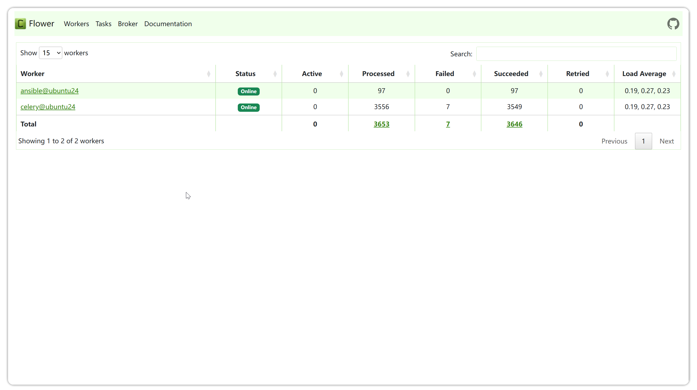

# 系统任务
!!! tip ""
    - 通过点击页面右上角小齿轮进入 **系统设置** 页面，点击 **系统任务** ，进入系统任务查看页面。
## 任务列表
!!! tip ""
    - JumpServer 支持使用 Ansible 等技术实现自动化执行任务，系统任务页面可查看任务执行的日志信息以及执行自动化任务的组件 Celery 的状态与已执行任务的历史记录等。

!!! tip ""
    - 该页面可查看所有自动化任务，其中包含账号备份计划，推送账号，检查资产连接性、邮件发送自动化任务等。
    - 点击自动化任务名称即可进入该自动化任务的详情页面，在该自动化任务的详情页面可查看任务详情信息，执行历史等信息。
!!! tip ""
    - 点击页面左上角的 **任务监控** 按钮，可查看 JumpServer 后端批量任务组件的相关状态。

!!! tip ""
    - 点击页面上部分的任务状态可查看成功任务的日志或失败任务的日志，查看后端 celery 组件与 ansible 服务的相关信息。

!!! tip ""
    - 点击已处理和成功总数，将显示任务的详细信息。

## 定期清理
!!! tip ""
    - 点击 **定期清理** 按钮，进入定期清理设置页面，配置登录、任务、操作、上传下载日志和数据库记录等审计任务的定时清理周期，为服务器存储减轻压力。
    - 该页面的配置主要控制本地保存的记录，当录像与日志存储到外部存储中，不受该页面配置影响。

!!! tip ""
    详细参数说明：

    | 参数               | 说明                                                                 |
    |--------------------|----------------------------------------------------------------------|
    | 登录日志           | 登录日志主要记录 JumpServer 用户的登录信息，包括用户名、类型、Agent、登录 IP 地址、登录地点以及登录日期。 |
    | 任务日志           | 任务日志主要记录一些批量命令等自动化的任务信息。                         |
    | 操作日志           | 操作日志主要记录用户对资产的操作动作、操作时间以及操作的资源类型和远端地址。 |
    | 上传下载           | 上传下载主要记录用户进行 FTP 上传、下载时所留下的操作记录。               |
    | 会话日志保存时间   | 会话日志主要记录通过 JumpServer 登录资产产生的会话日志包含录像与命令记录。 |
    | 活动记录           | 活动记录主要记录资产、授权、账号或任务详情页的操作信息。                   |
    | 作业中心执行历史   | 作业中心主要记录作业中心的任务执行的历史信息，包括快捷命令与作业。         |
    | 云同步记录         | 云同步记录主要记录执行云同步任务的信息。                                 |

