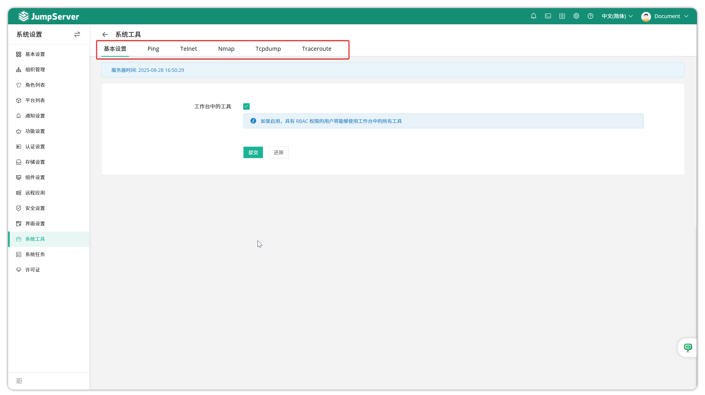

# System Tools

!!! tip ""
    - Click the gear icon in the top-right corner to enter the **System Settings** page, then click **System Tools** to open the system tools page.
    - This page contains system tools including ping, telnet, Nmap, Tcpdump, and Traceroute, allowing users to detect network connections between assets and JumpServer service.

