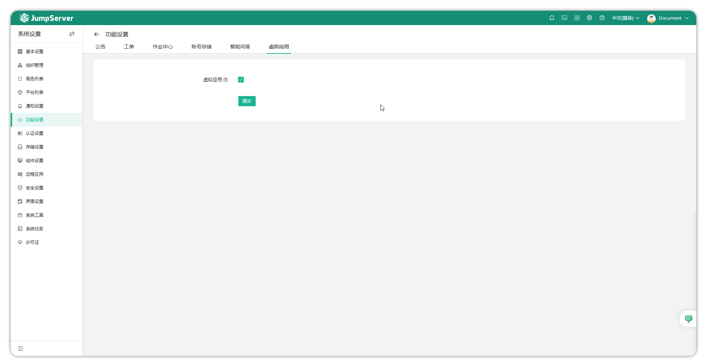
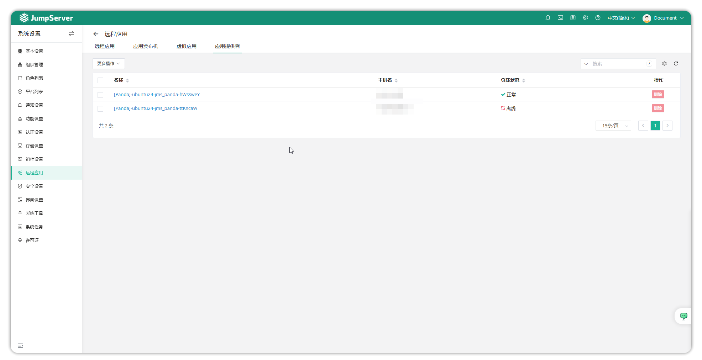
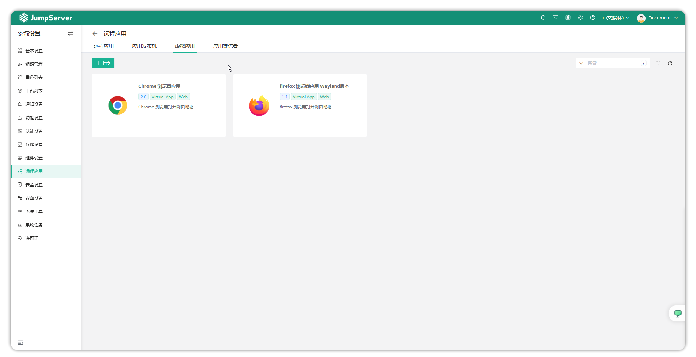
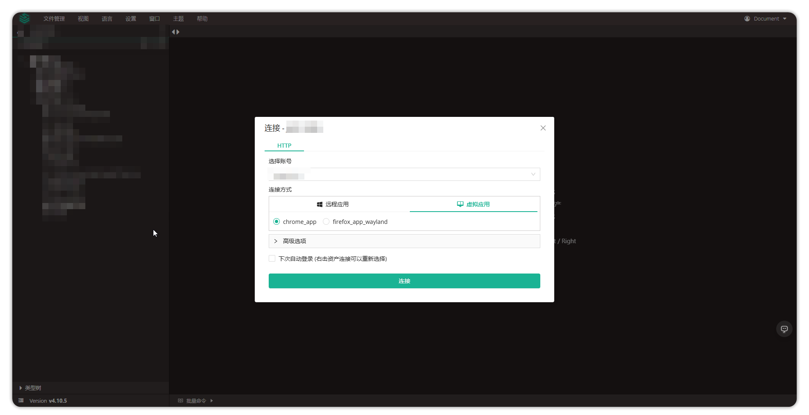

# Virtual Applications

!!! info "Note: Virtual Applications are an enterprise feature."

## 1 Feature Overview

!!! tips ""
    - VirtualApp (Virtual Application) is a remote application feature launched by JumpServer based on Linux graphical operating system, originally designed for Xinchuang system scenarios.
    - Panda is also known as Application Provider, a JumpServer component used to manage VirtualApp.
    - Through virtual applications, you can publish Web, database, and other assets.

## 2 Feature Enable

### 2.1 Enable Virtual Applications

!!! info ""
    - Check Virtual Applications on System Settings → Feature Settings → Virtual Applications page and submit.



### 2.2 Change Configuration File

!!! info ""
    - Login to the server where JumpServer runs as root or other privileged account.
    - Modify or add this line of configuration, entering the IP address of the Linux server providing virtual application service.

``` sh
vim /opt/jumpserver/config/config.txt
PANDA_HOST_IP=IP
```

!!! info ""
    - After modification, save and execute the following command to restart JumpServer.

``` sh
jmsctl restart
```

### 2.3 View Virtual Application Status

!!! info ""
    - Go to System Settings → Remote Applications → Application Provider page to view running Panda components. Click on component name to view details.
    - Panda will retrieve uploaded virtual applications every 5 minutes.


### 2.4 Upload Virtual Application

!!! info ""
    - Go to System Settings → Remote Applications → Virtual Applications page to see two default applications: Chrome Browser and Firefox Browser.
    - You can click the Upload button to upload self-developed applications.


## 3 Feature Usage

!!! info ""
    - After configuration is complete, create a Website asset and use Web Terminal to select virtual application mode for connection.

