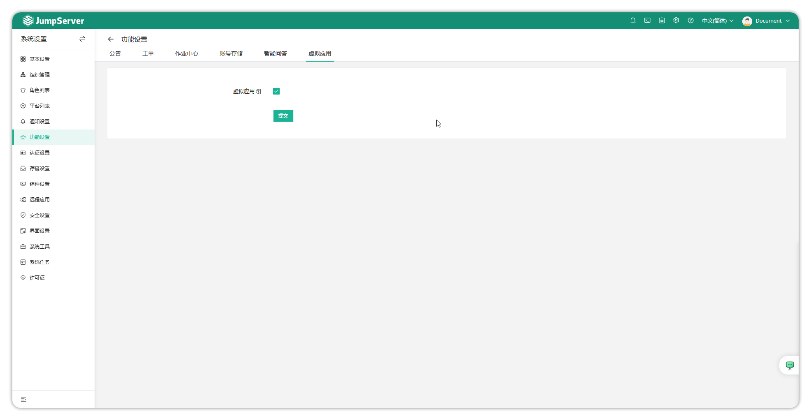
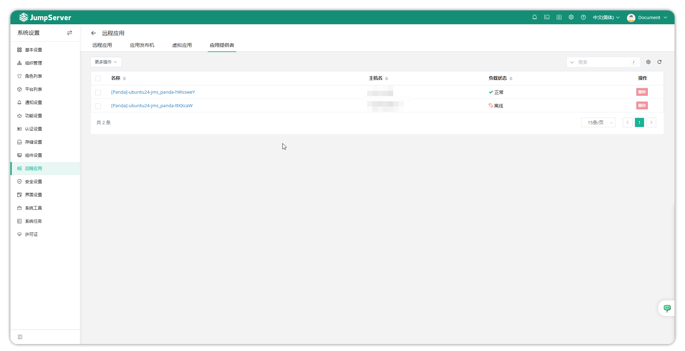
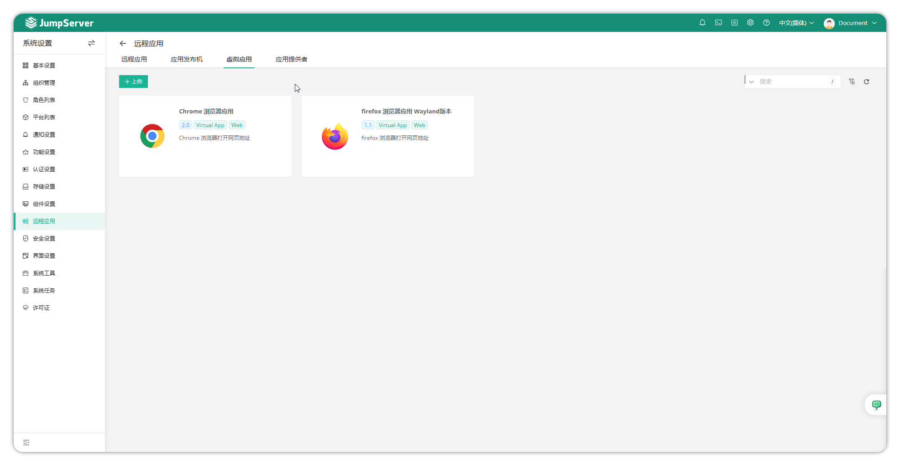
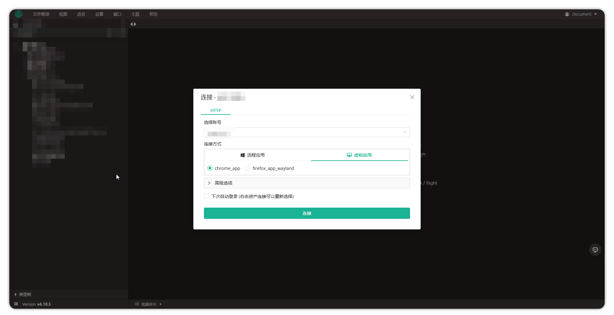

# 虚拟应用
!!! info "注：虚拟应用为企业版功能。"

## 1 功能概述
!!! tips ""
    - VirtualApp（虚拟应用）是 JumpServer 基于 Linux 图形化操作系统推出的远程应用功能，最初为信创系统场景设计。
    - Panda 也称为应用提供者 (Application provider) 是 JumpServer 的一个组件，用于管理 VirtualApp。  
    - 通过虚拟应用，可以发布 Web、数据库等资产。

## 2 功能启用

### 2.1 开启虚拟应用
!!! info ""
    - 在系统设置→功能设置→虚拟应用页面勾选虚拟应用后提交。



### 2.2 更改配置文件
!!! info ""
    - 使用 root 或其他特权账户登陆到 JumpServer 运行的服务器上。
    - 修改或添加该行配置，输入提供虚拟应用服务的 Linux 服务器的 IP 地址。

``` sh
vim /opt/jumpserver/config/config.txt
PANDA_HOST_IP=IP
```
!!! info ""
    - 修改完成后保存，执行如下命令重启 JumpServer。

``` sh
jmsctl restart
```

### 2.3 查看虚拟应用状态
!!! info ""
    - 进入系统设置→远程应用→应用提供者界面可以查看已在运行的 Panda 组件。点击组件的名称可以查看详情。
    - Panda 会每5分钟获取已上传的虚拟应用。


### 2.4 上传虚拟应用
!!! info ""
    - 进入系统设置→远程应用→虚拟界面应用可以看到默认存在的两款应用 Chrome 浏览器和 Firefox 浏览器。
    - 可以点击上传按钮上传自开发的应用。


## 3 功能使用
!!! info ""
    - 配置完成后，创建一个 Website 资产，使用 Web 终端选择虚拟应用方式进行连接。
